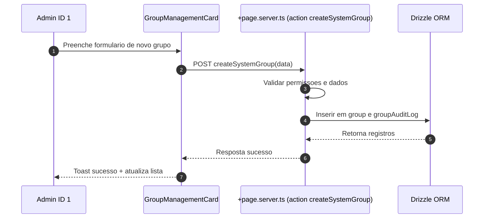
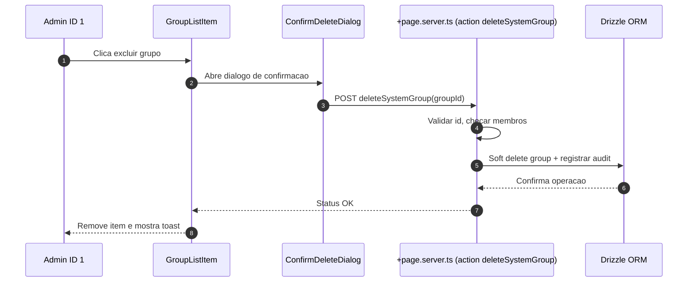
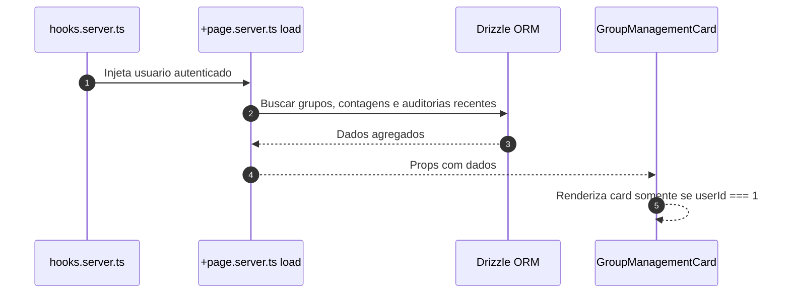
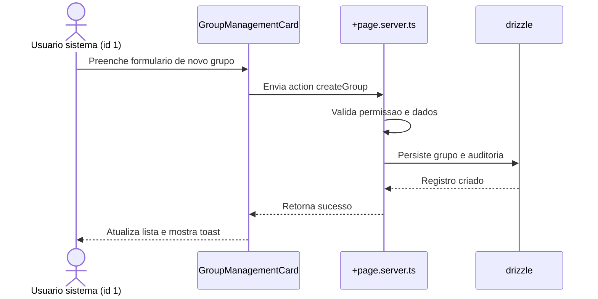
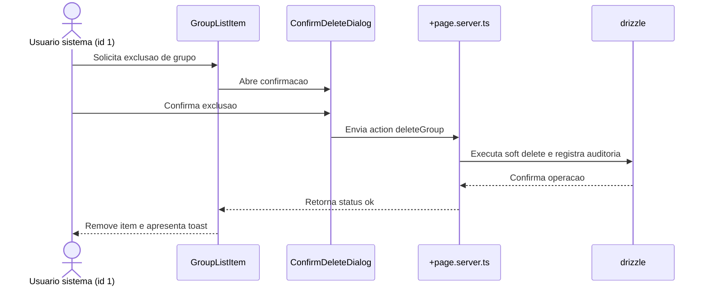
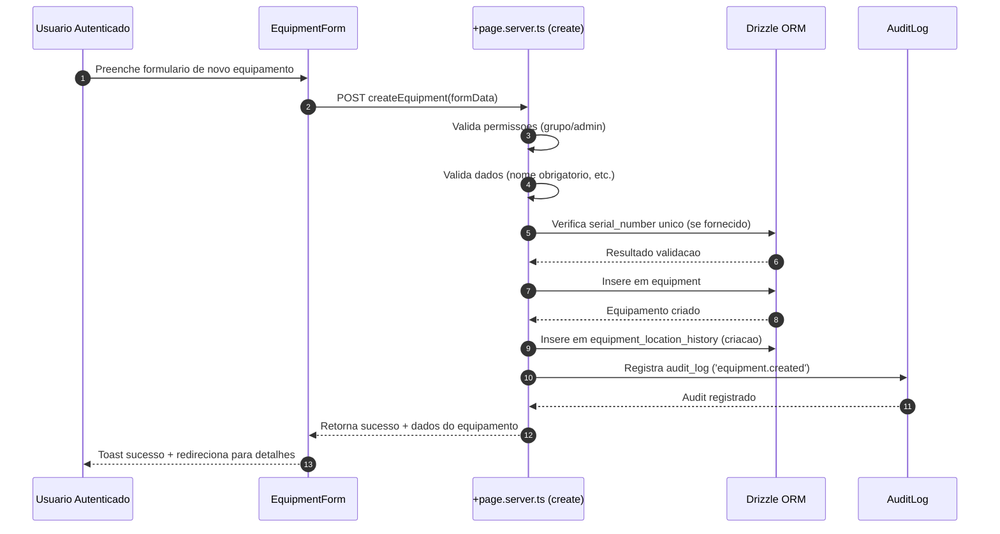
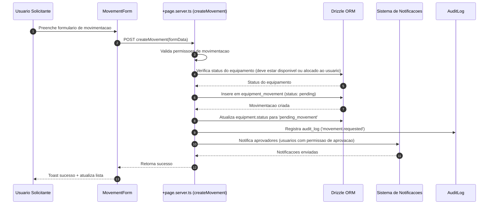
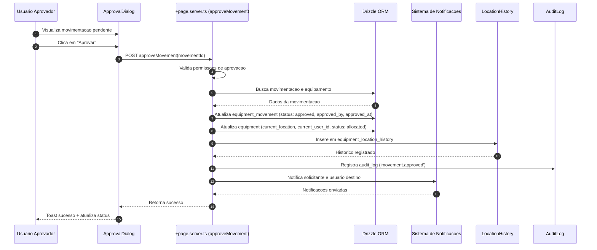
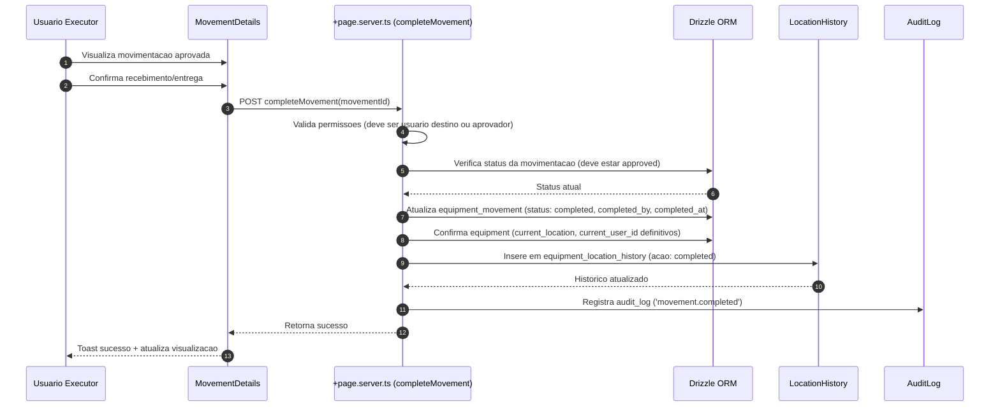
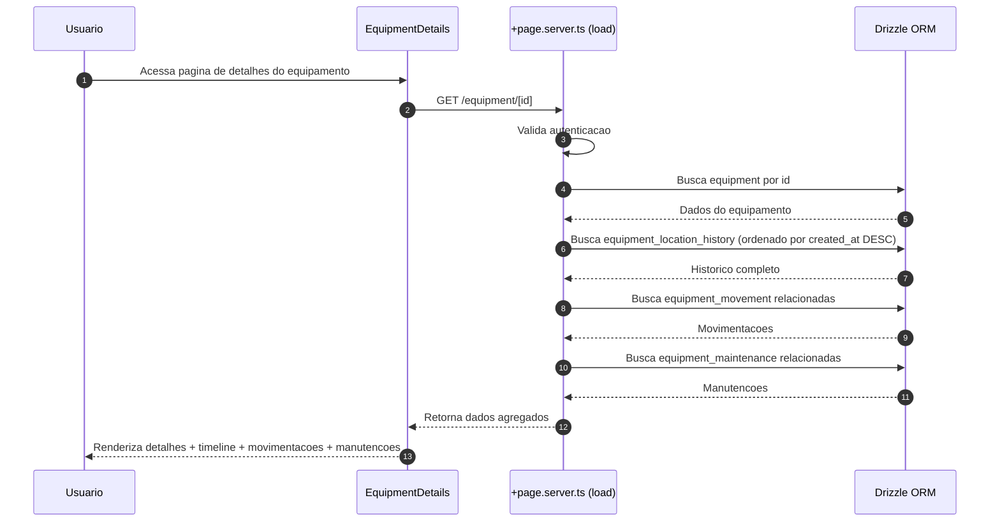

# Specification Document (use Mermaid.js, also use sequence diagrams)

> This document mirrors;

- SPEC.md
- src/routes/doc/spec/+page.md

---

## Gestao de Grupos pelo Usuario Sistema

### Descricao

Funcionalidade que permite ao usuario de sistema (ID = 1) gerenciar grupos diretamente na rota `user/profile`. O usuario sistema pode criar novos grupos e excluir grupos existentes, garantindo governanca, trilha de auditoria e integracao com as regras de permissao da plataforma.

### Requisitos

- Card exclusivo visivel apenas para `userId === 1`
- Formulario inline para criar grupo com nome e descricao opcionais
- Lista com grupos existentes, exibindo contadores de membros
- Acoes: criar, excluir (com confirm modal), e visualizar detalhes
- Feedback otimista e tratamento de erros com toasts
- Auditoria: registrar criador, timestamps, usuario responsavel pela exclusao

### Fluxos

### Schema

A funcionalidade utiliza as seguintes tabelas:

- `group`: Armazena grupos com campos de auditoria (description, createdAt, createdById, deletedAt, deletedById)
- `rel_group`: Relacionamento usuario-grupo com campos de auditoria (createdById, joinedAt)
- `group_audit_log`: Registro de todas as acoes realizadas nos grupos (create, delete)

### Componentes

- `GroupManagementCard.svelte`: Card principal que exibe lista de grupos e formulario de criacao
- `GroupForm.svelte`: Formulario inline para criar grupos (integrado no card)
- `GroupList.svelte` + `GroupListItem.svelte`: Lista e linha de grupo (integrado no card)
- `ConfirmDeleteDialog.svelte`: Dialogo de confirmacao para exclusao (usando AlertDialog do shadcn-svelte)

### Seguranca

- Validacao server-side: apenas usuario ID 1 pode executar as acoes
- Validacao de dados: nome obrigatorio (max 64 chars), descricao opcional (max 256 chars)
- Soft delete: grupos nao sao removidos fisicamente, apenas marcados como deletados
- Validacao de membros: nao permite excluir grupos que possuem membros
- Auditoria completa: todas as operacoes sao registradas em `group_audit_log`

### Localizacao

Todas as strings estao internacionalizadas em `messages/pt-br.json` e sincronizadas com outros idiomas via `project.inlang`.

---

## Funcionalidade: Gerenciamento de grupos do usuario sistema

### Contexto
- Permitir que o usuario mestre (id 1, criado no bootstrap da plataforma) gerencie grupos diretamente em `user/profile`.
- Manter rastreabilidade de quem executa cada acao e garantir mensagens internacionalizadas.
- Preservar arquitetura modular existente em `src/routes/user` e manter validacoes no backend com drizzle.

### Regras de negocio
- Card visivel somente quando `locals.user.id === '1'`.
- Acoes disponiveis: criar grupo com nome e descricao opcionais e excluir grupos existentes via confirmacao.
- Registrar auditoria de criacao e exclusao utilizando tabelas dedicadas.
- Impedir que grupos com membros ativos sejam removidos sem verificacoes adicionais.

### Implementacao
- `src/routes/user/profile/+page.svelte`: renderizar `GroupManagementCard` com formulario inline, lista de grupos e confirm modal.
- `src/routes/user/profile/+page.server.ts`: fornecer `load` com grupos e contagens, actions `createGroup` e `deleteGroup` protegidas por permissao do usuario mestre.
- `src/lib/components/user/GroupManagementCard.svelte` e subcomponentes `GroupForm`, `GroupList`, `GroupListItem`, `ConfirmDeleteDialog` para UI reutilizavel.
- `src/lib/utils/groups.ts`: validacoes de entrada (nome, descricao) e formatadores.
- `src/lib/db/schema.ts`: adicionar tabelas `group`, `userGroup` e `groupAuditLog` com campos de auditoria (createdAt, createdById, deletedAt, deletedById).
- Adicionar migracoes drizzle correspondentes e seeds iniciais quando necessario.
- Atualizar `messages/*.json` com chaves de texto (labels, tooltips, toasts) sincronizadas via `project.inlang`.

### Fluxo principal

### Fluxo de remocao

---

## Sistema de Gestao de Equipamentos

### Descricao

Sistema web completo para gestao de equipamentos com rastreamento de localizacao, historico de movimentacoes, controle de alocacoes e auditoria completa de todas as operacoes realizadas. Permite que usuarios cadastrem equipamentos, visualizem onde cada equipamento esta localizado, quem o alocou, quem autorizou a movimentacao e realizem movimentacoes de equipamentos.

### Requisitos

- Sistema web com autenticacao de usuarios
- Cadastro de equipamentos com informacoes detalhadas
- Visualizacao de localizacao atual de cada equipamento
- Rastreamento de quem alocou cada equipamento
- Rastreamento de quem autorizou cada movimentacao
- Funcionalidade de movimentacao de equipamentos
- Historico completo de movimentacoes
- Controle de permissoes baseado em grupos
- Auditoria completa de todas as operacoes

### Fluxos

#### Fluxo 1: Criacao de Equipamento

#### Fluxo 2: Solicitacao de Movimentacao

#### Fluxo 3: Aprovacao de Movimentacao

#### Fluxo 4: Completar Movimentacao

#### Fluxo 5: Visualizacao de Historico

### Schema

A funcionalidade utiliza as seguintes tabelas:

- `equipment`: Armazena equipamentos com informacoes detalhadas (nome, descricao, numero de serie, categoria, status, localizacao atual, usuario atual, grupo, etc.)
- `equipment_movement`: Registro de movimentacoes de equipamentos com status (pending, approved, rejected, completed, cancelled)
- `equipment_location_history`: Historico completo de localizacoes e acoes realizadas em cada equipamento
- `equipment_maintenance`: Registro de manutencoes agendadas e realizadas

### Componentes

- `EquipmentCard.svelte`: Card de equipamento na lista
- `EquipmentList.svelte`: Lista de equipamentos
- `EquipmentForm.svelte`: Formulario de criacao/edicao
- `EquipmentDetails.svelte`: Visualizacao detalhada
- `EquipmentStatusBadge.svelte`: Badge de status
- `MovementCard.svelte`: Card de movimentacao
- `MovementList.svelte`: Lista de movimentacoes
- `MovementForm.svelte`: Formulario de movimentacao
- `MovementTimeline.svelte`: Timeline do historico
- `LocationSelector.svelte`: Seletor de localizacao
- `ApprovalDialog.svelte`: Dialogo de aprovacao

### Seguranca

- Validacao server-side: permissoes baseadas em grupos
- Validacao de dados: nome obrigatorio, serial_number unico (se fornecido)
- Soft delete: equipamentos nao sao removidos fisicamente
- Auditoria completa: todas as operacoes sao registradas em `audit_log`
- Controle de acesso: usuarios veem apenas equipamentos do seu grupo (a menos que sejam admin)

### Regras de Negocio

1. **Visualizacao de Equipamentos:**
   - Todos os usuarios autenticados podem visualizar equipamentos
   - Filtros baseados em grupos (usuario ve apenas equipamentos do seu grupo, a menos que seja admin)

2. **Criacao de Equipamentos:**
   - Apenas usuarios com permissao de administrador de grupo ou sistema
   - Validacao: nome obrigatorio, serial_number unico (se fornecido)

3. **Movimentacao de Equipamentos:**
   - Usuarios podem solicitar movimentacao de equipamentos disponiveis ou alocados a eles
   - Aprovacao requerida de usuarios com permissao de aprovacao (configuravel por grupo)
   - Apenas aprovadores podem aprovar movimentacoes pendentes
   - Usuario destino ou aprovador pode completar a movimentacao

4. **Edicao de Equipamentos:**
   - Apenas criador ou administradores de grupo
   - Soft delete: equipamentos nao sao removidos fisicamente

### Localizacao

Todas as strings estao internacionalizadas em `messages/pt-br.json` e sincronizadas com outros idiomas via `project.inlang`.