# Specification Document (use Mermaid.js, also use sequence diagrams)

> This document mirrors;

- SPEC.md
- src/routes/doc/spec/+page.md

---

## Gestao de Grupos pelo Usuario Sistema

### Descricao

Funcionalidade que permite ao usuario de sistema (ID = 1) gerenciar grupos diretamente na rota `user/profile`. O usuario sistema pode criar novos grupos e excluir grupos existentes, garantindo governanca, trilha de auditoria e integracao com as regras de permissao da plataforma.

### Requisitos

- Card exclusivo visivel apenas para `userId === 1`
- Formulario inline para criar grupo com nome e descricao opcionais
- Lista com grupos existentes, exibindo contadores de membros
- Acoes: criar, excluir (com confirm modal), e visualizar detalhes
- Feedback otimista e tratamento de erros com toasts
- Auditoria: registrar criador, timestamps, usuario responsavel pela exclusao

### Fluxos

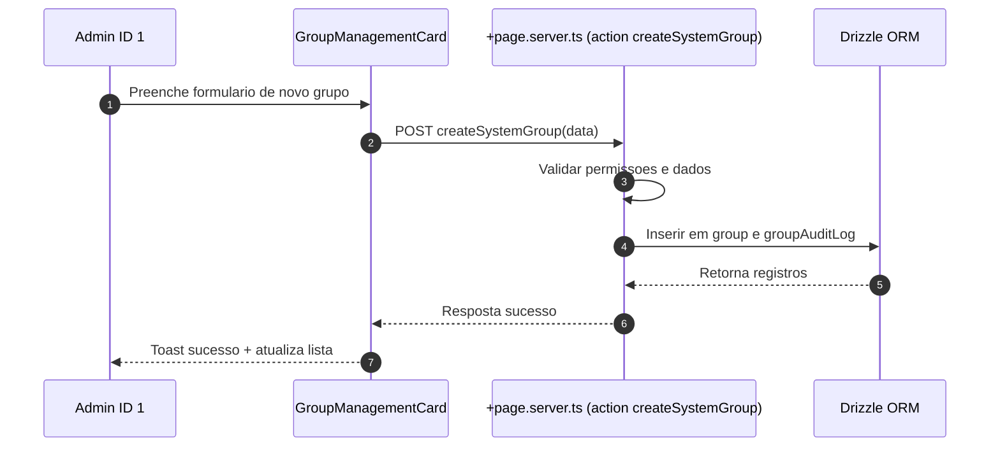

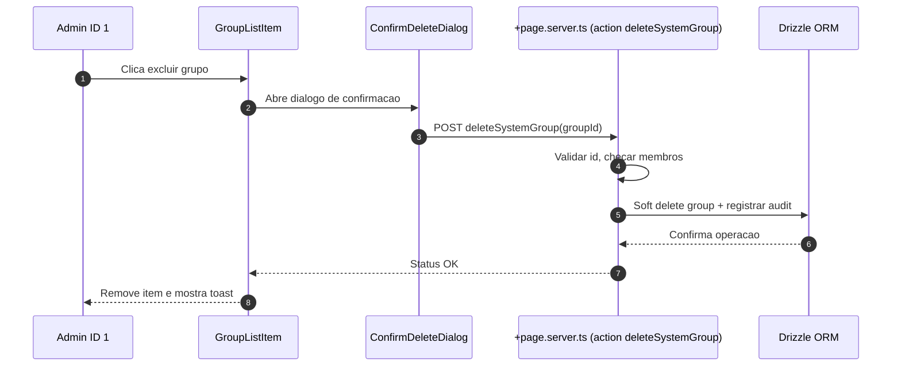

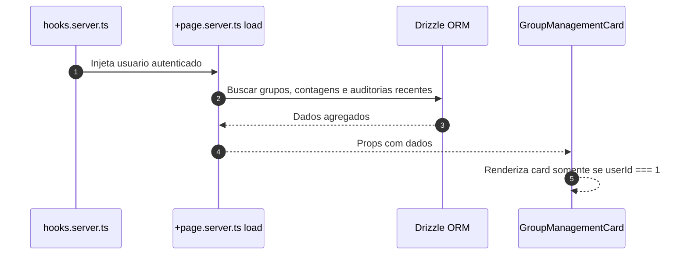

### Schema

A funcionalidade utiliza as seguintes tabelas:

- `group`: Armazena grupos com campos de auditoria (description, createdAt, createdById, deletedAt, deletedById)
- `rel_group`: Relacionamento usuario-grupo com campos de auditoria (createdById, joinedAt)
- `group_audit_log`: Registro de todas as acoes realizadas nos grupos (create, delete)

### Componentes

- `GroupManagementCard.svelte`: Card principal que exibe lista de grupos e formulario de criacao
- `GroupForm.svelte`: Formulario inline para criar grupos (integrado no card)
- `GroupList.svelte` + `GroupListItem.svelte`: Lista e linha de grupo (integrado no card)
- `ConfirmDeleteDialog.svelte`: Dialogo de confirmacao para exclusao (usando AlertDialog do shadcn-svelte)

### Seguranca

- Validacao server-side: apenas usuario ID 1 pode executar as acoes
- Validacao de dados: nome obrigatorio (max 64 chars), descricao opcional (max 256 chars)
- Soft delete: grupos nao sao removidos fisicamente, apenas marcados como deletados
- Validacao de membros: nao permite excluir grupos que possuem membros
- Auditoria completa: todas as operacoes sao registradas em `group_audit_log`

### Localizacao

Todas as strings estao internacionalizadas em `messages/pt-br.json` e sincronizadas com outros idiomas via `project.inlang`.

---

## Funcionalidade: Gerenciamento de grupos do usuario sistema

### Contexto

- Permitir que o usuario mestre (id 1, criado no bootstrap da plataforma) gerencie grupos diretamente em `user/profile`.
- Manter rastreabilidade de quem executa cada acao e garantir mensagens internacionalizadas.
- Preservar arquitetura modular existente em `src/routes/user` e manter validacoes no backend com drizzle.

### Regras de negocio

- Card visivel somente quando `locals.user.id === '1'`.
- Acoes disponiveis: criar grupo com nome e descricao opcionais e excluir grupos existentes via confirmacao.
- Registrar auditoria de criacao e exclusao utilizando tabelas dedicadas.
- Impedir que grupos com membros ativos sejam removidos sem verificacoes adicionais.

### Implementacao

- `src/routes/user/profile/+page.svelte`: renderizar `GroupManagementCard` com formulario inline, lista de grupos e confirm modal.
- `src/routes/user/profile/+page.server.ts`: fornecer `load` com grupos e contagens, actions `createGroup` e `deleteGroup` protegidas por permissao do usuario mestre.
- `src/lib/components/user/GroupManagementCard.svelte` e subcomponentes `GroupForm`, `GroupList`, `GroupListItem`, `ConfirmDeleteDialog` para UI reutilizavel.
- `src/lib/utils/groups.ts`: validacoes de entrada (nome, descricao) e formatadores.
- `src/lib/db/schema.ts`: adicionar tabelas `group`, `userGroup` e `groupAuditLog` com campos de auditoria (createdAt, createdById, deletedAt, deletedById).
- Adicionar migracoes drizzle correspondentes e seeds iniciais quando necessario.
- Atualizar `messages/*.json` com chaves de texto (labels, tooltips, toasts) sincronizadas via `project.inlang`.

### Fluxo principal

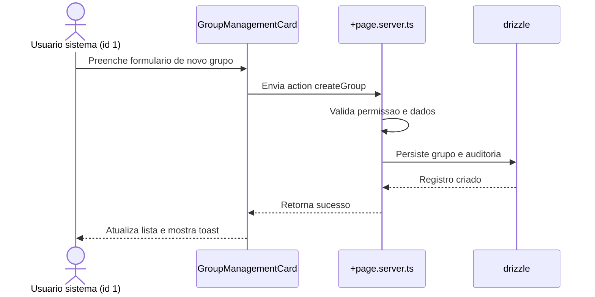

### Fluxo de remocao

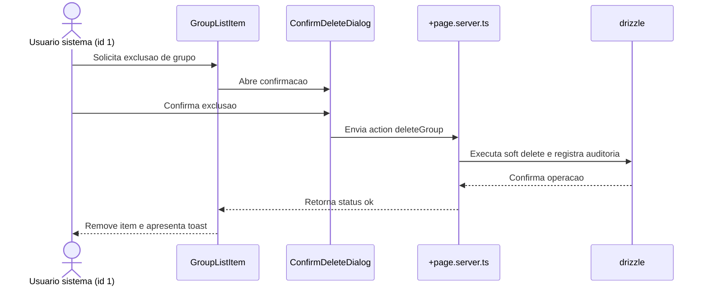

---

## Sistema de Gestao de Equipamentos

### Descricao

Sistema completo de gestao de equipamentos que permite o controle do ciclo de vida dos equipamentos, desde o cadastro inicial ate a manutencao e movimentacao entre diferentes localizacoes. O sistema inclui autenticacao de usuarios, cadastro de equipamentos, rastreamento de localizacao e responsaveis, movimentacao de equipamentos com autorizacao, e registro de manutencoes.

### Requisitos

- Sistema web com autenticacao de usuarios
- Cadastro completo de equipamentos com informacoes detalhadas
- Visualizacao em tempo real da localizacao atual de cada equipamento
- Identificacao de quem alocou e quem autorizou a movimentacao
- Movimentacao de equipamentos entre localizacoes com sistema de autorizacao
- Registro e historico de manutencoes realizadas em cada equipamento
- Auditoria completa de todas as operacoes

### Fluxos

#### Fluxo: Cadastro de Equipamento

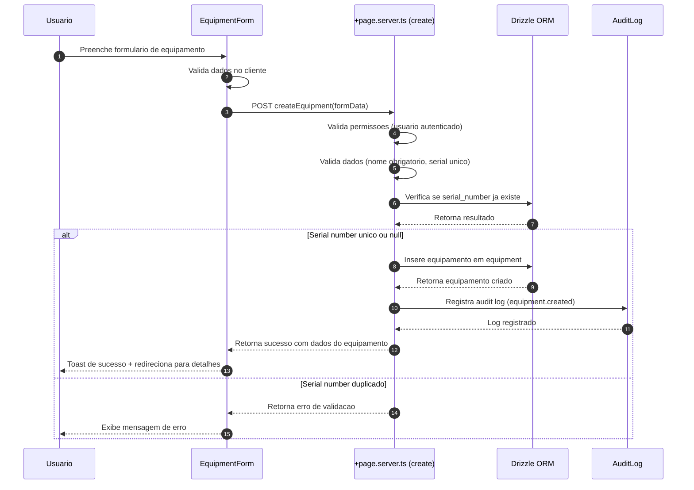

#### Fluxo: Alocacao de Equipamento

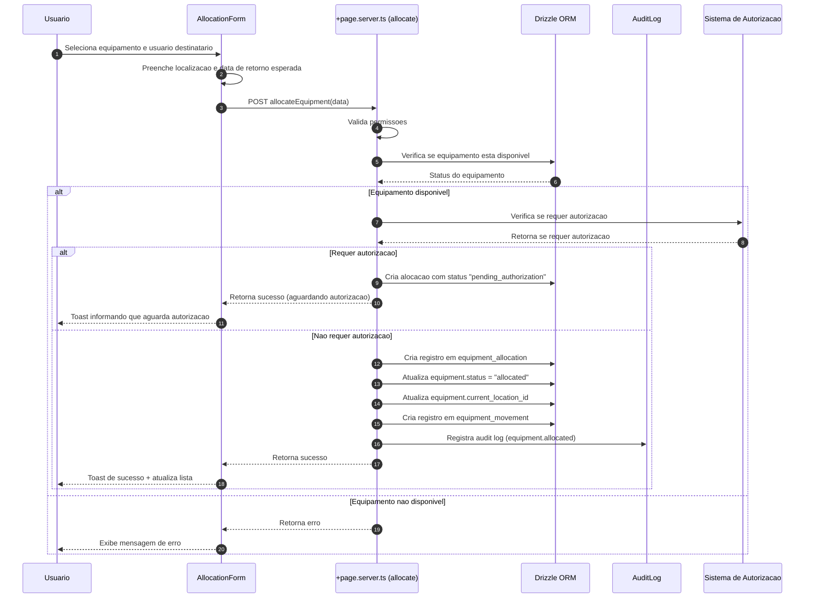

#### Fluxo: Movimentacao de Equipamento

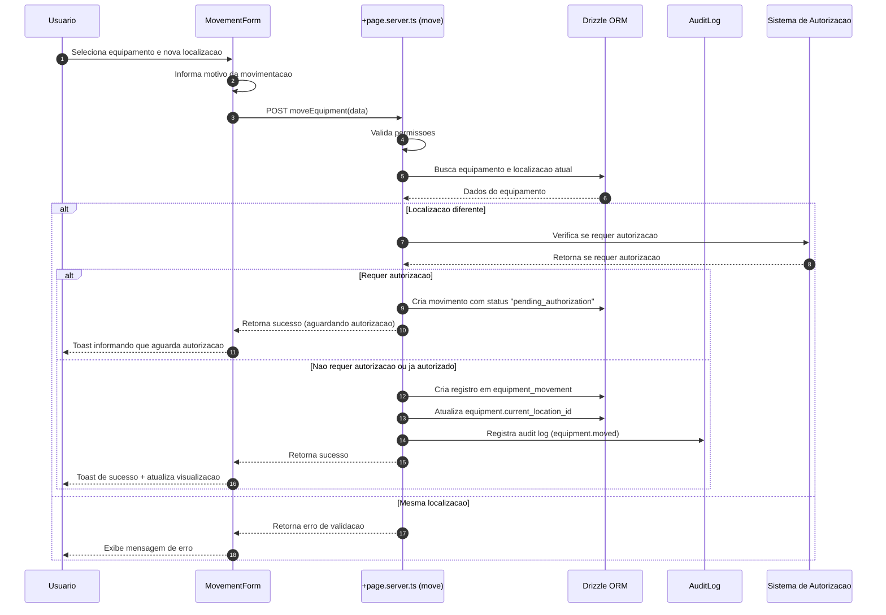

#### Fluxo: Autorizacao de Movimentacao/Alocacao

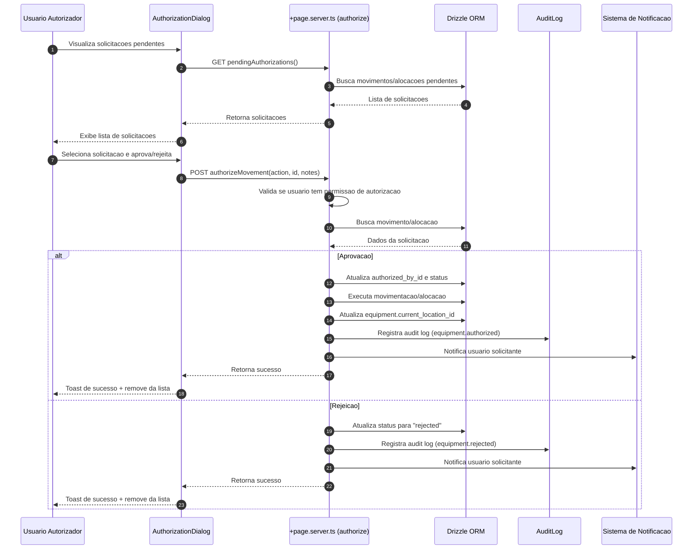

#### Fluxo: Registro de Manutencao

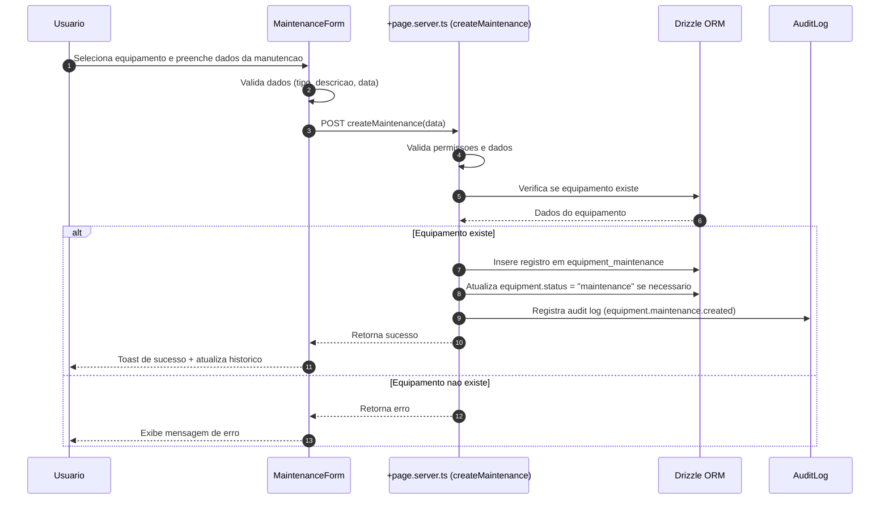

### Schema

O sistema utiliza as seguintes tabelas:

#### Tabela `equipment` (Equipamentos)

- `id`: Identificador unico (PK)
- `name`: Nome do equipamento (NOT NULL)
- `description`: Descricao opcional
- `serial_number`: Numero de serie (UNIQUE)
- `model`: Modelo do equipamento
- `manufacturer`: Fabricante
- `category`: Categoria (Informatica, Mobiliario, Ferramentas, etc.)
- `status`: Status atual (available, allocated, maintenance, retired) - DEFAULT 'available'
- `purchase_date`: Data de compra
- `purchase_value`: Valor de compra (em centavos)
- `warranty_expiry`: Data de expiracao da garantia
- `current_location_id`: Localizacao atual (FK para location)
- `created_by_id`: Usuario que criou (FK para user)
- `created_at`: Data de criacao (DEFAULT now())
- `updated_at`: Data de atualizacao
- `deleted_at`: Data de exclusao (soft delete)
- `deleted_by_id`: Usuario que excluiu (FK para user)

#### Tabela `location` (Localizacoes)

- `id`: Identificador unico (PK)
- `name`: Nome da localizacao (NOT NULL)
- `description`: Descricao opcional
- `address`: Endereco completo
- `building`: Edificio
- `floor`: Andar
- `room`: Sala/comodo
- `is_active`: Se a localizacao esta ativa (DEFAULT true)
- `created_by_id`: Usuario que criou (FK para user)
- `created_at`: Data de criacao (DEFAULT now())
- `updated_at`: Data de atualizacao
- `deleted_at`: Data de exclusao (soft delete)
- `deleted_by_id`: Usuario que excluiu (FK para user)

#### Tabela `equipment_allocation` (Alocacoes)

- `id`: Identificador unico (PK)
- `equipment_id`: Equipamento alocado (FK para equipment, NOT NULL)
- `user_id`: Usuario que recebeu o equipamento (FK para user, NOT NULL)
- `location_id`: Localizacao de destino (FK para location, NOT NULL)
- `allocated_by_id`: Quem fez a alocacao (FK para user, NOT NULL)
- `authorized_by_id`: Quem autorizou (FK para user, opcional)
- `status`: Status da alocacao (active, returned, cancelled, pending_authorization) - DEFAULT 'active'
- `allocated_at`: Data da alocacao (DEFAULT now())
- `returned_at`: Data de devolucao
- `expected_return_date`: Data esperada de retorno
- `notes`: Observacoes
- `created_by_id`: Usuario que criou (FK para user)
- `created_at`: Data de criacao (DEFAULT now())

#### Tabela `equipment_movement` (Movimentacoes)

- `id`: Identificador unico (PK)
- `equipment_id`: Equipamento movido (FK para equipment, NOT NULL)
- `from_location_id`: Localizacao de origem (FK para location, opcional)
- `to_location_id`: Localizacao de destino (FK para location, NOT NULL)
- `moved_by_id`: Quem executou a movimentacao (FK para user, NOT NULL)
- `authorized_by_id`: Quem autorizou (FK para user, opcional)
- `movement_type`: Tipo de movimentacao (transfer, allocation, return, maintenance) - NOT NULL
- `reason`: Motivo da movimentacao
- `movement_date`: Data da movimentacao (DEFAULT now())
- `notes`: Observacoes
- `created_by_id`: Usuario que criou (FK para user)
- `created_at`: Data de criacao (DEFAULT now())

#### Tabela `equipment_maintenance` (Manutencoes)

- `id`: Identificador unico (PK)
- `equipment_id`: Equipamento em manutencao (FK para equipment, NOT NULL)
- `maintenance_type`: Tipo de manutencao (preventive, corrective, calibration, upgrade) - NOT NULL
- `description`: Descricao da manutencao (NOT NULL)
- `performed_by`: Nome do tecnico ou empresa externa
- `performed_by_id`: Se for usuario do sistema (FK para user, opcional)
- `cost`: Custo da manutencao (em centavos)
- `start_date`: Data de inicio (NOT NULL)
- `end_date`: Data de conclusao
- `status`: Status (scheduled, in_progress, completed, cancelled) - DEFAULT 'scheduled'
- `next_maintenance_date`: Proxima data de manutencao prevista
- `notes`: Observacoes
- `created_by_id`: Usuario que criou (FK para user)
- `created_at`: Data de criacao (DEFAULT now())
- `updated_at`: Data de atualizacao

#### Diagrama ER

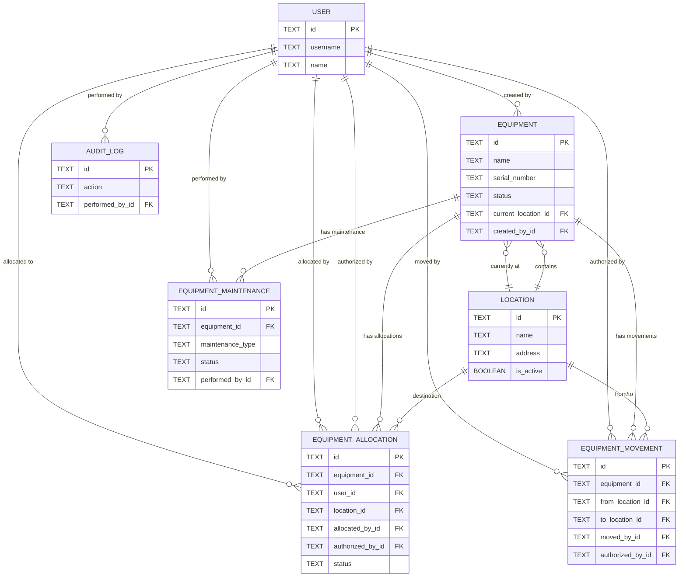

### Componentes

#### Modulo Equipment (`src/routes/equipment/`)

- `+page.svelte`: Lista de equipamentos
- `+page.server.ts`: Load e actions para lista
- `page.server.spec.ts`: Testes unitarios
- `create/+page.svelte`: Formulario de criacao
- `create/+page.server.ts`: Action de criacao
- `[id]/+page.svelte`: Detalhes do equipamento
- `[id]/+page.server.ts`: Load de detalhes
- `[id]/edit/+page.svelte`: Edicao de equipamento
- `[id]/edit/+page.server.ts`: Action de edicao
- `[id]/movements/+page.svelte`: Historico de movimentacoes
- `[id]/maintenance/+page.svelte`: Historico de manutencoes
- `[id]/maintenance/create/+page.svelte`: Criar manutencao
- `allocate/+page.svelte`: Formulario de alocacao
- `allocate/+page.server.ts`: Action de alocacao
- `move/+page.svelte`: Formulario de movimentacao
- `move/+page.server.ts`: Action de movimentacao

#### Modulo Location (`src/routes/location/`)

- `+page.svelte`: Lista de localizacoes
- `+page.server.ts`: Load e actions
- `create/+page.svelte`: Criar localizacao
- `[id]/+page.svelte`: Detalhes da localizacao

#### Componentes Reutilizaveis (`src/lib/components/equipment/`)

- `EquipmentCard.svelte`: Card de equipamento
- `EquipmentList.svelte`: Lista de equipamentos
- `EquipmentForm.svelte`: Formulario de equipamento
- `EquipmentStatusBadge.svelte`: Badge de status
- `AllocationForm.svelte`: Formulario de alocacao
- `MovementForm.svelte`: Formulario de movimentacao
- `MaintenanceForm.svelte`: Formulario de manutencao
- `MaintenanceHistory.svelte`: Historico de manutencoes
- `MovementHistory.svelte`: Historico de movimentacoes
- `EquipmentDetailsCard.svelte`: Card de detalhes

#### Componentes Location (`src/lib/components/location/`)

- `LocationCard.svelte`: Card de localizacao
- `LocationList.svelte`: Lista de localizacoes
- `LocationForm.svelte`: Formulario de localizacao
- `LocationSelector.svelte`: Seletor de localizacao

### Seguranca

- Validacao server-side: todas as acoes requerem autenticacao
- Validacao de dados: campos obrigatorios validados no servidor
- Soft delete: equipamentos e localizacoes nao sao removidos fisicamente
- Sistema de autorizacao: movimentacoes e alocacoes podem requerer autorizacao
- Auditoria completa: todas as operacoes sao registradas em `audit_log`
- Permissoes: verificacao de permissoes antes de cada operacao

### Localizacao

Todas as strings estao internacionalizadas em `messages/pt-br.json` e sincronizadas com outros idiomas via `project.inlang`.
