# Specification Document (use Mermaid.js, also use sequence diagrams)

> This document mirrors;

- SPEC.md
- src/routes/doc/spec/+page.md

---

## Gestao de Grupos pelo Usuario Sistema

### Descricao

Funcionalidade que permite ao usuario de sistema (ID = 1) gerenciar grupos diretamente na rota `user/profile`. O usuario sistema pode criar novos grupos e excluir grupos existentes, garantindo governanca, trilha de auditoria e integracao com as regras de permissao da plataforma.

### Requisitos

- Card exclusivo visivel apenas para `userId === 1`
- Formulario inline para criar grupo com nome e descricao opcionais
- Lista com grupos existentes, exibindo contadores de membros
- Acoes: criar, excluir (com confirm modal), e visualizar detalhes
- Feedback otimista e tratamento de erros com toasts
- Auditoria: registrar criador, timestamps, usuario responsavel pela exclusao

### Fluxos

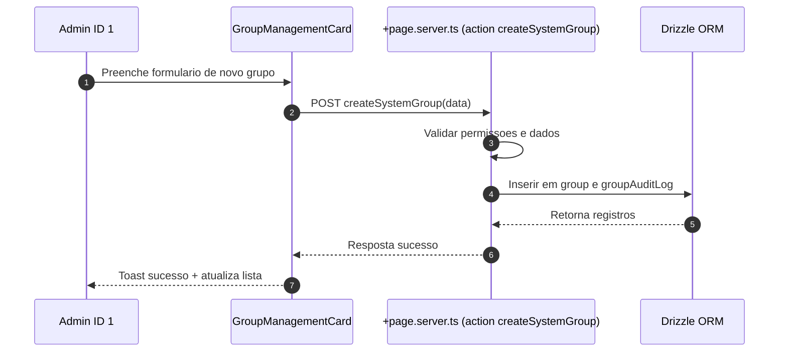

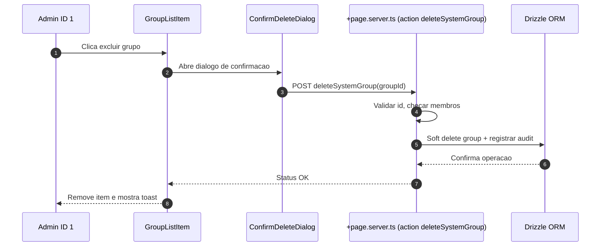

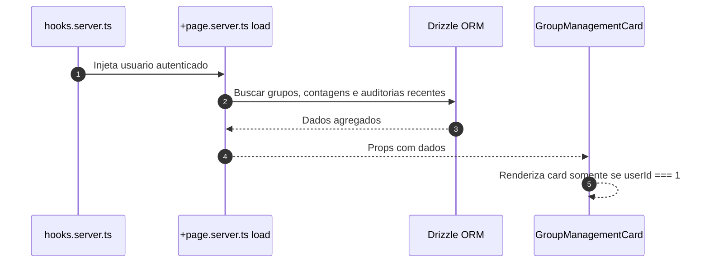

### Schema

A funcionalidade utiliza as seguintes tabelas:

- `group`: Armazena grupos com campos de auditoria (description, createdAt, createdById, deletedAt, deletedById)
- `rel_group`: Relacionamento usuario-grupo com campos de auditoria (createdById, joinedAt)
- `group_audit_log`: Registro de todas as acoes realizadas nos grupos (create, delete)

### Componentes

- `GroupManagementCard.svelte`: Card principal que exibe lista de grupos e formulario de criacao
- `GroupForm.svelte`: Formulario inline para criar grupos (integrado no card)
- `GroupList.svelte` + `GroupListItem.svelte`: Lista e linha de grupo (integrado no card)
- `ConfirmDeleteDialog.svelte`: Dialogo de confirmacao para exclusao (usando AlertDialog do shadcn-svelte)

### Seguranca

- Validacao server-side: apenas usuario ID 1 pode executar as acoes
- Validacao de dados: nome obrigatorio (max 64 chars), descricao opcional (max 256 chars)
- Soft delete: grupos nao sao removidos fisicamente, apenas marcados como deletados
- Validacao de membros: nao permite excluir grupos que possuem membros
- Auditoria completa: todas as operacoes sao registradas em `group_audit_log`

### Localizacao

Todas as strings estao internacionalizadas em `messages/pt-br.json` e sincronizadas com outros idiomas via `project.inlang`.

---

## Funcionalidade: Gerenciamento de grupos do usuario sistema

### Contexto
- Permitir que o usuario mestre (id 1, criado no bootstrap da plataforma) gerencie grupos diretamente em `user/profile`.
- Manter rastreabilidade de quem executa cada acao e garantir mensagens internacionalizadas.
- Preservar arquitetura modular existente em `src/routes/user` e manter validacoes no backend com drizzle.

### Regras de negocio
- Card visivel somente quando `locals.user.id === '1'`.
- Acoes disponiveis: criar grupo com nome e descricao opcionais e excluir grupos existentes via confirmacao.
- Registrar auditoria de criacao e exclusao utilizando tabelas dedicadas.
- Impedir que grupos com membros ativos sejam removidos sem verificacoes adicionais.

### Implementacao
- `src/routes/user/profile/+page.svelte`: renderizar `GroupManagementCard` com formulario inline, lista de grupos e confirm modal.
- `src/routes/user/profile/+page.server.ts`: fornecer `load` com grupos e contagens, actions `createGroup` e `deleteGroup` protegidas por permissao do usuario mestre.
- `src/lib/components/user/GroupManagementCard.svelte` e subcomponentes `GroupForm`, `GroupList`, `GroupListItem`, `ConfirmDeleteDialog` para UI reutilizavel.
- `src/lib/utils/groups.ts`: validacoes de entrada (nome, descricao) e formatadores.
- `src/lib/db/schema.ts`: adicionar tabelas `group`, `userGroup` e `groupAuditLog` com campos de auditoria (createdAt, createdById, deletedAt, deletedById).
- Adicionar migracoes drizzle correspondentes e seeds iniciais quando necessario.
- Atualizar `messages/*.json` com chaves de texto (labels, tooltips, toasts) sincronizadas via `project.inlang`.

### Fluxo principal

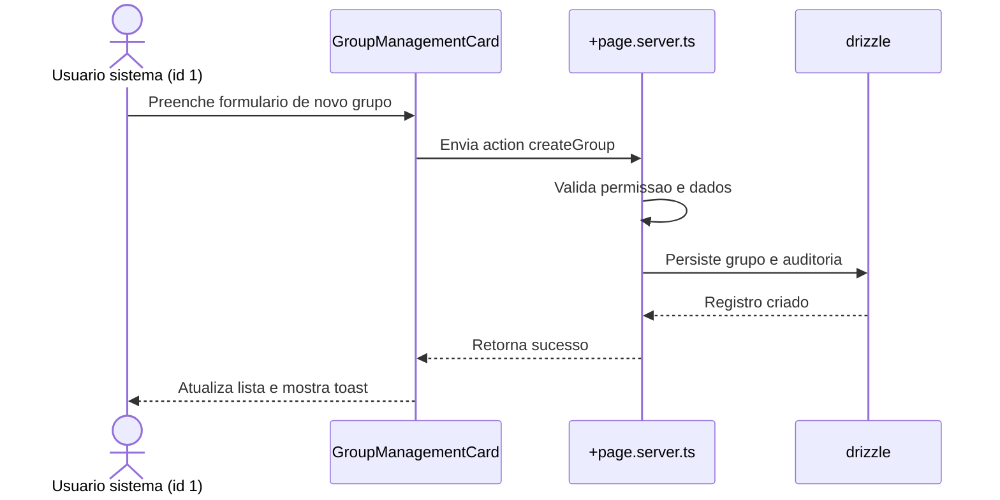

### Fluxo de remocao

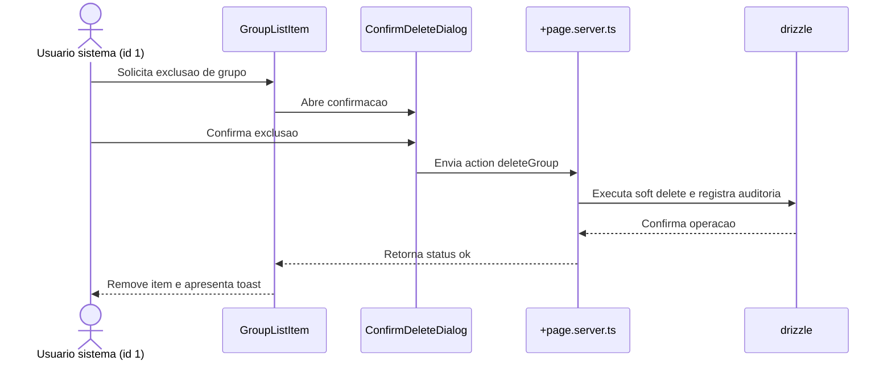

---

## Gestao de Equipamentos

### Descricao

Sistema completo de gestao de equipamentos que permite rastrear a localizacao, alocacao e movimentacao de equipamentos, garantindo transparencia e controle sobre quem autoriza e executa cada acao. Inclui funcionalidades de cadastro, visualizacao, movimentacao e registro de manutencoes.

### Requisitos

- Sistema web com login e senha de usuarios
- Cadastro de equipamentos com informacoes detalhadas
- Visualizacao da localizacao atual de cada equipamento
- Sistema de movimentacao com autorizacao
- Registro de manutencoes realizadas
- Historico completo de movimentacoes e manutencoes
- Rastreabilidade completa: visibilidade total sobre onde cada equipamento esta e quem e responsavel
- Controle de autorizacao: registro de quem autoriza movimentacoes, garantindo governanca
- Auditoria: trilha completa de todas as acoes realizadas no sistema

### Fluxos

#### Cadastro de Equipamento

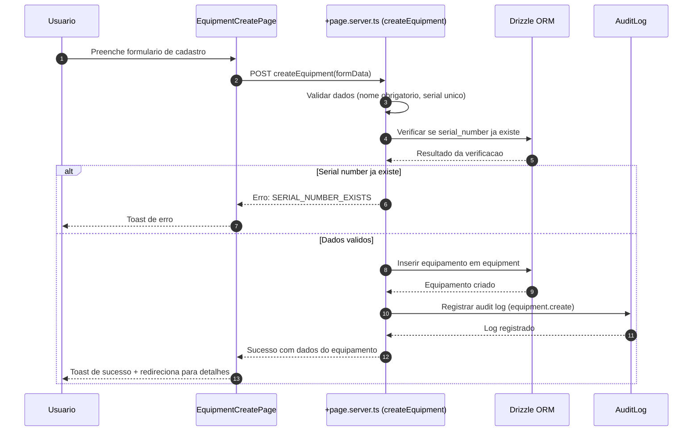

#### Visualizacao de Equipamentos e Localizacao

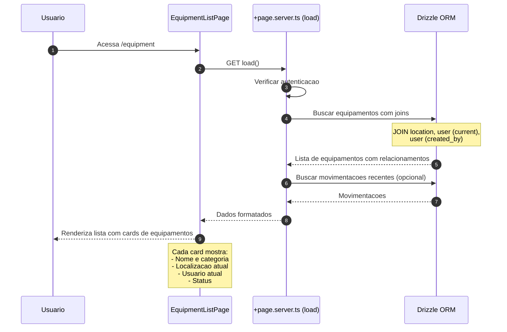

#### Movimentacao de Equipamento

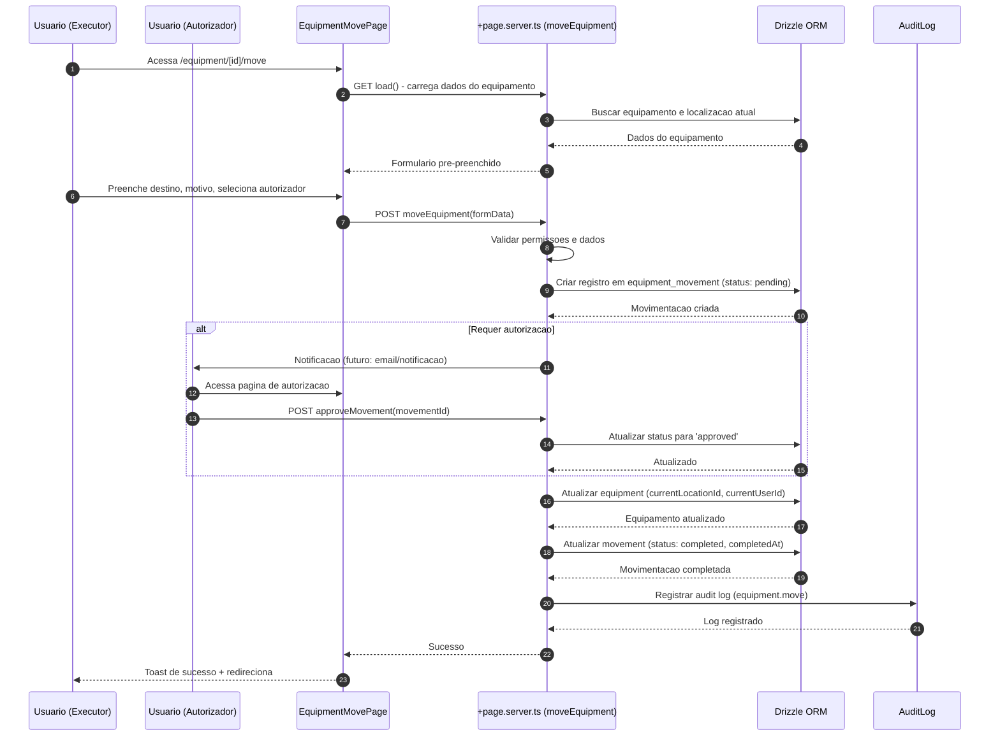

#### Cadastro de Manutencao

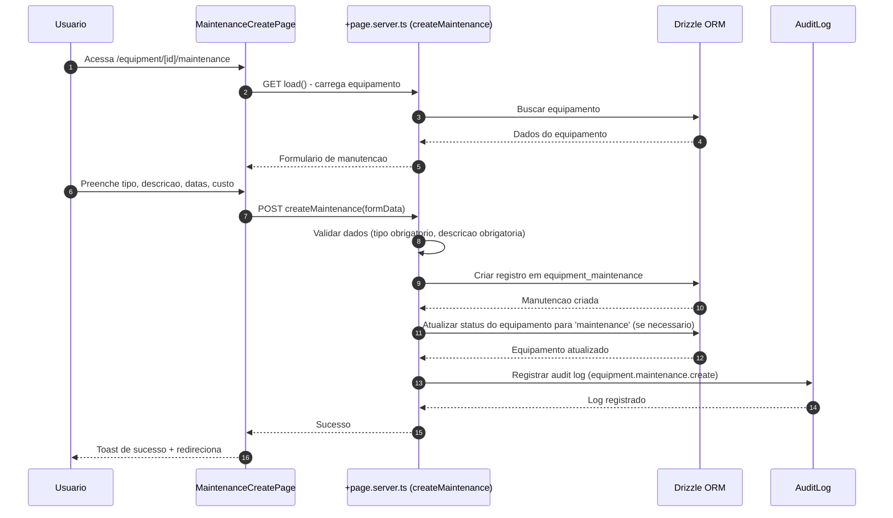

#### Visualizacao de Detalhes do Equipamento

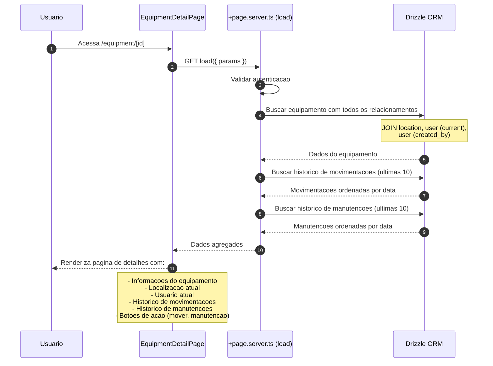

### Schema

A funcionalidade utiliza as seguintes tabelas:

- `equipment`: Armazena equipamentos com informacoes detalhadas (nome, descricao, numero de serie, categoria, status, localizacao atual, usuario atual)
- `location`: Armazena localizacoes (departamentos, salas, etc)
- `equipment_movement`: Registro de todas as movimentacoes de equipamentos (origem, destino, executor, autorizador, motivo, status)
- `equipment_maintenance`: Registro de todas as manutencoes realizadas (tipo, descricao, custo, datas, status)

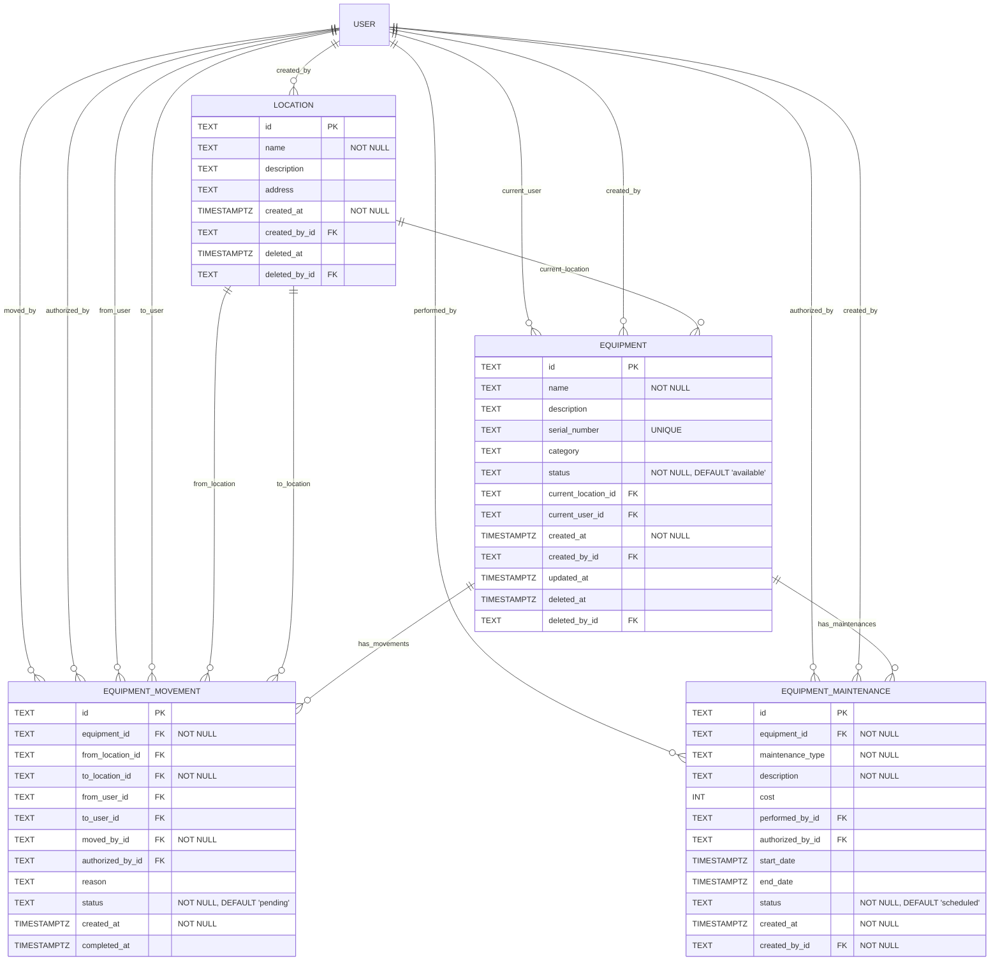

### Componentes

- `EquipmentCard.svelte`: Card para lista de equipamentos
- `EquipmentForm.svelte`: Formulario de cadastro/edicao
- `EquipmentDetailCard.svelte`: Card de detalhes do equipamento
- `MovementForm.svelte`: Formulario de movimentacao
- `MovementHistory.svelte`: Lista de historico de movimentacoes
- `MaintenanceForm.svelte`: Formulario de manutencao
- `MaintenanceHistory.svelte`: Lista de historico de manutencoes
- `LocationSelector.svelte`: Seletor de localizacao
- `UserSelector.svelte`: Seletor de usuario
- `StatusBadge.svelte`: Badge de status do equipamento

### Estrutura de Modulos

Seguindo o padrao do projeto, todo o modulo de equipamentos sera criado em `src/routes/equipment/`:

```
src/routes/equipment/
├── +page.server.ts          # Server-side logic principal
├── +page.svelte             # Lista de equipamentos
├── page.server.spec.ts      # Testes unitarios do servidor
├── page.spec.ts             # Testes unitarios do cliente
├── create/
│   ├── +page.server.ts      # Logica de criacao
│   ├── +page.svelte         # Formulario de cadastro
│   └── page.server.spec.ts  # Testes
├── [id]/
│   ├── +page.server.ts      # Detalhes do equipamento
│   ├── +page.svelte         # Visualizacao de detalhes
│   ├── page.server.spec.ts  # Testes
│   ├── move/
│   │   ├── +page.server.ts  # Logica de movimentacao
│   │   ├── +page.svelte     # Formulario de movimentacao
│   │   └── page.server.spec.ts
│   └── maintenance/
│       ├── +page.server.ts  # Logica de manutencao
│       ├── +page.svelte     # Formulario de manutencao
│       └── page.server.spec.ts
└── utils.server.ts          # Funcoes utilitarias compartilhadas
```

### Seguranca e Validacoes

#### Validacoes Server-Side

- **Criacao de equipamento:**
  - Nome obrigatorio (max 255 caracteres)
  - Serial number unico (se fornecido)
  - Usuario autenticado obrigatorio

- **Movimentacao:**
  - Equipamento deve existir
  - Localizacao de destino obrigatoria
  - Usuario executor deve estar autenticado
  - Se requer autorizacao, authorizedById deve ser valido

- **Manutencao:**
  - Equipamento deve existir
  - Tipo e descricao obrigatorios
  - Data de inicio nao pode ser futura (se status for completed)

#### Permissoes

- Todos os usuarios autenticados podem visualizar equipamentos
- Todos os usuarios autenticados podem criar equipamentos
- Todos os usuarios autenticados podem mover equipamentos
- Todos os usuarios autenticados podem registrar manutencoes
- Auditoria completa: todas as operacoes sao registradas em `audit_log`

### Localizacao

Todas as strings estao internacionalizadas em `messages/pt-br.json` e sincronizadas com outros idiomas via `project.inlang`.