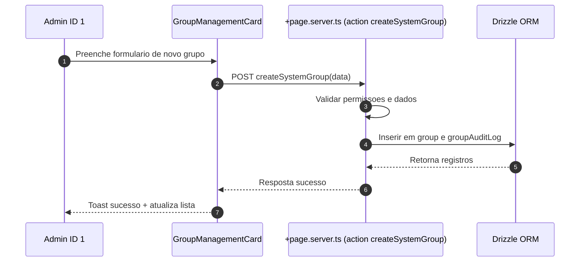
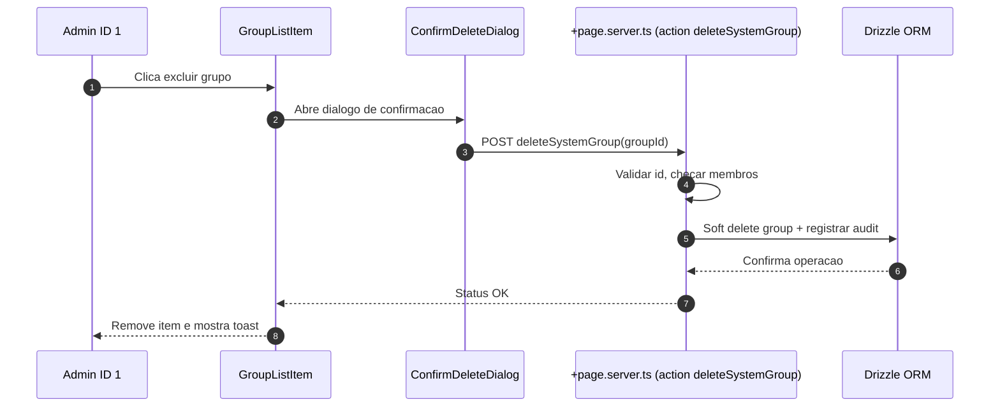
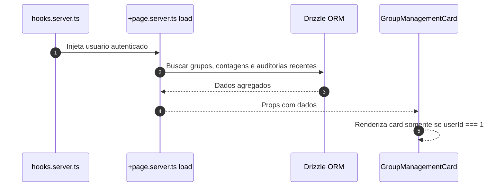
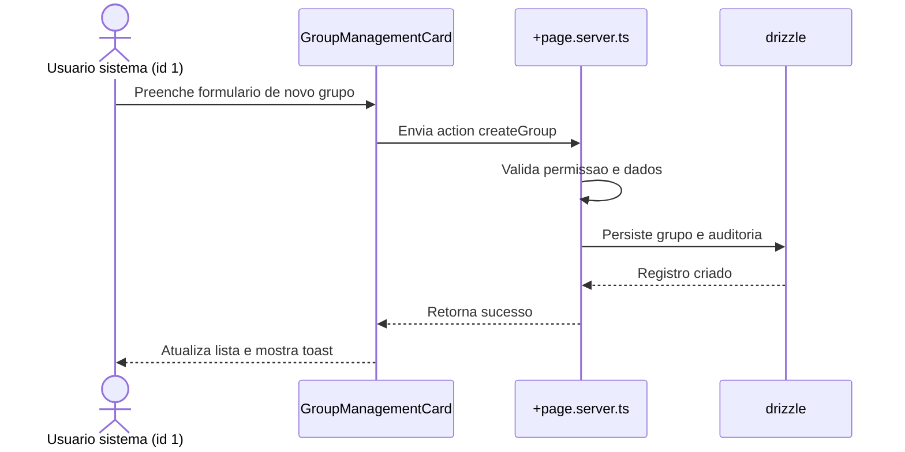
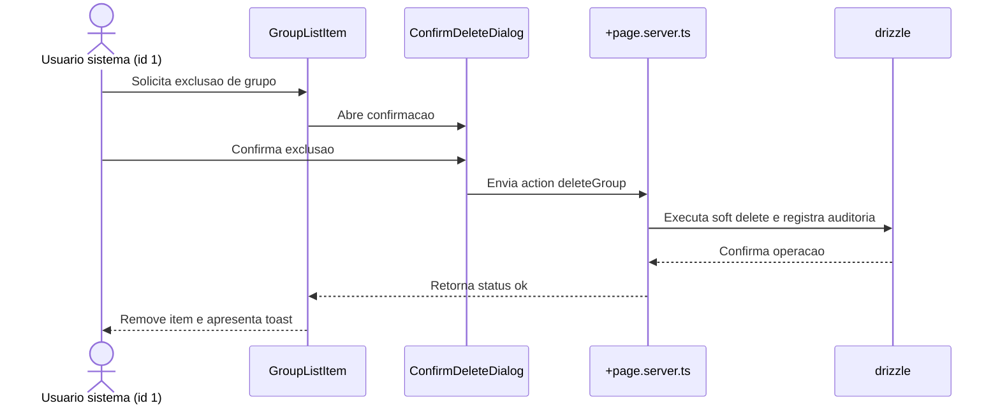
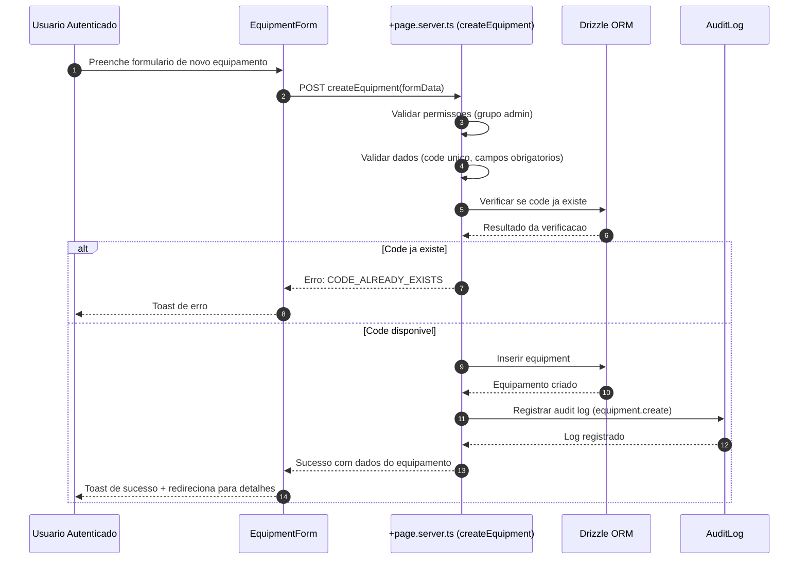
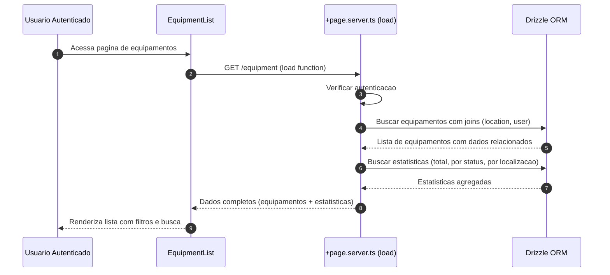
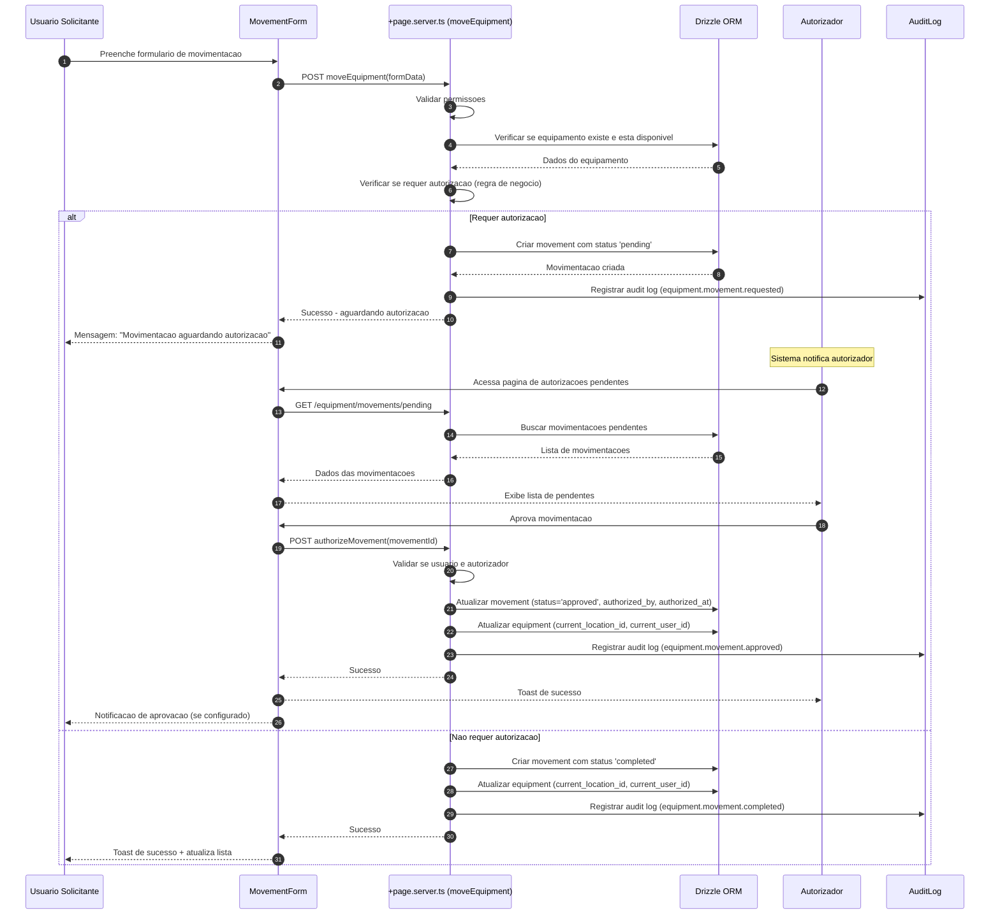
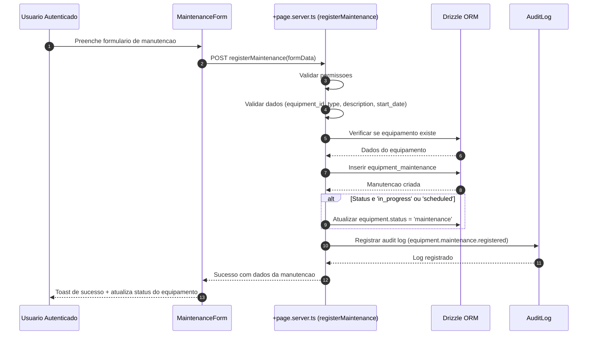
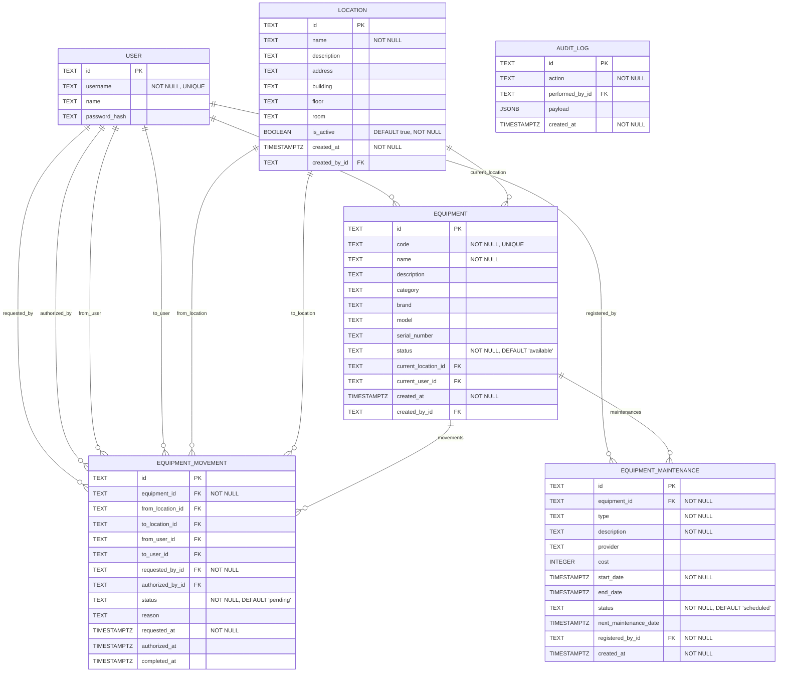

# Specification Document (use Mermaid.js, also use sequence diagrams)

> This document mirrors;

- SPEC.md
- src/routes/doc/spec/+page.md

---

## Gestao de Grupos pelo Usuario Sistema

### Descricao

Funcionalidade que permite ao usuario de sistema (ID = 1) gerenciar grupos diretamente na rota `user/profile`. O usuario sistema pode criar novos grupos e excluir grupos existentes, garantindo governanca, trilha de auditoria e integracao com as regras de permissao da plataforma.

### Requisitos

- Card exclusivo visivel apenas para `userId === 1`
- Formulario inline para criar grupo com nome e descricao opcionais
- Lista com grupos existentes, exibindo contadores de membros
- Acoes: criar, excluir (com confirm modal), e visualizar detalhes
- Feedback otimista e tratamento de erros com toasts
- Auditoria: registrar criador, timestamps, usuario responsavel pela exclusao

### Fluxos







### Schema

A funcionalidade utiliza as seguintes tabelas:

- `group`: Armazena grupos com campos de auditoria (description, createdAt, createdById, deletedAt, deletedById)
- `rel_group`: Relacionamento usuario-grupo com campos de auditoria (createdById, joinedAt)
- `group_audit_log`: Registro de todas as acoes realizadas nos grupos (create, delete)

### Componentes

- `GroupManagementCard.svelte`: Card principal que exibe lista de grupos e formulario de criacao
- `GroupForm.svelte`: Formulario inline para criar grupos (integrado no card)
- `GroupList.svelte` + `GroupListItem.svelte`: Lista e linha de grupo (integrado no card)
- `ConfirmDeleteDialog.svelte`: Dialogo de confirmacao para exclusao (usando AlertDialog do shadcn-svelte)

### Seguranca

- Validacao server-side: apenas usuario ID 1 pode executar as acoes
- Validacao de dados: nome obrigatorio (max 64 chars), descricao opcional (max 256 chars)
- Soft delete: grupos nao sao removidos fisicamente, apenas marcados como deletados
- Validacao de membros: nao permite excluir grupos que possuem membros
- Auditoria completa: todas as operacoes sao registradas em `group_audit_log`

### Localizacao

Todas as strings estao internacionalizadas em `messages/pt-br.json` e sincronizadas com outros idiomas via `project.inlang`.

---

## Funcionalidade: Gerenciamento de grupos do usuario sistema

### Contexto

- Permitir que o usuario mestre (id 1, criado no bootstrap da plataforma) gerencie grupos diretamente em `user/profile`.
- Manter rastreabilidade de quem executa cada acao e garantir mensagens internacionalizadas.
- Preservar arquitetura modular existente em `src/routes/user` e manter validacoes no backend com drizzle.

### Regras de negocio

- Card visivel somente quando `locals.user.id === '1'`.
- Acoes disponiveis: criar grupo com nome e descricao opcionais e excluir grupos existentes via confirmacao.
- Registrar auditoria de criacao e exclusao utilizando tabelas dedicadas.
- Impedir que grupos com membros ativos sejam removidos sem verificacoes adicionais.

### Implementacao

- `src/routes/user/profile/+page.svelte`: renderizar `GroupManagementCard` com formulario inline, lista de grupos e confirm modal.
- `src/routes/user/profile/+page.server.ts`: fornecer `load` com grupos e contagens, actions `createGroup` e `deleteGroup` protegidas por permissao do usuario mestre.
- `src/lib/components/user/GroupManagementCard.svelte` e subcomponentes `GroupForm`, `GroupList`, `GroupListItem`, `ConfirmDeleteDialog` para UI reutilizavel.
- `src/lib/utils/groups.ts`: validacoes de entrada (nome, descricao) e formatadores.
- `src/lib/db/schema.ts`: adicionar tabelas `group`, `userGroup` e `groupAuditLog` com campos de auditoria (createdAt, createdById, deletedAt, deletedById).
- Adicionar migracoes drizzle correspondentes e seeds iniciais quando necessario.
- Atualizar `messages/*.json` com chaves de texto (labels, tooltips, toasts) sincronizadas via `project.inlang`.

### Fluxo principal



### Fluxo de remocao



---

## Sistema de Gestao de Equipamentos

### Descricao

Sistema web de gestao de equipamentos que permite:

* **Autenticacao**: Integracao com o sistema de login e senha existente
* **Cadastro de Equipamentos**: Registro completo de equipamentos com informacoes detalhadas (codigo, descricao, categoria, status, etc.)
* **Visualizacao de Localizacao**: Interface para visualizar onde cada equipamento esta localizado atualmente
* **Rastreamento de Responsabilidades**: Exibicao de quem alocou o equipamento e quem autorizou sua movimentacao
* **Movimentacao de Equipamentos**: Funcionalidade para realizar transferencias de equipamentos entre locais/usuarios
* **Manutencao de Equipamentos**: Registro e acompanhamento de manutencoes preventivas e corretivas

### Requisitos

- Sistema web integrado com autenticacao existente
- Cadastro completo de equipamentos com codigo unico
- Rastreamento de localizacao atual de cada equipamento
- Sistema de movimentacao com autorizacao (quando necessario)
- Registro de manutencoes preventivas e corretivas
- Auditoria completa de todas as acoes
- Interface para visualizacao de historico de movimentacoes e manutencoes

### Fluxos

#### Fluxo 1: Cadastro de Equipamento



#### Fluxo 2: Visualizacao de Equipamentos e Localizacao



#### Fluxo 3: Movimentacao de Equipamento (Com Autorizacao)



#### Fluxo 4: Registro de Manutencao



### Schema

A funcionalidade utiliza as seguintes tabelas:

#### Tabela: `equipment`

Armazena informacoes dos equipamentos:

- `id`: Identificador unico (PK)
- `code`: Codigo unico do equipamento (NOT NULL, UNIQUE)
- `name`: Nome/descricao (NOT NULL)
- `description`: Descricao detalhada
- `category`: Categoria (ex: informatica, mobiliario, etc)
- `brand`: Marca
- `model`: Modelo
- `serial_number`: Numero de serie
- `status`: Status do equipamento (available, in_use, maintenance, unavailable) - DEFAULT 'available'
- `current_location_id`: Referencia para localizacao atual (FK para location)
- `current_user_id`: Usuario atual responsavel (FK para user)
- `purchase_date`: Data de compra
- `purchase_value`: Valor em centavos
- `warranty_expiry`: Data de expiracao da garantia
- Campos de auditoria: `created_at`, `created_by_id`, `updated_at`, `updated_by_id`, `deleted_at`, `deleted_by_id`

#### Tabela: `location`

Armazena locais fisicos onde equipamentos podem estar:

- `id`: Identificador unico (PK)
- `name`: Nome do local (NOT NULL)
- `description`: Descricao
- `address`: Endereco completo (opcional)
- `building`: Predio/edificio
- `floor`: Andar
- `room`: Sala
- `is_active`: Indica se o local esta ativo (DEFAULT true)
- Campos de auditoria: `created_at`, `created_by_id`, `updated_at`, `deleted_at`

#### Tabela: `equipment_movement`

Registra todas as movimentacoes de equipamentos:

- `id`: Identificador unico (PK)
- `equipment_id`: Referencia ao equipamento (FK, NOT NULL)
- `from_location_id`: Local origem (FK para location)
- `to_location_id`: Local destino (FK para location)
- `from_user_id`: Usuario origem (FK para user)
- `to_user_id`: Usuario destino (FK para user)
- `requested_by_id`: Quem solicitou (FK para user, NOT NULL)
- `authorized_by_id`: Quem autorizou (FK para user)
- `status`: Status da movimentacao (pending, approved, rejected, completed) - DEFAULT 'pending'
- `reason`: Motivo da movimentacao
- `notes`: Observacoes adicionais
- `requested_at`: Data da solicitacao (NOT NULL, DEFAULT NOW)
- `authorized_at`: Data da autorizacao
- `completed_at`: Data da conclusao
- `created_at`: Data de criacao (NOT NULL, DEFAULT NOW)

#### Tabela: `equipment_maintenance`

Registra manutencoes de equipamentos:

- `id`: Identificador unico (PK)
- `equipment_id`: Referencia ao equipamento (FK, NOT NULL)
- `type`: Tipo de manutencao (preventive, corrective, calibration) - NOT NULL
- `description`: Descricao do servico (NOT NULL)
- `provider`: Fornecedor/prestador do servico
- `cost`: Custo em centavos
- `start_date`: Data de inicio (NOT NULL)
- `end_date`: Data de fim
- `status`: Status da manutencao (scheduled, in_progress, completed, cancelled) - DEFAULT 'scheduled'
- `next_maintenance_date`: Proxima data de manutencao (para manutencao preventiva)
- `notes`: Observacoes
- `registered_by_id`: Quem registrou (FK para user, NOT NULL)
- `created_at`: Data de criacao (NOT NULL, DEFAULT NOW)
- `updated_at`: Data de atualizacao

### Diagrama de Entidade-Relacionamento



### Componentes

Componentes reutilizaveis em `src/lib/components/equipment/`:

- `EquipmentList.svelte`: Lista de equipamentos com filtros
- `EquipmentCard.svelte`: Card de exibicao de equipamento
- `EquipmentForm.svelte`: Formulario de criacao/edicao
- `MovementForm.svelte`: Formulario de movimentacao
- `MaintenanceForm.svelte`: Formulario de manutencao
- `MovementHistory.svelte`: Historico de movimentacoes
- `MaintenanceHistory.svelte`: Historico de manutencoes
- `LocationTracker.svelte`: Rastreamento de localizacao atual
- `AuthorizationDialog.svelte`: Dialogo de autorizacao de movimentacao

### Estrutura de Modulos

O sistema sera organizado no modulo `equipment` seguindo a arquitetura do projeto:

```
src/routes/equipment/
├── +page.svelte                    # Lista principal de equipamentos
├── +page.server.ts                 # Server-side logic e actions
├── page.server.spec.ts             # Testes unitarios
├── [id]/
│   ├── +page.svelte               # Detalhes do equipamento
│   ├── +page.server.ts            # Load de dados do equipamento
│   ├── page.server.spec.ts        # Testes
│   ├── move/
│   │   ├── +page.svelte           # Formulario de movimentacao
│   │   ├── +page.server.ts        # Action de movimentacao
│   │   └── page.server.spec.ts    # Testes
│   └── maintenance/
│       ├── +page.svelte           # Formulario de manutencao
│       ├── +page.server.ts        # Action de manutencao
│       └── page.server.spec.ts    # Testes
├── create/
│   ├── +page.svelte               # Formulario de criacao
│   ├── +page.server.ts            # Action de criacao
│   └── page.server.spec.ts        # Testes
└── utils.server.ts                 # Funcoes utilitarias
```

### Seguranca

- Validacao server-side: verificar permissoes do usuario (grupos)
- Validacao de dados: codigo unico, campos obrigatorios
- Soft delete: equipamentos nao sao removidos fisicamente, apenas marcados como deletados
- Auditoria completa: todas as operacoes sao registradas em `audit_log`
- Autorizacao de movimentacoes: sistema de aprovação para movimentacoes quando necessario

### Localizacao

Todas as strings estao internacionalizadas em `messages/pt-br.json` e sincronizadas com outros idiomas via `project.inlang`.
