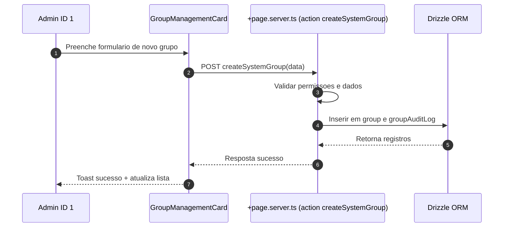
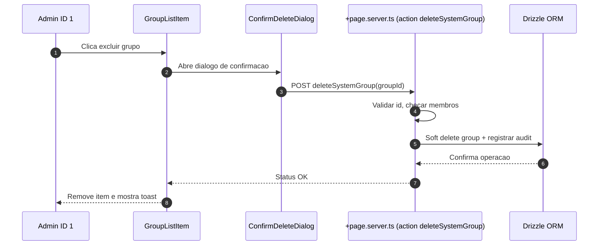
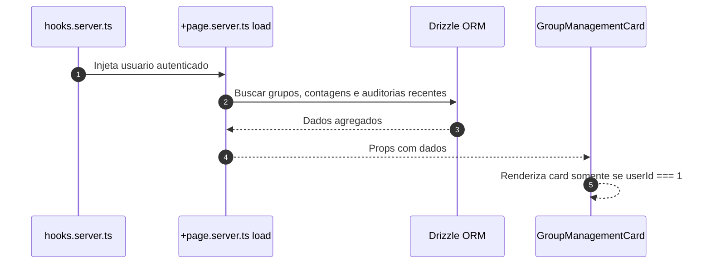
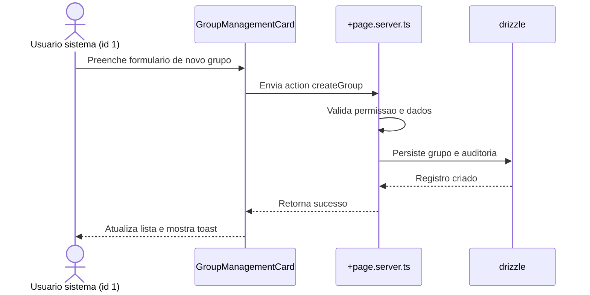
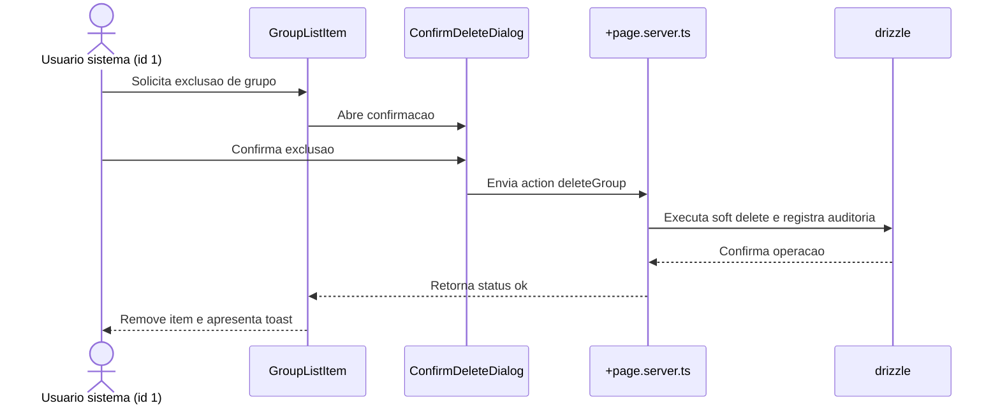
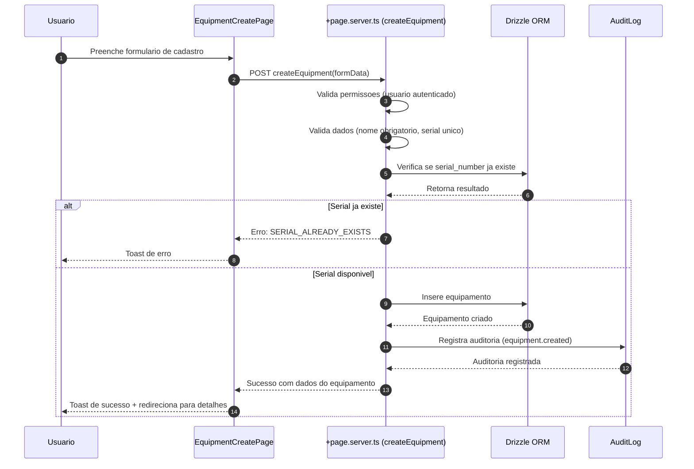
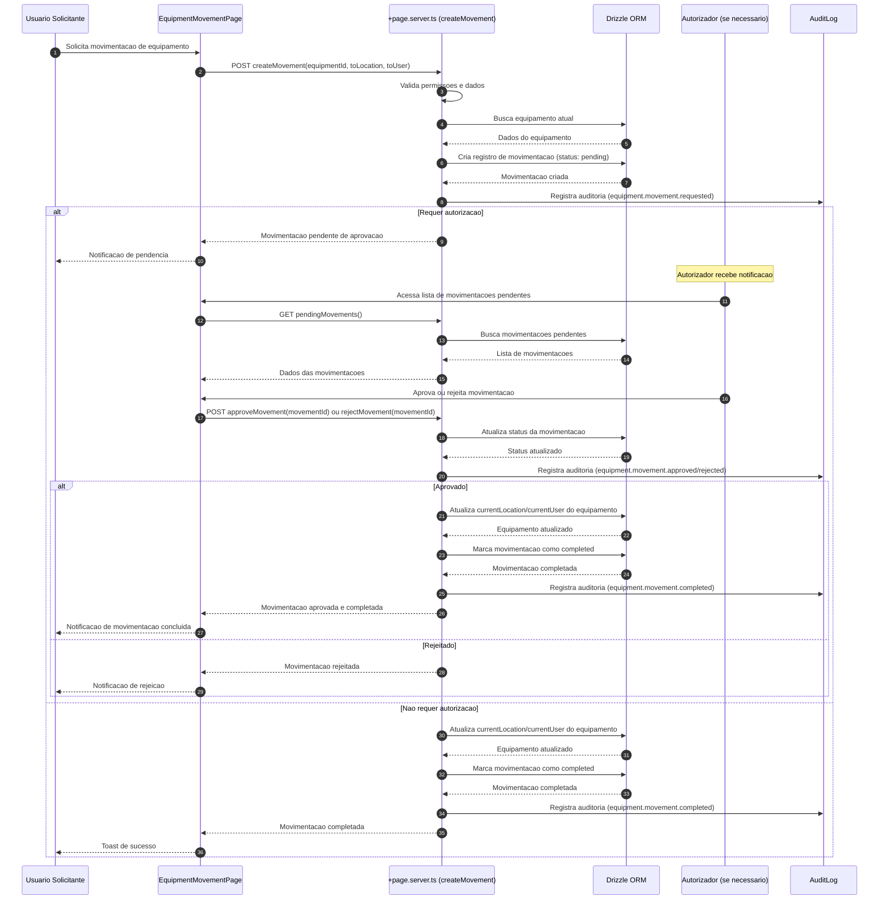
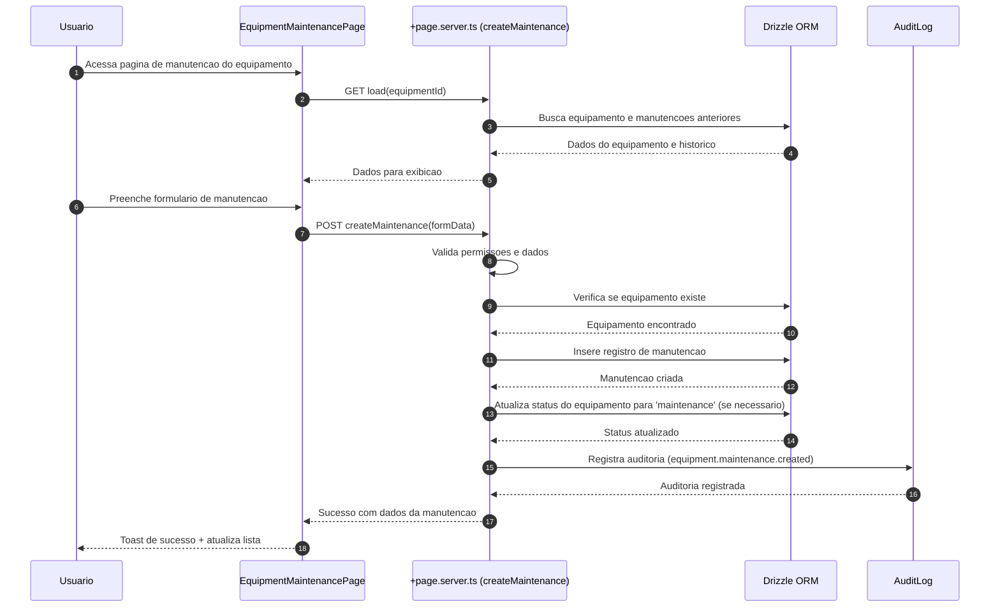
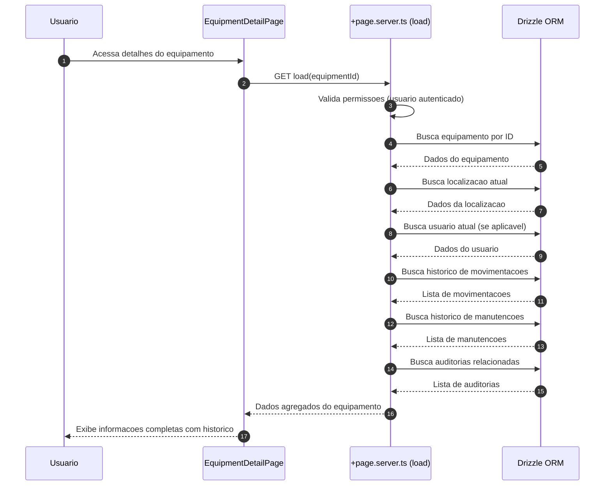
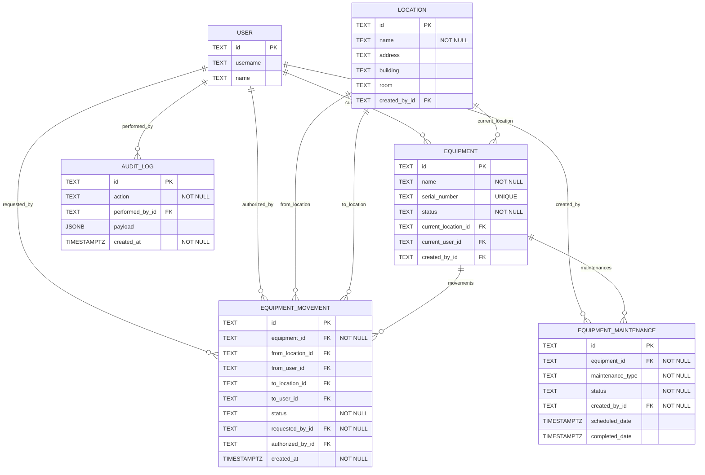

# Specification Document (use Mermaid.js, also use sequence diagrams)

> This document mirrors;

- SPEC.md
- src/routes/doc/spec/+page.md

---

## Gestao de Grupos pelo Usuario Sistema

### Descricao

Funcionalidade que permite ao usuario de sistema (ID = 1) gerenciar grupos diretamente na rota `user/profile`. O usuario sistema pode criar novos grupos e excluir grupos existentes, garantindo governanca, trilha de auditoria e integracao com as regras de permissao da plataforma.

### Requisitos

- Card exclusivo visivel apenas para `userId === 1`
- Formulario inline para criar grupo com nome e descricao opcionais
- Lista com grupos existentes, exibindo contadores de membros
- Acoes: criar, excluir (com confirm modal), e visualizar detalhes
- Feedback otimista e tratamento de erros com toasts
- Auditoria: registrar criador, timestamps, usuario responsavel pela exclusao

### Fluxos

### Schema

A funcionalidade utiliza as seguintes tabelas:

- `group`: Armazena grupos com campos de auditoria (description, createdAt, createdById, deletedAt, deletedById)
- `rel_group`: Relacionamento usuario-grupo com campos de auditoria (createdById, joinedAt)
- `group_audit_log`: Registro de todas as acoes realizadas nos grupos (create, delete)

### Componentes

- `GroupManagementCard.svelte`: Card principal que exibe lista de grupos e formulario de criacao
- `GroupForm.svelte`: Formulario inline para criar grupos (integrado no card)
- `GroupList.svelte` + `GroupListItem.svelte`: Lista e linha de grupo (integrado no card)
- `ConfirmDeleteDialog.svelte`: Dialogo de confirmacao para exclusao (usando AlertDialog do shadcn-svelte)

### Seguranca

- Validacao server-side: apenas usuario ID 1 pode executar as acoes
- Validacao de dados: nome obrigatorio (max 64 chars), descricao opcional (max 256 chars)
- Soft delete: grupos nao sao removidos fisicamente, apenas marcados como deletados
- Validacao de membros: nao permite excluir grupos que possuem membros
- Auditoria completa: todas as operacoes sao registradas em `group_audit_log`

### Localizacao

Todas as strings estao internacionalizadas em `messages/pt-br.json` e sincronizadas com outros idiomas via `project.inlang`.

---

## Funcionalidade: Gerenciamento de grupos do usuario sistema

### Contexto

- Permitir que o usuario mestre (id 1, criado no bootstrap da plataforma) gerencie grupos diretamente em `user/profile`.
- Manter rastreabilidade de quem executa cada acao e garantir mensagens internacionalizadas.
- Preservar arquitetura modular existente em `src/routes/user` e manter validacoes no backend com drizzle.

### Regras de negocio

- Card visivel somente quando `locals.user.id === '1'`.
- Acoes disponiveis: criar grupo com nome e descricao opcionais e excluir grupos existentes via confirmacao.
- Registrar auditoria de criacao e exclusao utilizando tabelas dedicadas.
- Impedir que grupos com membros ativos sejam removidos sem verificacoes adicionais.

### Implementacao

- `src/routes/user/profile/+page.svelte`: renderizar `GroupManagementCard` com formulario inline, lista de grupos e confirm modal.
- `src/routes/user/profile/+page.server.ts`: fornecer `load` com grupos e contagens, actions `createGroup` e `deleteGroup` protegidas por permissao do usuario mestre.
- `src/lib/components/user/GroupManagementCard.svelte` e subcomponentes `GroupForm`, `GroupList`, `GroupListItem`, `ConfirmDeleteDialog` para UI reutilizavel.
- `src/lib/utils/groups.ts`: validacoes de entrada (nome, descricao) e formatadores.
- `src/lib/db/schema.ts`: adicionar tabelas `group`, `userGroup` e `groupAuditLog` com campos de auditoria (createdAt, createdById, deletedAt, deletedById).
- Adicionar migracoes drizzle correspondentes e seeds iniciais quando necessario.
- Atualizar `messages/*.json` com chaves de texto (labels, tooltips, toasts) sincronizadas via `project.inlang`.

### Fluxo principal

### Fluxo de remocao

---

## Sistema de Gestao de Equipamentos

### Descricao

Sistema completo de gestao de equipamentos que permite cadastro, rastreamento de localizacao, movimentacao entre locais/usuarios, autorizacao de movimentacoes e gestao de manutencao preventiva e corretiva.

### Requisitos

- Cadastro de equipamentos com informacoes detalhadas (nome, descricao, numero de serie, modelo, fabricante, categoria, status)
- Rastreamento de localizacao atual de cada equipamento
- Visualizacao de quem alocou e quem autorizou movimentacoes
- Sistema de movimentacao de equipamentos entre locais/usuarios
- Autorizacao de movimentacoes (quando necessario)
- Historico completo de movimentacoes e manutencoes
- Gestao de manutencao preventiva e corretiva
- Auditoria completa de todas as operacoes

### Fluxos

#### Fluxo de Cadastro de Equipamento

#### Fluxo de Movimentacao de Equipamento

#### Fluxo de Registro de Manutencao

#### Fluxo de Visualizacao de Equipamento e Historico

### Schema

O sistema utiliza as seguintes tabelas:

- `equipment`: Armazena equipamentos com informacoes detalhadas (nome, descricao, numero de serie, modelo, fabricante, categoria, status, localizacao atual, usuario atual)
- `location`: Armazena localizacoes fisicas (nome, descricao, endereco, predio, andar, sala)
- `equipment_movement`: Registro de movimentacoes entre locais/usuarios (origem, destino, status, solicitante, autorizador)
- `equipment_maintenance`: Registro de manutencoes preventivas e corretivas (tipo, descricao, status, datas, custo, tecnico)
- `audit_log`: Registro de auditoria de todas as operacoes

#### Diagrama ER

### Componentes

- `EquipmentList.svelte`: Lista de equipamentos com filtros e busca
- `EquipmentCard.svelte`: Card individual de equipamento
- `EquipmentForm.svelte`: Formulario de cadastro/edicao
- `EquipmentDetail.svelte`: Visualizacao detalhada
- `MovementForm.svelte`: Formulario de movimentacao
- `MovementHistory.svelte`: Lista de movimentacoes
- `MaintenanceForm.svelte`: Formulario de manutencao
- `MaintenanceHistory.svelte`: Lista de manutencoes
- `LocationSelector.svelte`: Seletor de localizacao
- `UserSelector.svelte`: Seletor de usuario
- `StatusBadge.svelte`: Badge de status do equipamento
- `ApprovalDialog.svelte`: Dialogo de aprovacao/rejeicao

### Seguranca

- Validacao server-side: apenas usuarios autenticados podem executar acoes
- Validacao de dados: nome obrigatorio, numero de serie unico
- Soft delete: equipamentos nao sao removidos fisicamente, apenas marcados como deletados
- Auditoria completa: todas as operacoes sao registradas em `audit_log`
- Controle de autorizacao: movimentacoes podem requerer aprovacao de autorizador

### Localizacao

Todas as strings estao internacionalizadas em `messages/pt-br.json` e sincronizadas com outros idiomas via `project.inlang`.
