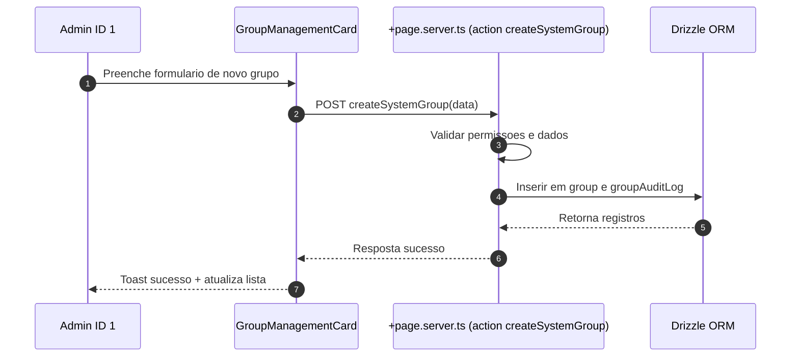
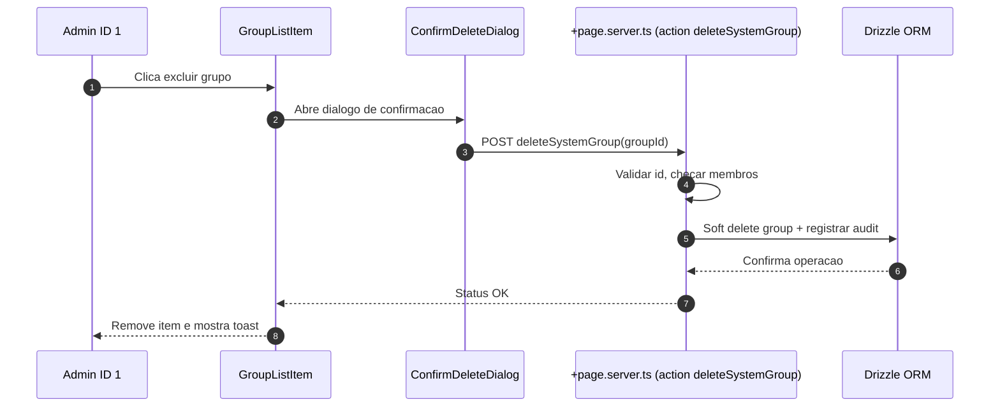
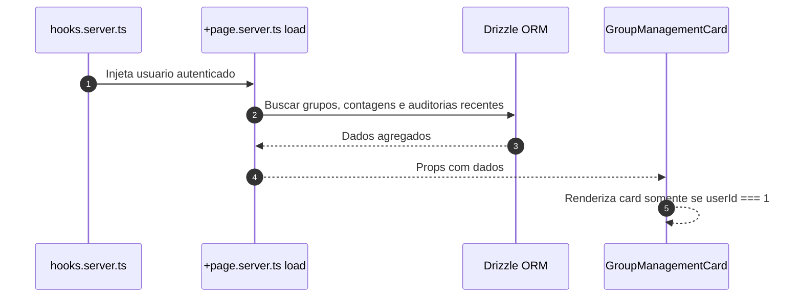
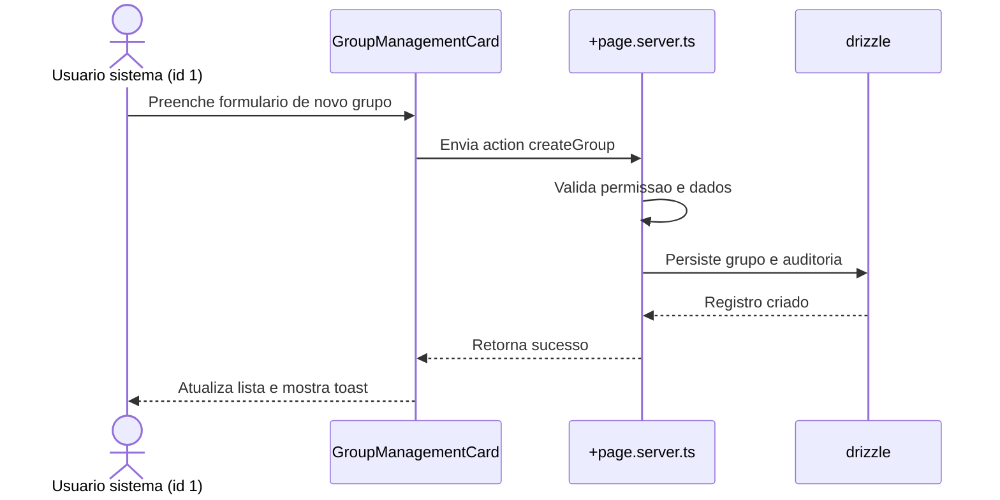
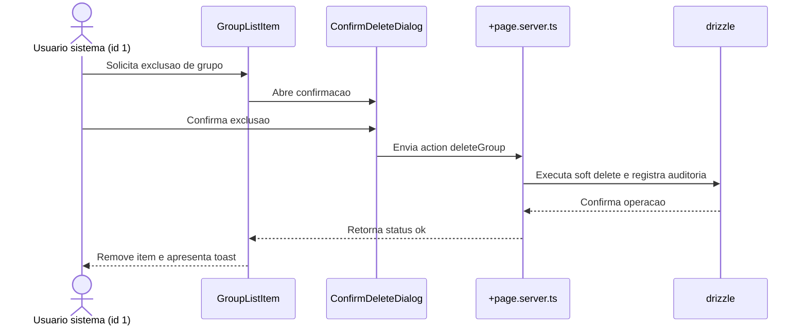
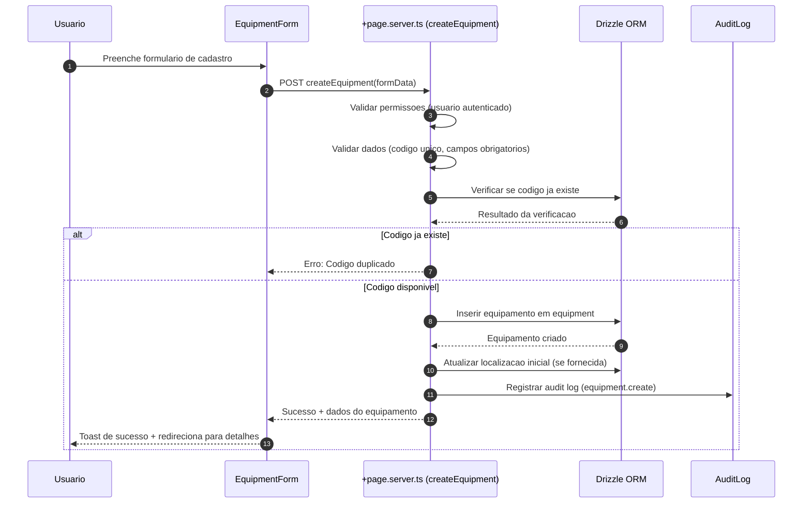
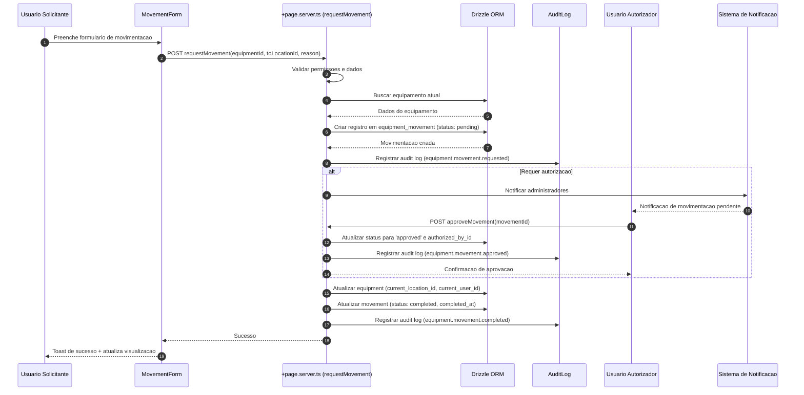
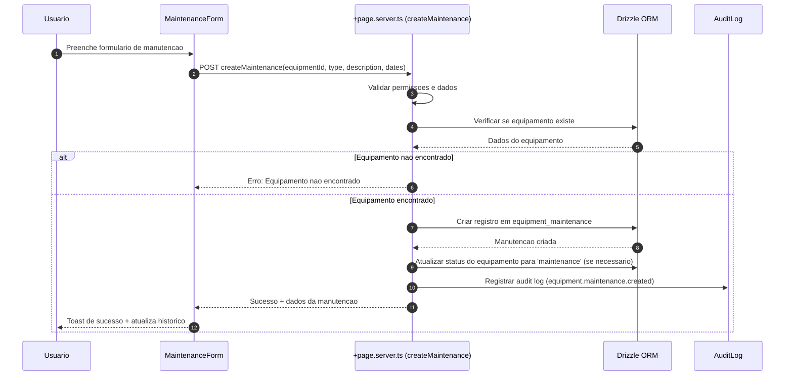

# Specification Document (use Mermaid.js, also use sequence diagrams)

> This document mirrors;

- SPEC.md
- src/routes/doc/spec/+page.md

---

## Gestao de Grupos pelo Usuario Sistema

### Descricao

Funcionalidade que permite ao usuario de sistema (ID = 1) gerenciar grupos diretamente na rota `user/profile`. O usuario sistema pode criar novos grupos e excluir grupos existentes, garantindo governanca, trilha de auditoria e integracao com as regras de permissao da plataforma.

### Requisitos

- Card exclusivo visivel apenas para `userId === 1`
- Formulario inline para criar grupo com nome e descricao opcionais
- Lista com grupos existentes, exibindo contadores de membros
- Acoes: criar, excluir (com confirm modal), e visualizar detalhes
- Feedback otimista e tratamento de erros com toasts
- Auditoria: registrar criador, timestamps, usuario responsavel pela exclusao

### Fluxos

### Schema

A funcionalidade utiliza as seguintes tabelas:

- `group`: Armazena grupos com campos de auditoria (description, createdAt, createdById, deletedAt, deletedById)
- `rel_group`: Relacionamento usuario-grupo com campos de auditoria (createdById, joinedAt)
- `group_audit_log`: Registro de todas as acoes realizadas nos grupos (create, delete)

### Componentes

- `GroupManagementCard.svelte`: Card principal que exibe lista de grupos e formulario de criacao
- `GroupForm.svelte`: Formulario inline para criar grupos (integrado no card)
- `GroupList.svelte` + `GroupListItem.svelte`: Lista e linha de grupo (integrado no card)
- `ConfirmDeleteDialog.svelte`: Dialogo de confirmacao para exclusao (usando AlertDialog do shadcn-svelte)

### Seguranca

- Validacao server-side: apenas usuario ID 1 pode executar as acoes
- Validacao de dados: nome obrigatorio (max 64 chars), descricao opcional (max 256 chars)
- Soft delete: grupos nao sao removidos fisicamente, apenas marcados como deletados
- Validacao de membros: nao permite excluir grupos que possuem membros
- Auditoria completa: todas as operacoes sao registradas em `group_audit_log`

### Localizacao

Todas as strings estao internacionalizadas em `messages/pt-br.json` e sincronizadas com outros idiomas via `project.inlang`.

---

## Funcionalidade: Gerenciamento de grupos do usuario sistema

### Contexto

- Permitir que o usuario mestre (id 1, criado no bootstrap da plataforma) gerencie grupos diretamente em `user/profile`.
- Manter rastreabilidade de quem executa cada acao e garantir mensagens internacionalizadas.
- Preservar arquitetura modular existente em `src/routes/user` e manter validacoes no backend com drizzle.

### Regras de negocio

- Card visivel somente quando `locals.user.id === '1'`.
- Acoes disponiveis: criar grupo com nome e descricao opcionais e excluir grupos existentes via confirmacao.
- Registrar auditoria de criacao e exclusao utilizando tabelas dedicadas.
- Impedir que grupos com membros ativos sejam removidos sem verificacoes adicionais.

### Implementacao

- `src/routes/user/profile/+page.svelte`: renderizar `GroupManagementCard` com formulario inline, lista de grupos e confirm modal.
- `src/routes/user/profile/+page.server.ts`: fornecer `load` com grupos e contagens, actions `createGroup` e `deleteGroup` protegidas por permissao do usuario mestre.
- `src/lib/components/user/GroupManagementCard.svelte` e subcomponentes `GroupForm`, `GroupList`, `GroupListItem`, `ConfirmDeleteDialog` para UI reutilizavel.
- `src/lib/utils/groups.ts`: validacoes de entrada (nome, descricao) e formatadores.
- `src/lib/db/schema.ts`: adicionar tabelas `group`, `userGroup` e `groupAuditLog` com campos de auditoria (createdAt, createdById, deletedAt, deletedById).
- Adicionar migracoes drizzle correspondentes e seeds iniciais quando necessario.
- Atualizar `messages/*.json` com chaves de texto (labels, tooltips, toasts) sincronizadas via `project.inlang`.

### Fluxo principal

### Fluxo de remocao

---

## Sistema de Gestao de Equipamentos

### Descricao

Sistema web para gestao completa de equipamentos com as seguintes funcionalidades:

* Interface web responsiva
* Autenticacao de usuarios (login e senha)
* Cadastro completo de equipamentos com informacoes detalhadas
* Visualizacao da localizacao atual de cada equipamento
* Rastreamento de quem alocou e quem autorizou cada movimentacao
* Sistema de solicitacao e autorizacao de movimentacoes de equipamentos
* Registro e acompanhamento de manutencoes de equipamentos

### Requisitos

- Cadastro de equipamentos com codigo unico, nome, descricao, categoria, marca, modelo, numero de serie, numero de patrimonio
- Gestao de localizacoes (predio, andar, sala, endereco)
- Sistema de movimentacao com solicitacao, autorizacao e conclusao
- Registro de manutencoes (preventiva, corretiva, preditiva)
- Historico completo de movimentacoes e manutencoes
- Rastreamento de responsaveis (quem alocou, quem autorizou)
- Auditoria completa de todas as operacoes

### Fluxos

#### Fluxo: Cadastro de Equipamento

#### Fluxo: Movimentacao de Equipamento

#### Fluxo: Registro de Manutencao

### Schema

#### Tabela: `equipment` (Equipamentos)

- `id`: Identificador unico (PK)
- `code`: Codigo unico do equipamento (NOT NULL, UNIQUE)
- `name`: Nome do equipamento (NOT NULL)
- `description`: Descricao detalhada
- `category`: Categoria (ex: Informatica, Mobiliario, etc)
- `brand`: Marca
- `model`: Modelo
- `serialNumber`: Numero de serie
- `patrimonyNumber`: Numero de patrimonio
- `purchaseDate`: Data de compra
- `purchaseValue`: Valor de compra
- `supplier`: Fornecedor
- `warrantyExpiry`: Fim da garantia
- `status`: Status (available, in_use, maintenance, retired) - DEFAULT 'available'
- `currentLocationId`: Localizacao atual (FK para location)
- `currentUserId`: Usuario responsavel atual (FK para user)
- `notes`: Observacoes gerais
- Campos de auditoria: `createdAt`, `createdById`, `updatedAt`, `updatedById`, `deletedAt`, `deletedById`

#### Tabela: `location` (Localizacoes)

- `id`: Identificador unico (PK)
- `name`: Nome da localizacao (NOT NULL)
- `description`: Descricao da localizacao
- `address`: Endereco completo
- `building`: Predio
- `floor`: Andar
- `room`: Sala
- `isActive`: Status ativo (DEFAULT true)
- Campos de auditoria: `createdAt`, `createdById`, `updatedAt`, `updatedById`

#### Tabela: `equipment_movement` (Movimentacoes)

- `id`: Identificador unico (PK)
- `equipmentId`: Equipamento (FK, NOT NULL)
- `fromLocationId`: Localizacao origem (FK)
- `toLocationId`: Localizacao destino (FK, NOT NULL)
- `fromUserId`: Usuario origem (FK)
- `toUserId`: Usuario destino (FK)
- `requestedById`: Quem solicitou (FK, NOT NULL)
- `authorizedById`: Quem autorizou (FK)
- `status`: Status (pending, approved, rejected, completed) - DEFAULT 'pending'
- `reason`: Motivo da movimentacao
- `requestedAt`: Data da solicitacao (NOT NULL)
- `authorizedAt`: Data da autorizacao
- `completedAt`: Data da conclusao
- `notes`: Observacoes
- `createdAt`: Data de criacao (NOT NULL)

#### Tabela: `equipment_maintenance` (Manutencoes)

- `id`: Identificador unico (PK)
- `equipmentId`: Equipamento (FK, NOT NULL)
- `type`: Tipo (preventive, corrective, predictive) - NOT NULL
- `description`: Descricao da manutencao (NOT NULL)
- `cost`: Custo da manutencao
- `supplier`: Fornecedor/prestador do servico
- `startDate`: Data de inicio (NOT NULL)
- `endDate`: Data de fim
- `nextMaintenanceDate`: Proxima manutencao
- `status`: Status (scheduled, in_progress, completed, cancelled) - DEFAULT 'scheduled'
- `performedById`: Quem realizou (FK)
- `registeredById`: Quem registrou (FK, NOT NULL)
- `notes`: Observacoes
- `createdAt`: Data de criacao (NOT NULL)

### Componentes

#### Paginas

- `/equipment`: Listagem de equipamentos com filtros e busca
- `/equipment/[id]`: Detalhes do equipamento com historico
- `/equipment/new`: Cadastro de novo equipamento
- `/equipment/[id]/edit`: Edicao de equipamento
- `/equipment/[id]/move`: Movimentacao de equipamento
- `/equipment/[id]/maintenance`: Registro de manutencao
- `/equipment/history`: Historico e relatorios

#### Componentes Svelte

- `EquipmentList.svelte`: Lista principal de equipamentos
- `EquipmentCard.svelte`: Card individual de equipamento
- `EquipmentFilters.svelte`: Filtros e busca
- `EquipmentForm.svelte`: Formulario de cadastro/edicao
- `MovementForm.svelte`: Formulario de movimentacao
- `MaintenanceForm.svelte`: Formulario de manutencao
- `EquipmentDetails.svelte`: Detalhes do equipamento
- `MovementHistory.svelte`: Historico de movimentacoes
- `MaintenanceHistory.svelte`: Historico de manutencoes
- `LocationSelector.svelte`: Seletor de localizacao
- `MovementApprovalDialog.svelte`: Dialogo de aprovacao

### Seguranca

- Validacao server-side: apenas usuarios autenticados podem acessar
- Validacao de dados: codigo unico obrigatorio, campos validados
- Soft delete: equipamentos nao sao removidos fisicamente
- Auditoria completa: todas as operacoes sao registradas em `audit_log`
- Controle de permissoes: movimentacoes podem requerer autorizacao

### Localizacao

Todas as strings estao internacionalizadas em `messages/pt-br.json` e sincronizadas com outros idiomas via `project.inlang`.
