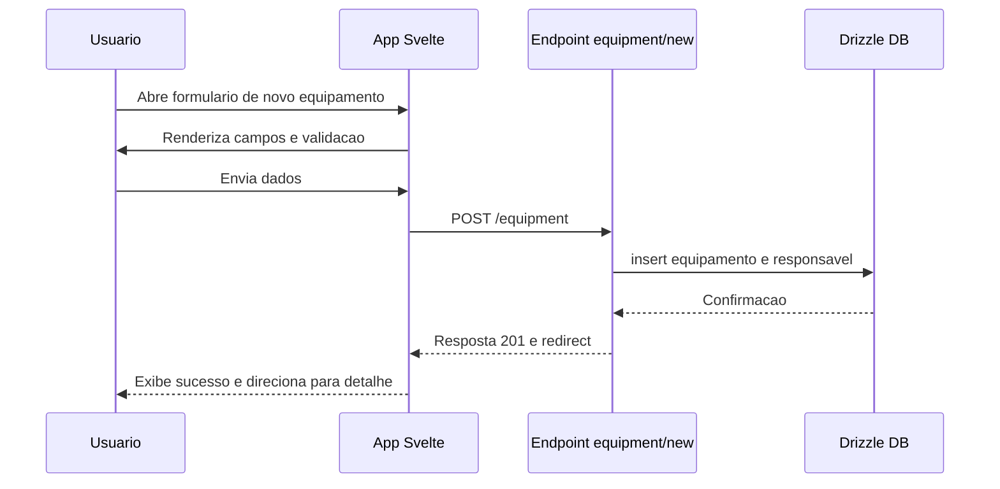
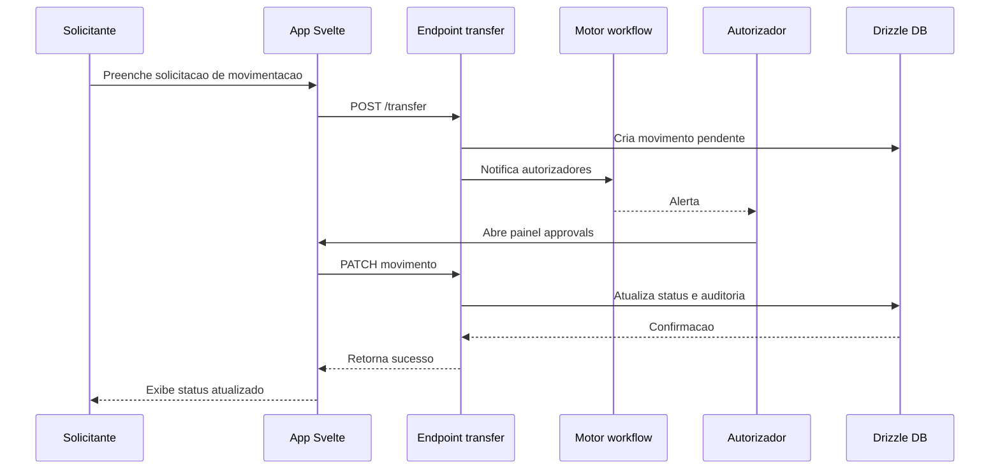
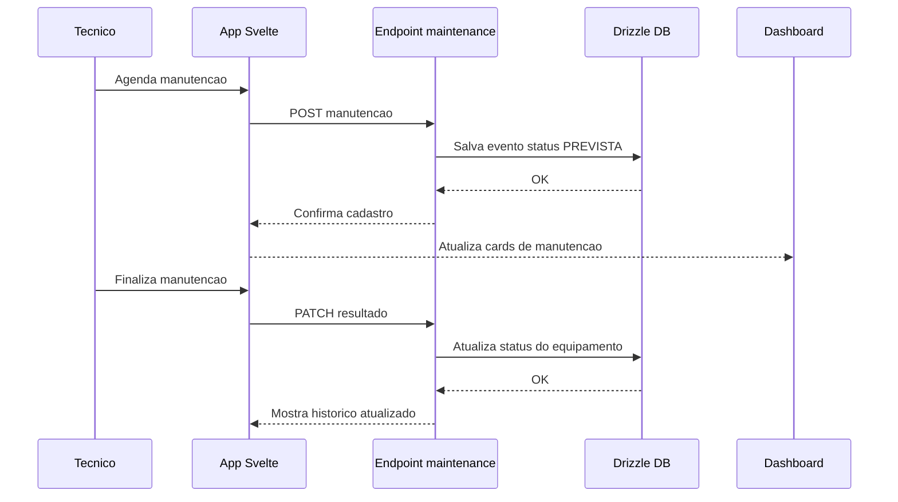

# Specification Document (use Mermaid.js, also use sequence diagrams)

> This document mirrors;

- SPEC.md
- src/routes/doc/spec/+page.md

---

## Modulo de Gestao de Equipamentos

### Visao Geral

- Plataforma web para controlar ciclo de vida de ativos corporativos com rastreabilidade ponta a ponta.
- Autenticacao obrigatoria reutilizando fluxo existente em `src/routes/user`.
- Painel operacional com indicadores em tempo real, filtros persistentes e cards de alerta.
- Fluxos auditaveis para cadastro, movimentacao, manutencao e definicao de politicas.

### Escopo Funcional

- **Dashboard operacional** (`src/routes/equipment/+page.svelte`): lista equipamentos consultando `+page.server.ts`, inclui cards de status, filtros persistidos via store e atalho para cadastros.
- **Cadastro e edicao** (`src/routes/equipment/new` e `src/routes/equipment/[id]/edit`): formularios com criticidade, localizacao, anexos e responsavel; actions server-side validam entradas.
- **Localizacoes** (`src/routes/equipment/locations`): CRUD hierarquico matriz > filial > sala com flags de atividade.
- **Detalhes e historico** (`src/routes/equipment/[id]` e `[id]/history`): resumo operacional, timeline completa e acessos rapidos para manutencao ou movimentacao.
- **Movimentacao** (`src/routes/equipment/[id]/transfer`): solicita origem/destino, motivo, aprovador; painel de aprovacao em `src/routes/equipment/approvals`.
- **Manutencao** (`src/routes/equipment/[id]/maintenance`): agenda preventiva/corretiva, acompanha execucao, anexa laudos e atualiza status operacional.
- **Relatorios** (`src/routes/equipment/reports/+page.server.ts`): exporta CSV seguindo filtros de categoria e status, preparando integracoes externas.
- **Politicas de aprovacao** (modeladas em `movement_policy`): mapeiam papeis, escopos e regras, usadas pelos endpoints de movimentacao.

### Componentes e Stores

- Store `equipmentFilters` (`src/lib/stores/equipment.ts`) persiste filtros em localStorage para manter contexto entre sessoes.
- Rotas utilizam componentes base do design system e cards responsivos para resumo rapido de status.
- Layout dedicado (`src/routes/equipment/+layout.*`) garante verificacao de autenticacao e injecao de breadcrumbs.

### Fluxos Principais

Fluxo de cadastro inicial:

Fluxo de solicitacao e aprovacao de movimentacao:

Fluxo de manutencao preventiva:

### Modelo de Dados e Politicas

- Tabelas `equipment`, `location`, `equipment_movement`, `equipment_maintenance`, `equipment_audit_log` e `movement_policy` definidas em `src/lib/db/schema.ts`.
- Enums dedicados controlam status, criticidade, tipos de manutencao e escopo de politicas.
- Layout server-side valida `event.locals.user` antes de expor dados sensiveis.
- Movimentacoes futuras devem consultar regras em `movement_policy` para determinar aprovadores.

### Testes e Validacao

- Cobertura unit test para stores (`src/lib/stores/equipment.spec.ts`) garantindo persistencia e reset de filtros.
- Suites existentes validam actions server-side das rotas de usuario; expandir para rotas de equipamento conforme endpoints evoluirem.
- E2E previstos em `e2e/equipment*.test.ts` para cenarios de cadastro, solicitacao multi-etapa e manutencao concluida.