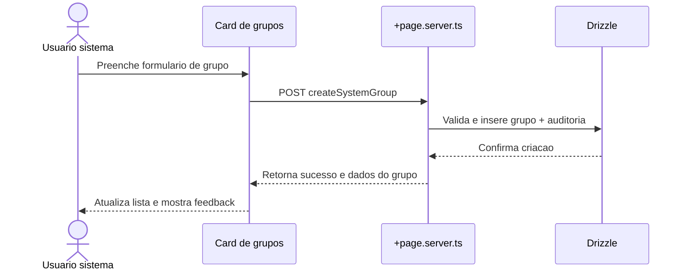
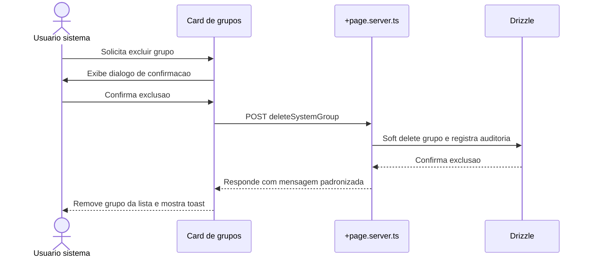

# Specification Document (use Mermaid.js, also use sequence diagrams)

> This document mirrors;

- SPEC.md
- src/routes/doc/spec/+page.md

---

## Gestao de grupos do usuario sistema

- Card novo em `user/profile` exibido somente quando `user.id === '1'`.
- Permite criar grupos com nome e descricao opcional, listar grupos ativos e acionar exclusao com confirmacao.
- Acoes usam `+page.server.ts` com validacao de permissao, feedback estruturado e auditoria em tabela dedicada.
- Todas as mensagens seguem traducoes em `messages/*` para manter consistencia multilingue.

