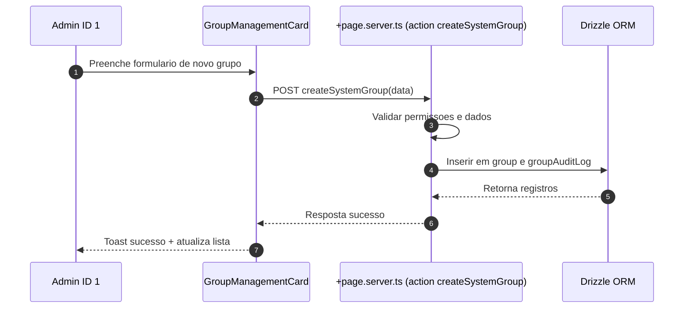
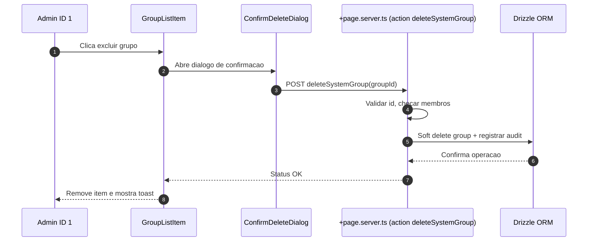
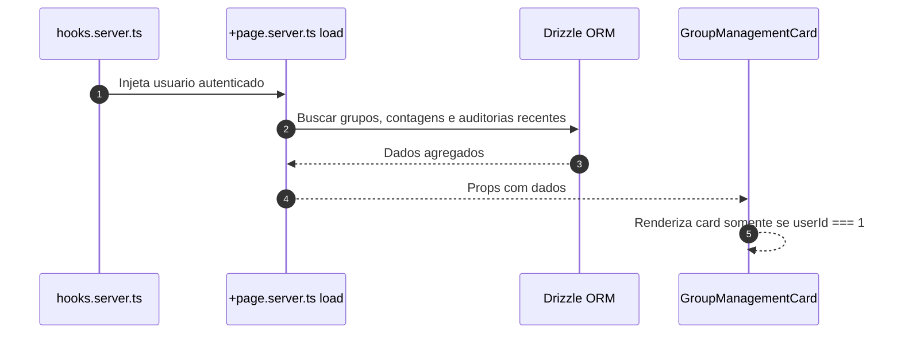
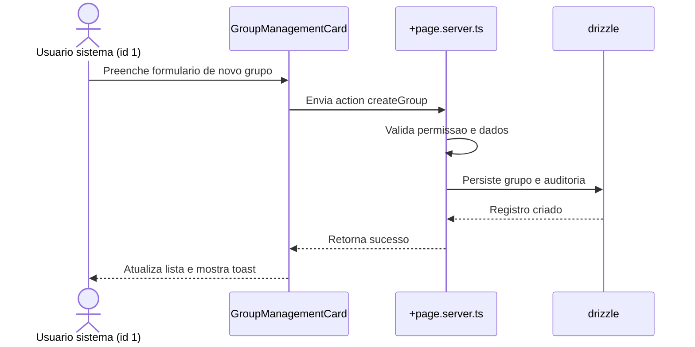
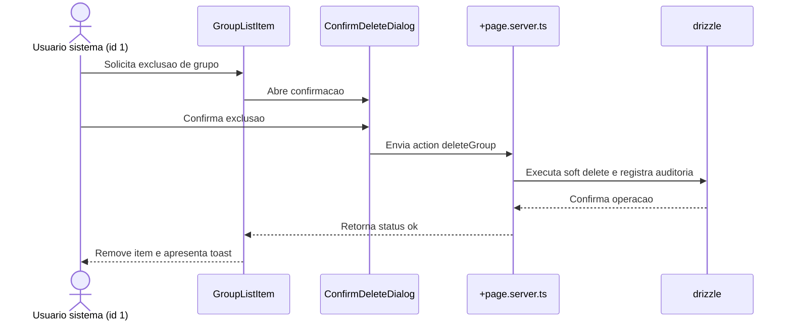
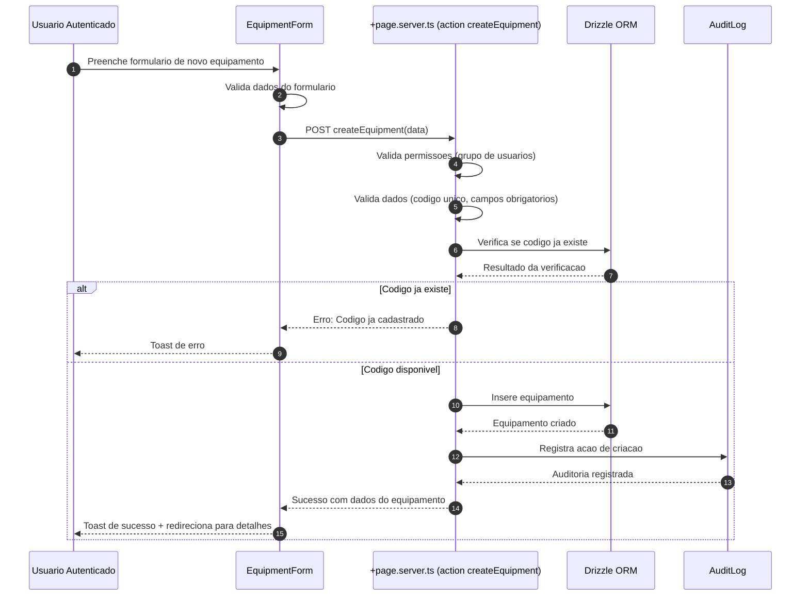
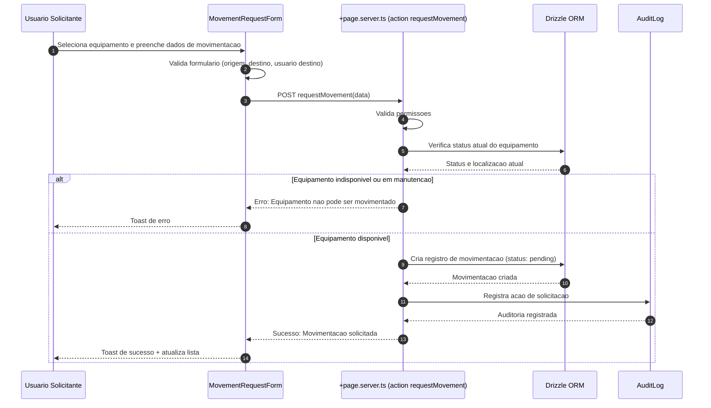
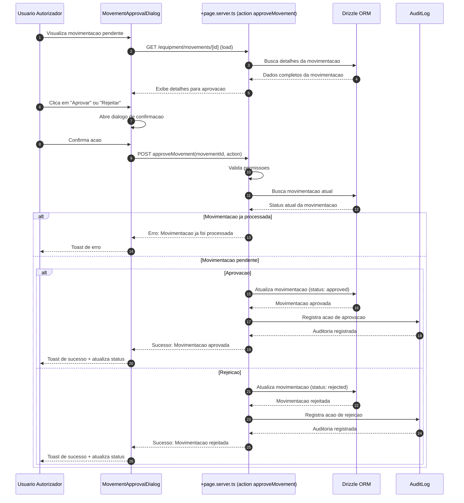
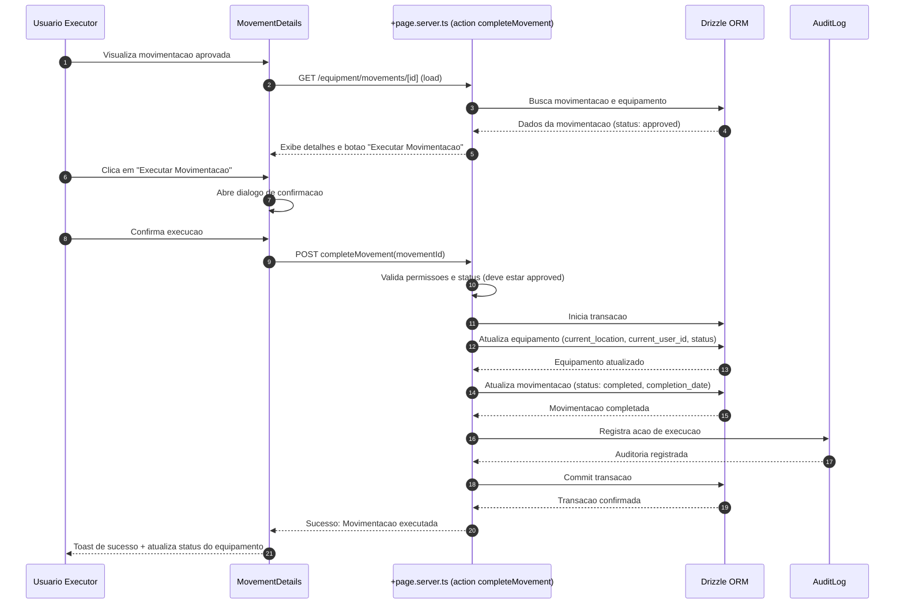

# Specification Document (use Mermaid.js, also use sequence diagrams)

> This document mirrors;

- SPEC.md
- src/routes/doc/spec/+page.md

---

## Gestao de Grupos pelo Usuario Sistema

### Descricao

Funcionalidade que permite ao usuario de sistema (ID = 1) gerenciar grupos diretamente na rota `user/profile`. O usuario sistema pode criar novos grupos e excluir grupos existentes, garantindo governanca, trilha de auditoria e integracao com as regras de permissao da plataforma.

### Requisitos

- Card exclusivo visivel apenas para `userId === 1`
- Formulario inline para criar grupo com nome e descricao opcionais
- Lista com grupos existentes, exibindo contadores de membros
- Acoes: criar, excluir (com confirm modal), e visualizar detalhes
- Feedback otimista e tratamento de erros com toasts
- Auditoria: registrar criador, timestamps, usuario responsavel pela exclusao

### Fluxos







### Schema

A funcionalidade utiliza as seguintes tabelas:

- `group`: Armazena grupos com campos de auditoria (description, createdAt, createdById, deletedAt, deletedById)
- `rel_group`: Relacionamento usuario-grupo com campos de auditoria (createdById, joinedAt)
- `group_audit_log`: Registro de todas as acoes realizadas nos grupos (create, delete)

### Componentes

- `GroupManagementCard.svelte`: Card principal que exibe lista de grupos e formulario de criacao
- `GroupForm.svelte`: Formulario inline para criar grupos (integrado no card)
- `GroupList.svelte` + `GroupListItem.svelte`: Lista e linha de grupo (integrado no card)
- `ConfirmDeleteDialog.svelte`: Dialogo de confirmacao para exclusao (usando AlertDialog do shadcn-svelte)

### Seguranca

- Validacao server-side: apenas usuario ID 1 pode executar as acoes
- Validacao de dados: nome obrigatorio (max 64 chars), descricao opcional (max 256 chars)
- Soft delete: grupos nao sao removidos fisicamente, apenas marcados como deletados
- Validacao de membros: nao permite excluir grupos que possuem membros
- Auditoria completa: todas as operacoes sao registradas em `group_audit_log`

### Localizacao

Todas as strings estao internacionalizadas em `messages/pt-br.json` e sincronizadas com outros idiomas via `project.inlang`.

---

## Funcionalidade: Gerenciamento de grupos do usuario sistema

### Contexto

- Permitir que o usuario mestre (id 1, criado no bootstrap da plataforma) gerencie grupos diretamente em `user/profile`.
- Manter rastreabilidade de quem executa cada acao e garantir mensagens internacionalizadas.
- Preservar arquitetura modular existente em `src/routes/user` e manter validacoes no backend com drizzle.

### Regras de negocio

- Card visivel somente quando `locals.user.id === '1'`.
- Acoes disponiveis: criar grupo com nome e descricao opcionais e excluir grupos existentes via confirmacao.
- Registrar auditoria de criacao e exclusao utilizando tabelas dedicadas.
- Impedir que grupos com membros ativos sejam removidos sem verificacoes adicionais.

### Implementacao

- `src/routes/user/profile/+page.svelte`: renderizar `GroupManagementCard` com formulario inline, lista de grupos e confirm modal.
- `src/routes/user/profile/+page.server.ts`: fornecer `load` com grupos e contagens, actions `createGroup` e `deleteGroup` protegidas por permissao do usuario mestre.
- `src/lib/components/user/GroupManagementCard.svelte` e subcomponentes `GroupForm`, `GroupList`, `GroupListItem`, `ConfirmDeleteDialog` para UI reutilizavel.
- `src/lib/utils/groups.ts`: validacoes de entrada (nome, descricao) e formatadores.
- `src/lib/db/schema.ts`: adicionar tabelas `group`, `userGroup` e `groupAuditLog` com campos de auditoria (createdAt, createdById, deletedAt, deletedById).
- Adicionar migracoes drizzle correspondentes e seeds iniciais quando necessario.
- Atualizar `messages/*.json` com chaves de texto (labels, tooltips, toasts) sincronizadas via `project.inlang`.

### Fluxo principal



### Fluxo de remocao



---

## Sistema de Gestao de Equipamentos

### Descricao

Sistema web completo para gestao de equipamentos com rastreabilidade de movimentacoes, controle de alocacao e registro de manutencoes. Permite que organizacoes controlem de forma eficiente o ciclo de vida completo de seus ativos fisicos.

### Requisitos

- **Autenticacao e Autorizacao**: Login com usuario e senha, controle de permissoes por grupo de usuarios, diferentes niveis de acesso
- **Cadastro de Equipamentos**: Criacao de equipamentos com informacoes completas (codigo unico, nome, categoria, fabricante, modelo, numero de serie, data de aquisicao, valor, status, localizacao, observacoes)
- **Visualizacao de Equipamentos**: Listagem com filtros e busca, visualizacao detalhada, historico completo de movimentacoes, informacoes de alocacao
- **Movimentacao de Equipamentos**: Solicitacao, aprovacao/autorizacao, execucao de movimentacoes, notificacoes, registro automatico de auditoria
- **Gestao de Manutencao**: Cadastro de manutencoes (preventiva/corretiva), agendamento, registro de historico, alertas, vinculacao a equipamentos

### Fluxos

#### Fluxo de Cadastro de Equipamento



#### Fluxo de Solicitacao de Movimentacao



#### Fluxo de Aprovacao de Movimentacao



#### Fluxo de Execucao de Movimentacao



### Schema

#### Tabela `equipment`

- `id`: TEXT PRIMARY KEY
- `code`: TEXT NOT NULL UNIQUE (codigo unico do equipamento)
- `name`: TEXT NOT NULL
- `description`: TEXT
- `category`: TEXT (categoria/tipo do equipamento)
- `manufacturer`: TEXT
- `model`: TEXT
- `serial_number`: TEXT
- `acquisition_date`: TIMESTAMPTZ
- `value`: INTEGER (valor em centavos)
- `status`: TEXT NOT NULL DEFAULT 'available' (available, allocated, maintenance, unavailable)
- `current_location`: TEXT
- `current_user_id`: TEXT FK -> user.id (usuario atual responsavel)
- `notes`: TEXT
- `created_at`: TIMESTAMPTZ NOT NULL DEFAULT NOW()
- `created_by_id`: TEXT FK -> user.id
- `updated_at`: TIMESTAMPTZ
- `updated_by_id`: TEXT FK -> user.id
- `deleted_at`: TIMESTAMPTZ
- `deleted_by_id`: TEXT FK -> user.id

#### Tabela `equipment_movement`

- `id`: TEXT PRIMARY KEY
- `equipment_id`: TEXT NOT NULL FK -> equipment.id
- `from_location`: TEXT
- `to_location`: TEXT NOT NULL
- `from_user_id`: TEXT FK -> user.id (usuario que tinha o equipamento)
- `to_user_id`: TEXT FK -> user.id (usuario que recebera o equipamento)
- `requested_by_id`: TEXT NOT NULL FK -> user.id (quem solicitou)
- `authorized_by_id`: TEXT FK -> user.id (quem autorizou)
- `status`: TEXT NOT NULL DEFAULT 'pending' (pending, approved, rejected, completed, cancelled)
- `request_date`: TIMESTAMPTZ NOT NULL DEFAULT NOW()
- `authorization_date`: TIMESTAMPTZ
- `completion_date`: TIMESTAMPTZ
- `notes`: TEXT
- `created_at`: TIMESTAMPTZ NOT NULL DEFAULT NOW()
- `created_by_id`: TEXT FK -> user.id

#### Tabela `equipment_maintenance`

- `id`: TEXT PRIMARY KEY
- `equipment_id`: TEXT NOT NULL FK -> equipment.id
- `type`: TEXT NOT NULL (preventive, corrective)
- `description`: TEXT NOT NULL
- `scheduled_date`: TIMESTAMPTZ
- `completed_date`: TIMESTAMPTZ
- `status`: TEXT NOT NULL DEFAULT 'scheduled' (scheduled, in_progress, completed, cancelled)
- `cost`: INTEGER (custo em centavos)
- `provider`: TEXT (fornecedor/prestador do servico)
- `technician`: TEXT (tecnico responsavel)
- `notes`: TEXT
- `created_at`: TIMESTAMPTZ NOT NULL DEFAULT NOW()
- `created_by_id`: TEXT FK -> user.id
- `updated_at`: TIMESTAMPTZ
- `updated_by_id`: TEXT FK -> user.id

### Estrutura de Modulos

O modulo de equipamentos sera criado em `src/routes/equipment/`:

```
src/routes/equipment/
├── +page.server.ts          # Server-side logic principal
├── +page.svelte             # Listagem de equipamentos
├── page.server.spec.ts      # Testes unitarios do servidor
├── page.spec.ts             # Testes unitarios do cliente
├── [id]/
│   ├── +page.server.ts      # Detalhes do equipamento
│   ├── +page.svelte         # Visualizacao detalhada
│   ├── page.server.spec.ts
│   └── page.spec.ts
├── create/
│   ├── +page.server.ts      # Criacao de equipamento
│   ├── +page.svelte         # Formulario de criacao
│   ├── page.server.spec.ts
│   └── page.spec.ts
├── movements/
│   ├── +page.server.ts      # Listagem de movimentacoes
│   ├── +page.svelte         # Interface de movimentacoes
│   ├── page.server.spec.ts
│   └── page.spec.ts
├── movements/
│   └── [id]/
│       ├── +page.server.ts  # Detalhes da movimentacao
│       ├── +page.svelte     # Visualizacao e aprovacao
│       ├── page.server.spec.ts
│       └── page.spec.ts
└── maintenance/
    ├── +page.server.ts      # Listagem de manutencoes
    ├── +page.svelte         # Interface de manutencoes
    ├── page.server.spec.ts
    └── page.spec.ts
```

### Componentes

Em `src/lib/components/equipment/`:

- `EquipmentCard.svelte` - Card para exibicao de equipamento em listagens
- `EquipmentForm.svelte` - Formulario de criacao/edicao de equipamento
- `EquipmentList.svelte` - Lista de equipamentos com filtros
- `EquipmentDetails.svelte` - Visualizacao detalhada de equipamento
- `MovementRequestForm.svelte` - Formulario de solicitacao de movimentacao
- `MovementApprovalDialog.svelte` - Dialogo para aprovacao de movimentacoes
- `MovementHistory.svelte` - Historico de movimentacoes de um equipamento
- `MaintenanceForm.svelte` - Formulario de cadastro de manutencao
- `MaintenanceList.svelte` - Lista de manutencoes
- `LocationSelector.svelte` - Seletor de localizacao
- `StatusBadge.svelte` - Badge de status do equipamento

### Seguranca

- Validacao server-side: permissoes baseadas em grupos de usuarios
- Validacao de dados: codigo unico obrigatorio, campos validados
- Soft delete: equipamentos nao sao removidos fisicamente
- Auditoria completa: todas as operacoes sao registradas em `audit_log`
- Controle de acesso: diferentes niveis (visualizacao, movimentacao, autorizacao, administracao)

### Localizacao

Todas as strings estao internacionalizadas em `messages/pt-br.json` e sincronizadas com outros idiomas via `project.inlang`.
