# Specification Document (use Mermaid.js, also use sequence diagrams)

> This document mirrors;

- SPEC.md
- src/routes/doc/spec/+page.md

---

## Gestao de Grupos pelo Usuario Sistema

### Descricao

Funcionalidade que permite ao usuario de sistema (ID = 1) gerenciar grupos diretamente na rota `user/profile`. O usuario sistema pode criar novos grupos e excluir grupos existentes, garantindo governanca, trilha de auditoria e integracao com as regras de permissao da plataforma.

### Requisitos

- Card exclusivo visivel apenas para `userId === 1`
- Formulario inline para criar grupo com nome e descricao opcionais
- Lista com grupos existentes, exibindo contadores de membros
- Acoes: criar, excluir (com confirm modal), e visualizar detalhes
- Feedback otimista e tratamento de erros com toasts
- Auditoria: registrar criador, timestamps, usuario responsavel pela exclusao

### Fluxos

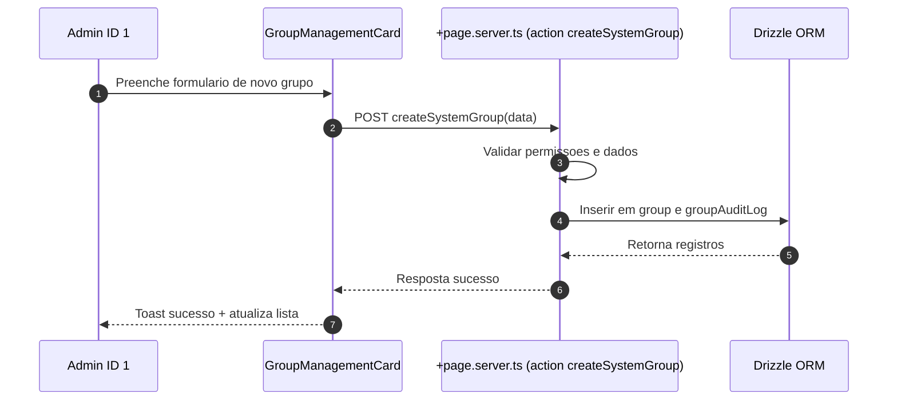

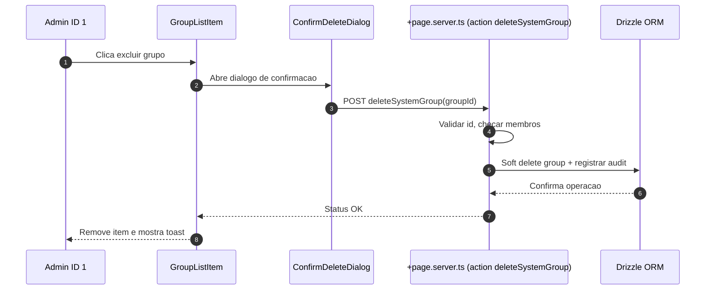

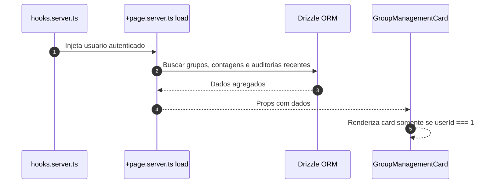

### Schema

A funcionalidade utiliza as seguintes tabelas:

- `group`: Armazena grupos com campos de auditoria (description, createdAt, createdById, deletedAt, deletedById)
- `rel_group`: Relacionamento usuario-grupo com campos de auditoria (createdById, joinedAt)
- `group_audit_log`: Registro de todas as acoes realizadas nos grupos (create, delete)

### Componentes

- `GroupManagementCard.svelte`: Card principal que exibe lista de grupos e formulario de criacao
- `GroupForm.svelte`: Formulario inline para criar grupos (integrado no card)
- `GroupList.svelte` + `GroupListItem.svelte`: Lista e linha de grupo (integrado no card)
- `ConfirmDeleteDialog.svelte`: Dialogo de confirmacao para exclusao (usando AlertDialog do shadcn-svelte)

### Seguranca

- Validacao server-side: apenas usuario ID 1 pode executar as acoes
- Validacao de dados: nome obrigatorio (max 64 chars), descricao opcional (max 256 chars)
- Soft delete: grupos nao sao removidos fisicamente, apenas marcados como deletados
- Validacao de membros: nao permite excluir grupos que possuem membros
- Auditoria completa: todas as operacoes sao registradas em `group_audit_log`

### Localizacao

Todas as strings estao internacionalizadas em `messages/pt-br.json` e sincronizadas com outros idiomas via `project.inlang`.

---

## Funcionalidade: Gerenciamento de grupos do usuario sistema

### Contexto

- Permitir que o usuario mestre (id 1, criado no bootstrap da plataforma) gerencie grupos diretamente em `user/profile`.
- Manter rastreabilidade de quem executa cada acao e garantir mensagens internacionalizadas.
- Preservar arquitetura modular existente em `src/routes/user` e manter validacoes no backend com drizzle.

### Regras de negocio

- Card visivel somente quando `locals.user.id === '1'`.
- Acoes disponiveis: criar grupo com nome e descricao opcionais e excluir grupos existentes via confirmacao.
- Registrar auditoria de criacao e exclusao utilizando tabelas dedicadas.
- Impedir que grupos com membros ativos sejam removidos sem verificacoes adicionais.

### Implementacao

- `src/routes/user/profile/+page.svelte`: renderizar `GroupManagementCard` com formulario inline, lista de grupos e confirm modal.
- `src/routes/user/profile/+page.server.ts`: fornecer `load` com grupos e contagens, actions `createGroup` e `deleteGroup` protegidas por permissao do usuario mestre.
- `src/lib/components/user/GroupManagementCard.svelte` e subcomponentes `GroupForm`, `GroupList`, `GroupListItem`, `ConfirmDeleteDialog` para UI reutilizavel.
- `src/lib/utils/groups.ts`: validacoes de entrada (nome, descricao) e formatadores.
- `src/lib/db/schema.ts`: adicionar tabelas `group`, `userGroup` e `groupAuditLog` com campos de auditoria (createdAt, createdById, deletedAt, deletedById).
- Adicionar migracoes drizzle correspondentes e seeds iniciais quando necessario.
- Atualizar `messages/*.json` com chaves de texto (labels, tooltips, toasts) sincronizadas via `project.inlang`.

### Fluxo principal

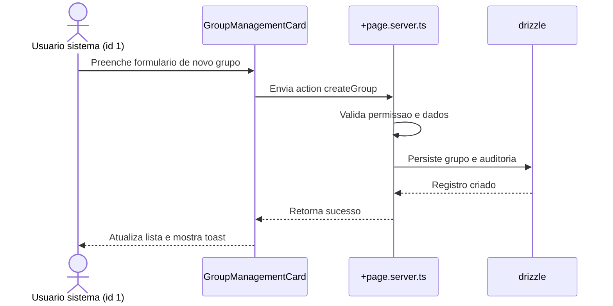

### Fluxo de remocao

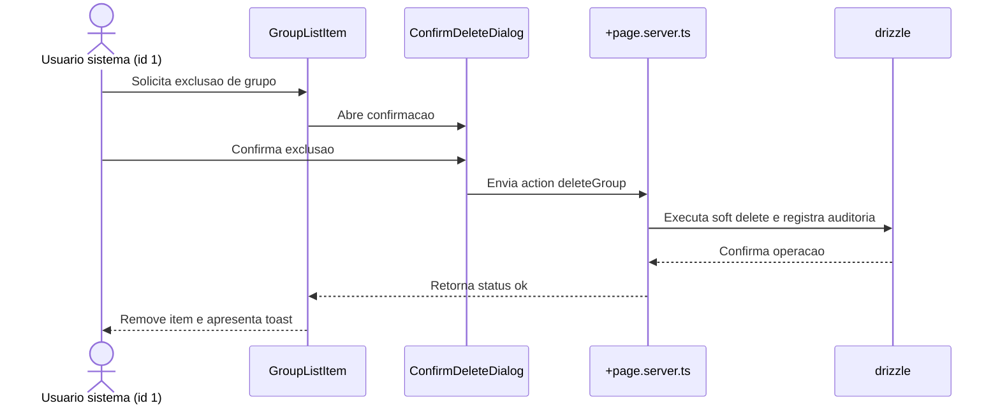

---

## Sistema de Gestao de Equipamentos

### Descricao

Sistema web completo de gestao de equipamentos que permite aos usuarios cadastrar equipamentos, visualizar localizacao atual, rastrear movimentacoes, identificar quem alocou e autorizou movimentacoes, realizar movimentacoes entre locais/usuarios, e registrar/acompanhar manutencoes preventivas e corretivas.

### Requisitos

- Interface web acessivel via navegador
- Autenticacao de usuarios com login e senha
- Cadastro completo de equipamentos com informacoes detalhadas
- Visualizacao da localizacao atual de cada equipamento
- Rastreamento de quem alocou cada equipamento
- Registro de quem autorizou cada movimentacao
- Movimentacao de equipamentos entre locais e/ou usuarios
- Cadastro e gestao de manutencoes de equipamentos
- Historico completo de movimentacoes e manutencoes
- Auditoria completa de todas as acoes

### Fluxos

#### Fluxo de Cadastro de Equipamento

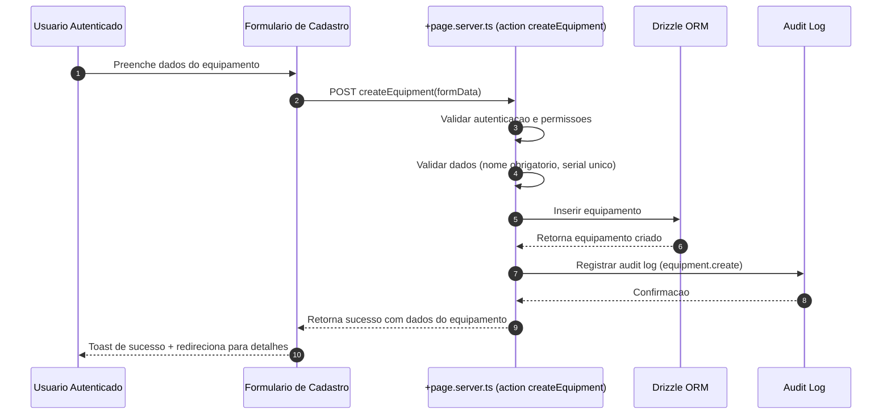

#### Fluxo de Movimentacao de Equipamento

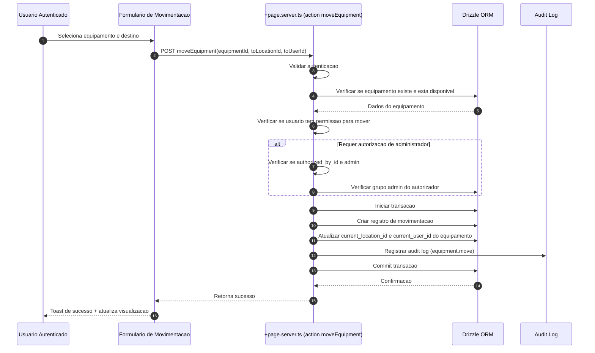

#### Fluxo de Visualizacao de Equipamento

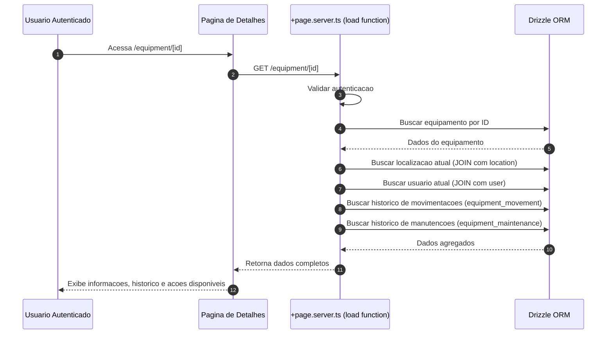

#### Fluxo de Cadastro de Manutencao

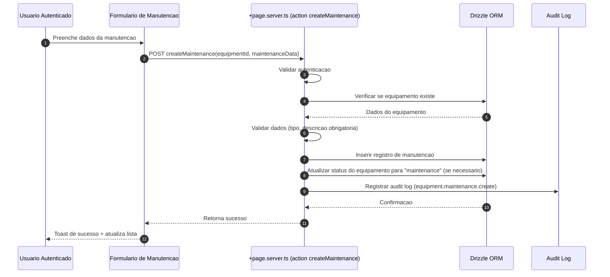

#### Fluxo de Listagem de Equipamentos

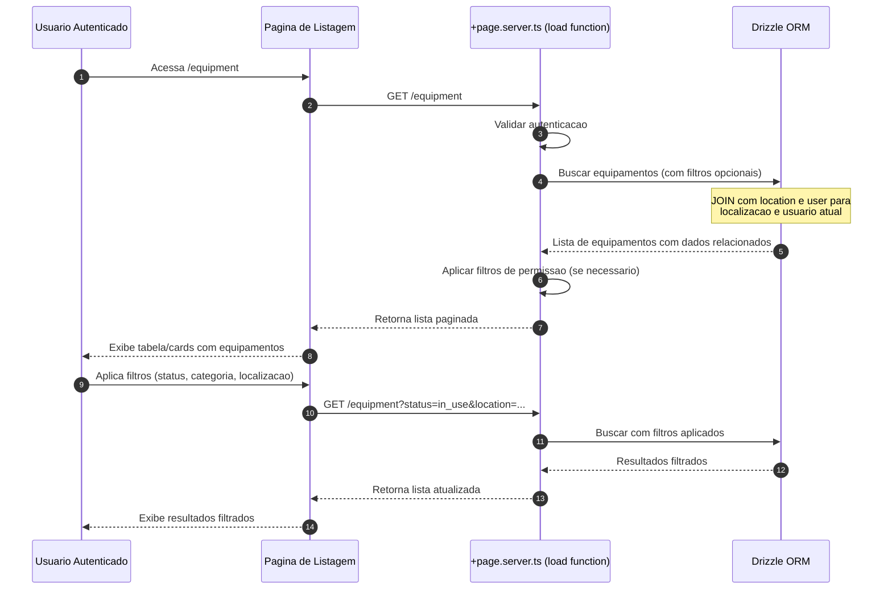

### Schema

#### Tabelas do Banco de Dados

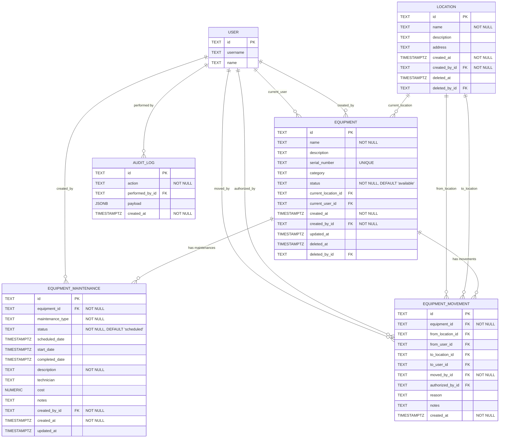

### Estrutura de Modulos

O sistema sera implementado como um novo modulo seguindo o padrao do projeto em `src/routes/equipment/`.

```
src/routes/equipment/
├── +page.server.ts          # Server-side logic principal
├── +page.svelte             # Pagina de listagem de equipamentos
├── page.server.spec.ts      # Testes unitarios do servidor
├── page.spec.ts             # Testes unitarios do cliente
├── [id]/
│   ├── +page.server.ts      # Detalhes do equipamento
│   ├── +page.svelte         # Visualizacao de detalhes
│   ├── page.server.spec.ts
│   └── page.spec.ts
├── create/
│   ├── +page.server.ts      # Criacao de equipamento
│   ├── +page.svelte         # Formulario de criacao
│   └── page.server.spec.ts
├── move/
│   ├── +page.server.ts      # Movimentacao de equipamento
│   ├── +page.svelte         # Formulario de movimentacao
│   └── page.server.spec.ts
├── maintenance/
│   ├── +page.server.ts      # Gestao de manutencoes
│   ├── +page.svelte         # Lista de manutencoes
│   ├── [id]/
│   │   ├── +page.server.ts  # Detalhes da manutencao
│   │   └── +page.svelte
│   └── create/
│       ├── +page.server.ts  # Criar manutencao
│       └── +page.svelte
└── utils.server.ts          # Funcoes auxiliares do servidor
```

### Componentes

#### Componentes Principais

```
src/lib/components/equipment/
├── EquipmentList.svelte          # Lista de equipamentos (tabela/cards)
├── EquipmentCard.svelte           # Card individual de equipamento
├── EquipmentForm.svelte           # Formulario de criacao/edicao
├── EquipmentDetails.svelte       # Visualizacao de detalhes
├── EquipmentMovementForm.svelte   # Formulario de movimentacao
├── EquipmentMovementHistory.svelte # Historico de movimentacoes
├── MaintenanceList.svelte         # Lista de manutencoes
├── MaintenanceForm.svelte         # Formulario de manutencao
├── MaintenanceCard.svelte         # Card de manutencao
└── LocationSelector.svelte        # Seletor de localizacao
```

### Permissoes e Seguranca

#### Regras de Permissao

- **Visualizacao**: Todos os usuarios autenticados podem ver equipamentos
- **Criacao**: Apenas usuarios com permissao de administrador ou grupo especifico
- **Movimentacao**: Usuarios podem mover equipamentos, mas pode requerer autorizacao de admin dependendo da configuracao
- **Manutencao**: Usuarios podem criar manutencoes, admins podem editar/cancelar
- **Exclusao**: Apenas administradores (soft delete)

#### Validacoes Server-Side

- Todas as validacoes devem ser feitas no servidor (`+page.server.ts`)
- Validar existencia de equipamentos, locais e usuarios antes de operacoes
- Verificar permissoes antes de cada acao
- Usar transacoes para operacoes que modificam multiplas tabelas

### Auditoria

Todas as acoes devem ser registradas no `audit_log`:

- `equipment.create`
- `equipment.update`
- `equipment.delete`
- `equipment.move`
- `equipment.maintenance.create`
- `equipment.maintenance.update`
- `equipment.maintenance.complete`
- `location.create`
- `location.update`
- `location.delete`

### Localizacao

Todas as strings devem ser adicionadas em `messages/pt-br.json` e sincronizadas via `project.inlang/settings.json`.

### Testes

#### Testes Unitarios

- `src/routes/equipment/page.server.spec.ts`: Testar load e actions
- `src/routes/equipment/[id]/page.server.spec.ts`: Testar detalhes
- `src/routes/equipment/create/page.server.spec.ts`: Testar criacao
- `src/routes/equipment/move/page.server.spec.ts`: Testar movimentacao
- `src/routes/equipment/maintenance/page.server.spec.ts`: Testar manutencoes

#### Testes End-to-End

- `e2e/equipment.test.ts`: Fluxo completo de criacao, movimentacao e manutencao

### Melhores Praticas Aplicadas

1. **Rastreabilidade Completa**: Todo equipamento tem historico completo de movimentacoes
2. **Soft Delete**: Equipamentos nao sao removidos fisicamente, apenas marcados como deletados
3. **Status Management**: Estados claros (disponivel, em uso, em manutencao, aposentado)
4. **Autorizacao de Movimentacao**: Sistema de autorizacao para movimentacoes importantes
5. **Manutencao Preventiva**: Suporte a manutencoes agendadas com alertas
6. **Localizacao Hierarquica**: Suporte a locais com enderecos e descricoes
7. **Auditoria Completa**: Todas as acoes sao registradas para compliance
