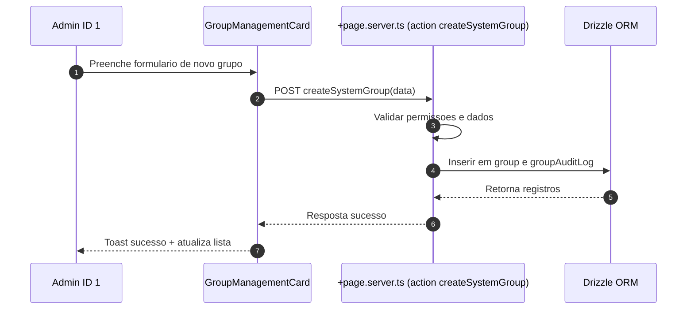
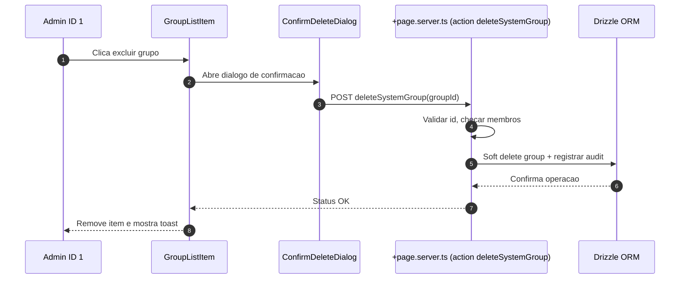
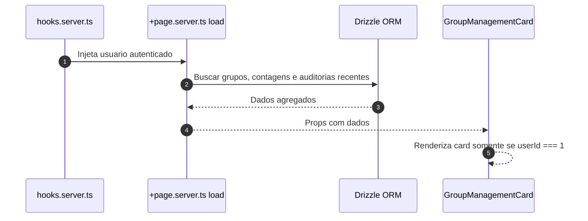
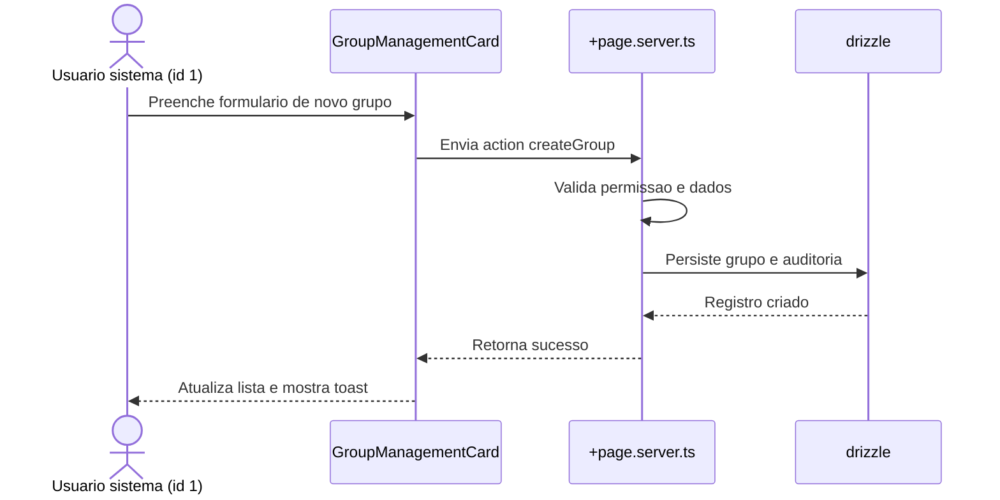
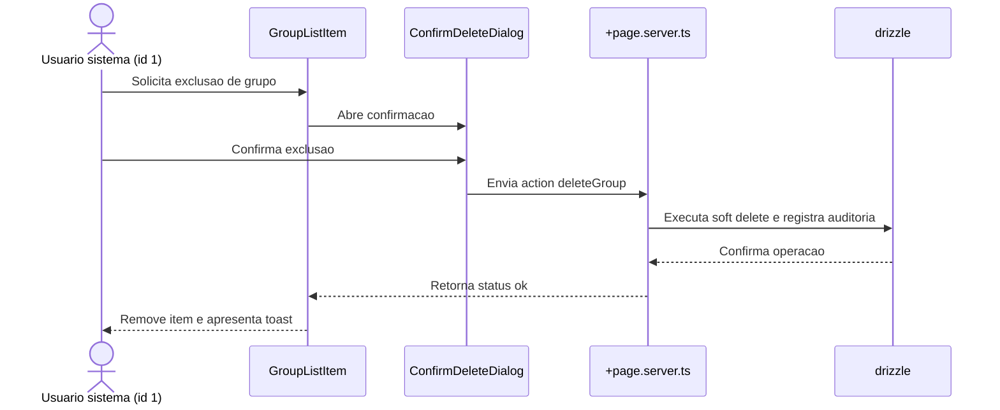
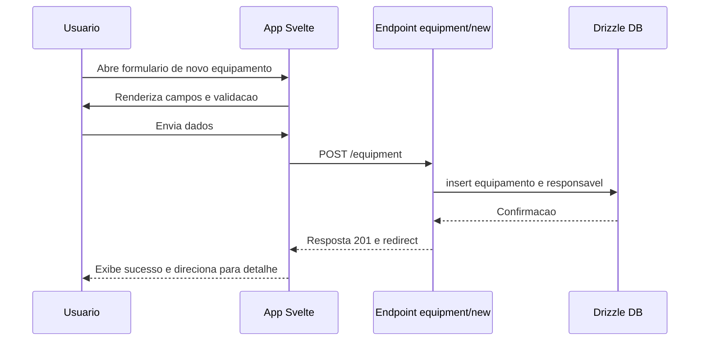
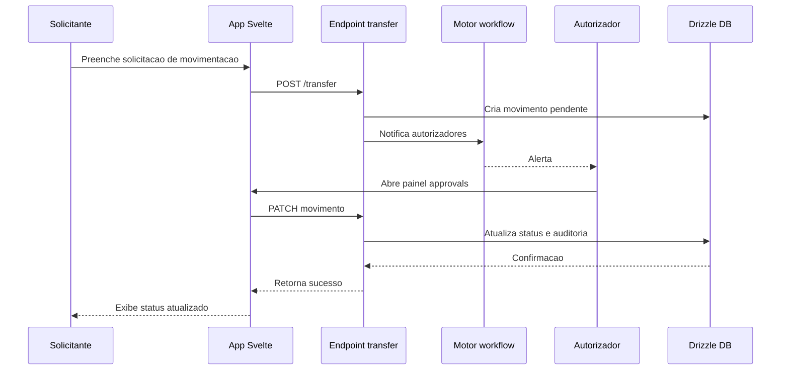
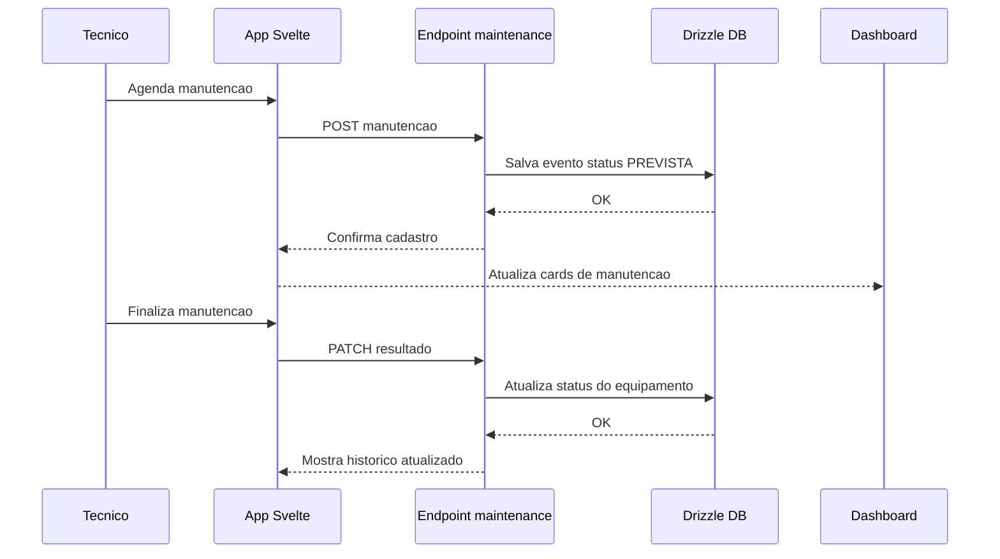

# Specification Document (use Mermaid.js, also use sequence diagrams)

> This document mirrors;

- SPEC.md
- src/routes/doc/spec/+page.md

---

## Gestao de Grupos pelo Usuario Sistema

### Descricao

Funcionalidade que permite ao usuario de sistema (ID = 1) gerenciar grupos diretamente na rota `user/profile`. O usuario sistema pode criar novos grupos e excluir grupos existentes, garantindo governanca, trilha de auditoria e integracao com as regras de permissao da plataforma.

### Requisitos

- Card exclusivo visivel apenas para `userId === 1`
- Formulario inline para criar grupo com nome e descricao opcionais
- Lista com grupos existentes, exibindo contadores de membros
- Acoes: criar, excluir (com confirm modal), e visualizar detalhes
- Feedback otimista e tratamento de erros com toasts
- Auditoria: registrar criador, timestamps, usuario responsavel pela exclusao

### Fluxos

```mermaid
sequenceDiagram
    autonumber
    participant A as Admin ID 1
    participant UI as GroupManagementCard
    participant S as +page.server.ts (action createSystemGroup)
    participant DB as Drizzle ORM
    A->>UI: Preenche formulario de novo grupo
    UI->>S: POST createSystemGroup(data)
    S->>S: Validar permissoes e dados
    S->>DB: Inserir em group e groupAuditLog
    DB-->>S: Retorna registros
    S-->>UI: Resposta sucesso
    UI-->>A: Toast sucesso + atualiza lista
```

```mermaid
sequenceDiagram
    autonumber
    participant A as Admin ID 1
    participant UI as GroupListItem
    participant C as ConfirmDeleteDialog
    participant S as +page.server.ts (action deleteSystemGroup)
    participant DB as Drizzle ORM
    A->>UI: Clica excluir grupo
    UI->>C: Abre dialogo de confirmacao
    C->>S: POST deleteSystemGroup(groupId)
    S->>S: Validar id, checar membros
    S->>DB: Soft delete group + registrar audit
    DB-->>S: Confirma operacao
    S-->>UI: Status OK
    UI-->>A: Remove item e mostra toast
```

```mermaid
sequenceDiagram
    autonumber
    participant Job as hooks.server.ts
    participant S as +page.server.ts load
    participant DB as Drizzle ORM
    participant UI as GroupManagementCard
    Job->>S: Injeta usuario autenticado
    S->>DB: Buscar grupos, contagens e auditorias recentes
    DB-->>S: Dados agregados
    S-->>UI: Props com dados
    UI-->>UI: Renderiza card somente se userId === 1
```

### Schema

A funcionalidade utiliza as seguintes tabelas:

- `group`: Armazena grupos com campos de auditoria (description, createdAt, createdById, deletedAt, deletedById)
- `rel_group`: Relacionamento usuario-grupo com campos de auditoria (createdById, joinedAt)
- `group_audit_log`: Registro de todas as acoes realizadas nos grupos (create, delete)

### Componentes

- `GroupManagementCard.svelte`: Card principal que exibe lista de grupos e formulario de criacao
- `GroupForm.svelte`: Formulario inline para criar grupos (integrado no card)
- `GroupList.svelte` + `GroupListItem.svelte`: Lista e linha de grupo (integrado no card)
- `ConfirmDeleteDialog.svelte`: Dialogo de confirmacao para exclusao (usando AlertDialog do shadcn-svelte)

### Seguranca

- Validacao server-side: apenas usuario ID 1 pode executar as acoes
- Validacao de dados: nome obrigatorio (max 64 chars), descricao opcional (max 256 chars)
- Soft delete: grupos nao sao removidos fisicamente, apenas marcados como deletados
- Validacao de membros: nao permite excluir grupos que possuem membros
- Auditoria completa: todas as operacoes sao registradas em `group_audit_log`

### Localizacao

Todas as strings estao internacionalizadas em `messages/pt-br.json` e sincronizadas com outros idiomas via `project.inlang`.

---

## Funcionalidade: Gerenciamento de grupos do usuario sistema

### Contexto
- Permitir que o usuario mestre (id 1, criado no bootstrap da plataforma) gerencie grupos diretamente em `user/profile`.
- Manter rastreabilidade de quem executa cada acao e garantir mensagens internacionalizadas.
- Preservar arquitetura modular existente em `src/routes/user` e manter validacoes no backend com drizzle.

### Regras de negocio
- Card visivel somente quando `locals.user.id === '1'`.
- Acoes disponiveis: criar grupo com nome e descricao opcionais e excluir grupos existentes via confirmacao.
- Registrar auditoria de criacao e exclusao utilizando tabelas dedicadas.
- Impedir que grupos com membros ativos sejam removidos sem verificacoes adicionais.

### Implementacao
- `src/routes/user/profile/+page.svelte`: renderizar `GroupManagementCard` com formulario inline, lista de grupos e confirm modal.
- `src/routes/user/profile/+page.server.ts`: fornecer `load` com grupos e contagens, actions `createGroup` e `deleteGroup` protegidas por permissao do usuario mestre.
- `src/lib/components/user/GroupManagementCard.svelte` e subcomponentes `GroupForm`, `GroupList`, `GroupListItem`, `ConfirmDeleteDialog` para UI reutilizavel.
- `src/lib/utils/groups.ts`: validacoes de entrada (nome, descricao) e formatadores.
- `src/lib/db/schema.ts`: adicionar tabelas `group`, `userGroup` e `groupAuditLog` com campos de auditoria (createdAt, createdById, deletedAt, deletedById).
- Adicionar migracoes drizzle correspondentes e seeds iniciais quando necessario.
- Atualizar `messages/*.json` com chaves de texto (labels, tooltips, toasts) sincronizadas via `project.inlang`.

### Fluxo principal

```mermaid
sequenceDiagram
    actor Admin as Usuario sistema (id 1)
    participant UI as GroupManagementCard
    participant Server as +page.server.ts
    participant DB as drizzle
    Admin->>UI: Preenche formulario de novo grupo
    UI->>Server: Envia action createGroup
    Server->>Server: Valida permissao e dados
    Server->>DB: Persiste grupo e auditoria
    DB-->>Server: Registro criado
    Server-->>UI: Retorna sucesso
    UI-->>Admin: Atualiza lista e mostra toast
```

### Fluxo de remocao

```mermaid
sequenceDiagram
    actor Admin as Usuario sistema (id 1)
    participant UI as GroupListItem
    participant Dialog as ConfirmDeleteDialog
    participant Server as +page.server.ts
    participant DB as drizzle
    Admin->>UI: Solicita exclusao de grupo
    UI->>Dialog: Abre confirmacao
    Admin->>Dialog: Confirma exclusao
    Dialog->>Server: Envia action deleteGroup
    Server->>DB: Executa soft delete e registra auditoria
    DB-->>Server: Confirma operacao
    Server-->>UI: Retorna status ok
    UI-->>Admin: Remove item e apresenta toast
```

---

## Modulo de Gestao de Equipamentos

### Visao Geral

- Plataforma web para controlar ciclo de vida de ativos corporativos com rastreabilidade ponta a ponta.
- Autenticacao obrigatoria reutilizando fluxo existente em `src/routes/user`.
- Painel operacional com indicadores em tempo real, filtros persistentes e cards de alerta.
- Fluxos auditaveis para cadastro, movimentacao, manutencao e definicao de politicas.

### Escopo Funcional

- **Dashboard operacional** (`src/routes/equipment/+page.svelte`): lista equipamentos consultando `+page.server.ts`, inclui cards de status, filtros persistidos via store e atalho para cadastros.
- **Cadastro e edicao** (`src/routes/equipment/new` e `src/routes/equipment/[id]/edit`): formularios com criticidade, localizacao, anexos e responsavel; actions server-side validam entradas.
- **Localizacoes** (`src/routes/equipment/locations`): CRUD hierarquico matriz > filial > sala com flags de atividade.
- **Detalhes e historico** (`src/routes/equipment/[id]` e `[id]/history`): resumo operacional, timeline completa e acessos rapidos para manutencao ou movimentacao.
- **Movimentacao** (`src/routes/equipment/[id]/transfer`): solicita origem/destino, motivo, aprovador; painel de aprovacao em `src/routes/equipment/approvals`.
- **Manutencao** (`src/routes/equipment/[id]/maintenance`): agenda preventiva/corretiva, acompanha execucao, anexa laudos e atualiza status operacional.
- **Relatorios** (`src/routes/equipment/reports/+page.server.ts`): exporta CSV seguindo filtros de categoria e status, preparando integracoes externas.
- **Politicas de aprovacao** (modeladas em `movement_policy`): mapeiam papeis, escopos e regras, usadas pelos endpoints de movimentacao.

### Componentes e Stores

- Store `equipmentFilters` (`src/lib/stores/equipment.ts`) persiste filtros em localStorage para manter contexto entre sessoes.
- Rotas utilizam componentes base do design system e cards responsivos para resumo rapido de status.
- Layout dedicado (`src/routes/equipment/+layout.*`) garante verificacao de autenticacao e injecao de breadcrumbs.

### Fluxos Principais

Fluxo de cadastro inicial:

```mermaid
sequenceDiagram
    participant U as Usuario
    participant UI as App Svelte
    participant SV as Endpoint equipment/new
    participant DB as Drizzle DB
    U->>UI: Abre formulario de novo equipamento
    UI->>U: Renderiza campos e validacao
    U->>UI: Envia dados
    UI->>SV: POST /equipment
    SV->>DB: insert equipamento e responsavel
    DB-->>SV: Confirmacao
    SV-->>UI: Resposta 201 e redirect
    UI-->>U: Exibe sucesso e direciona para detalhe
```

Fluxo de solicitacao e aprovacao de movimentacao:

```mermaid
sequenceDiagram
    participant Req as Solicitante
    participant UI as App Svelte
    participant SV as Endpoint transfer
    participant WF as Motor workflow
    participant Auth as Autorizador
    participant DB as Drizzle DB
    Req->>UI: Preenche solicitacao de movimentacao
    UI->>SV: POST /transfer
    SV->>DB: Cria movimento pendente
    SV->>WF: Notifica autorizadores
    WF-->>Auth: Alerta
    Auth->>UI: Abre painel approvals
    UI->>SV: PATCH movimento
    SV->>DB: Atualiza status e auditoria
    DB-->>SV: Confirmacao
    SV-->>UI: Retorna sucesso
    UI-->>Req: Exibe status atualizado
```

Fluxo de manutencao preventiva:

```mermaid
sequenceDiagram
    participant Tec as Tecnico
    participant UI as App Svelte
    participant SV as Endpoint maintenance
    participant DB as Drizzle DB
    participant Dash as Dashboard
    Tec->>UI: Agenda manutencao
    UI->>SV: POST manutencao
    SV->>DB: Salva evento status PREVISTA
    DB-->>SV: OK
    SV-->>UI: Confirma cadastro
    UI-->>Dash: Atualiza cards de manutencao
    Tec->>UI: Finaliza manutencao
    UI->>SV: PATCH resultado
    SV->>DB: Atualiza status do equipamento
    DB-->>SV: OK
    SV-->>UI: Mostra historico atualizado
```

### Modelo de Dados e Politicas

- Tabelas `equipment`, `location`, `equipment_movement`, `equipment_maintenance`, `equipment_audit_log` e `movement_policy` definidas em `src/lib/db/schema.ts`.
- Enums dedicados controlam status, criticidade, tipos de manutencao e escopo de politicas.
- Layout server-side valida `event.locals.user` antes de expor dados sensiveis.
- Movimentacoes futuras devem consultar regras em `movement_policy` para determinar aprovadores.

### Testes e Validacao

- Cobertura unit test para stores (`src/lib/stores/equipment.spec.ts`) garantindo persistencia e reset de filtros.
- Suites existentes validam actions server-side das rotas de usuario; expandir para rotas de equipamento conforme endpoints evoluirem.
- E2E previstos em `e2e/equipment*.test.ts` para cenarios de cadastro, solicitacao multi-etapa e manutencao concluida.
