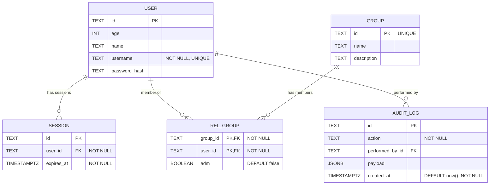

# Database Schema (Mermaid)

> This document mirrors; Update this file whenever the TypeScript schema changes!

- src/lib/db/schema.ts (original)
- src/lib/db/schema.md (mirror)
- src/routes/doc/schema/+page.md (mirror)

Details and constraints

**USER table:**

- user.id is the primary key (NOT NULL)
- user.username is UNIQUE and NOT NULL
- user.age, user.name, and user.password_hash are nullable

**SESSION table:**

- session.id is the primary key (NOT NULL)
- session.user_id → user.id (foreign key, required/NOT NULL)
- session.expires_at uses a timestamp with timezone (mode: date) and is NOT NULL

**GROUP table:**

- group.id is UNIQUE and serves as the primary key (NOT NULL)
- group.name and group.description are nullable

**REL_GROUP table:**

- rel_group has a composite primary key (group_id, user_id)
- rel_group.group_id → group.id (foreign key, required/NOT NULL)
- rel_group.user_id → user.id (foreign key, required/NOT NULL)
- rel_group.adm is a boolean flag indicating admin status (nullable, defaults to false)

**AUDIT_LOG table:**

- audit_log.id is the primary key (NOT NULL)
- audit_log.action is NOT NULL
- audit_log.performed_by_id → user.id (foreign key, optional/nullable)
- audit_log.payload is a JSONB field for storing metadata (nullable)
- audit_log.created_at defaults to now() and is NOT NULL (timestamp with timezone, mode: date)
