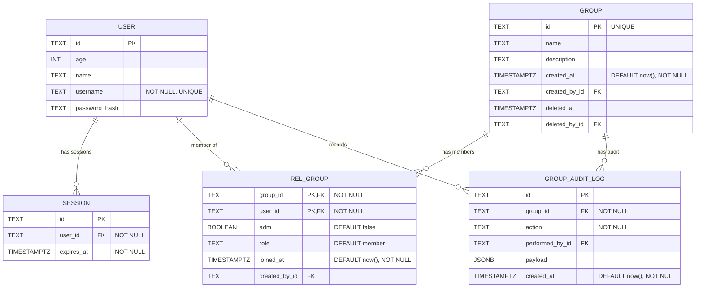

# Database Schema (Mermaid)

> This document mirrors; Update this file whenever the TypeScript schema changes!

- src/lib/db/schema.ts.
- src/routes/doc/schema/+page.md

Details and constraints

- session.user_id → user.id (foreign key, required)
- user.username is UNIQUE and NOT NULL
- session.expires_at uses a timestamp with timezone (mode: date) and is NOT NULL
- group.id is UNIQUE and serves as the primary key
- group.created_by_id → user.id
- group.deleted_by_id → user.id
- rel_group has a composite primary key (group_id, user_id)
- rel_group.group_id → group.id (foreign key, required)
- rel_group.user_id → user.id (foreign key, required)
- rel_group.created_by_id → user.id
- rel_group.adm e role definem papel do usuario no grupo
- group_audit_log.group_id → group.id (foreign key, required)
- group_audit_log.performed_by_id → user.id
