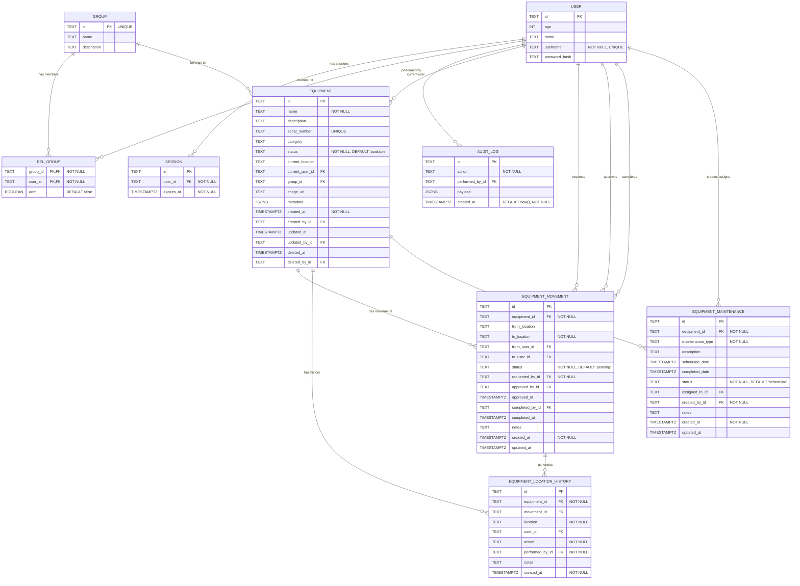

# Database Schema (Mermaid)

> This document mirrors; Update this file whenever the TypeScript schema changes!

- src/lib/db/schema.ts (original)
- src/lib/db/schema.md (mirror)
- src/routes/doc/schema/+page.md (mirror)

Details and constraints

**USER table:**
- user.id is the primary key (NOT NULL)
- user.username is UNIQUE and NOT NULL
- user.age, user.name, and user.password_hash are nullable

**SESSION table:**
- session.id is the primary key (NOT NULL)
- session.user_id → user.id (foreign key, required/NOT NULL)
- session.expires_at uses a timestamp with timezone (mode: date) and is NOT NULL

**GROUP table:**
- group.id is UNIQUE and serves as the primary key (NOT NULL)
- group.name and group.description are nullable

**REL_GROUP table:**
- rel_group has a composite primary key (group_id, user_id)
- rel_group.group_id → group.id (foreign key, required/NOT NULL)
- rel_group.user_id → user.id (foreign key, required/NOT NULL)
- rel_group.adm is a boolean flag indicating admin status (nullable, defaults to false)

**AUDIT_LOG table:**
- audit_log.id is the primary key (NOT NULL)
- audit_log.action is NOT NULL
- audit_log.performed_by_id → user.id (foreign key, optional/nullable)
- audit_log.payload is a JSONB field for storing metadata (nullable)
- audit_log.created_at defaults to now() and is NOT NULL (timestamp with timezone, mode: date)

**EQUIPMENT table:**
- equipment.id is the primary key (NOT NULL)
- equipment.name is NOT NULL
- equipment.serial_number is UNIQUE (nullable)
- equipment.status defaults to 'available' and is NOT NULL
- equipment.current_user_id → user.id (foreign key, nullable)
- equipment.group_id → group.id (foreign key, nullable)
- equipment.created_by_id → user.id (foreign key, nullable)
- equipment.updated_by_id → user.id (foreign key, nullable)
- equipment.deleted_by_id → user.id (foreign key, nullable)
- Supports soft delete via deleted_at and deleted_by_id

**EQUIPMENT_MOVEMENT table:**
- equipment_movement.id is the primary key (NOT NULL)
- equipment_movement.equipment_id → equipment.id (foreign key, required/NOT NULL)
- equipment_movement.to_location is NOT NULL
- equipment_movement.status defaults to 'pending' and is NOT NULL
- equipment_movement.requested_by_id → user.id (foreign key, required/NOT NULL)
- equipment_movement.approved_by_id → user.id (foreign key, nullable)
- equipment_movement.completed_by_id → user.id (foreign key, nullable)

**EQUIPMENT_LOCATION_HISTORY table:**
- equipment_location_history.id is the primary key (NOT NULL)
- equipment_location_history.equipment_id → equipment.id (foreign key, required/NOT NULL)
- equipment_location_history.movement_id → equipment_movement.id (foreign key, nullable)
- equipment_location_history.location is NOT NULL
- equipment_location_history.action is NOT NULL
- equipment_location_history.performed_by_id → user.id (foreign key, required/NOT NULL)

**EQUIPMENT_MAINTENANCE table:**
- equipment_maintenance.id is the primary key (NOT NULL)
- equipment_maintenance.equipment_id → equipment.id (foreign key, required/NOT NULL)
- equipment_maintenance.maintenance_type is NOT NULL
- equipment_maintenance.status defaults to 'scheduled' and is NOT NULL
- equipment_maintenance.created_by_id → user.id (foreign key, required/NOT NULL)
- equipment_maintenance.assigned_to_id → user.id (foreign key, nullable)
