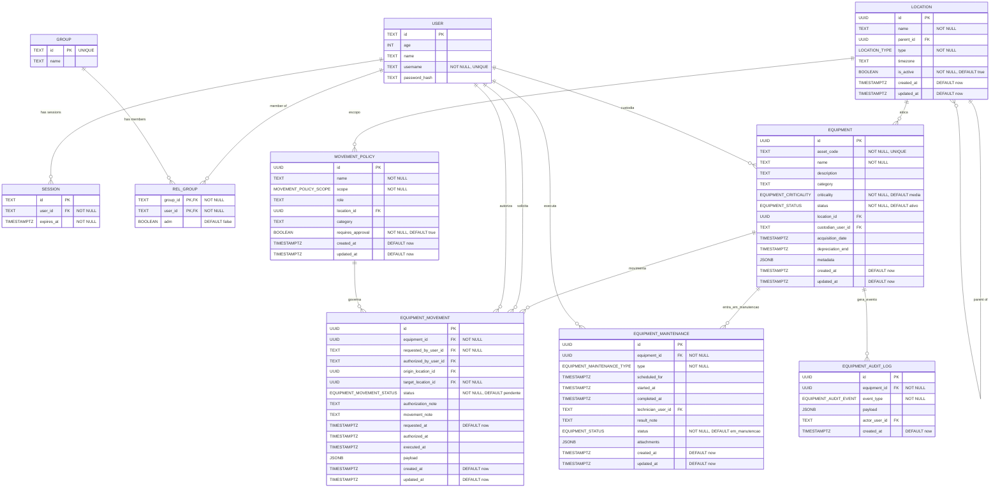

# Database Schema (Mermaid)

> This document mirrors; Update this file whenever the TypeScript schema changes!

- src/lib/db/schema.ts.
- src/routes/doc/schema/+page.md

Details and constraints

- session.user_id → user.id (foreign key, required)
- user.username is UNIQUE and NOT NULL
- session.expires_at uses a timestamp with timezone (mode: date) and is NOT NULL
- group.id is UNIQUE and serves as the primary key
- rel_group has a composite primary key (group_id, user_id)
- rel_group.group_id → group.id (foreign key, required)
- rel_group.user_id → user.id (foreign key, required)
- rel_group.adm is a boolean flag indicating admin status
- location.parent_id → location.id (self reference, optional)
- equipment.location_id → location.id (optional)
- equipment.custodian_user_id → user.id (optional)
- equipment_movement.equipment_id → equipment.id (required)
- equipment_movement.requested_by_user_id → user.id (required)
- equipment_movement.authorized_by_user_id → user.id (optional)
- equipment_movement.origin_location_id → location.id (optional)
- equipment_movement.target_location_id → location.id (required)
- equipment_maintenance.equipment_id → equipment.id (required)
- equipment_maintenance.technician_user_id → user.id (optional)
- equipment_audit_log.equipment_id → equipment.id (required)
- equipment_audit_log.actor_user_id → user.id (optional)
- movement_policy.location_id → location.id (optional)
- Enumerations: equipment_status, equipment_criticality, equipment_movement_status, equipment_maintenance_type, equipment_audit_event, location_type, movement_policy_scope
