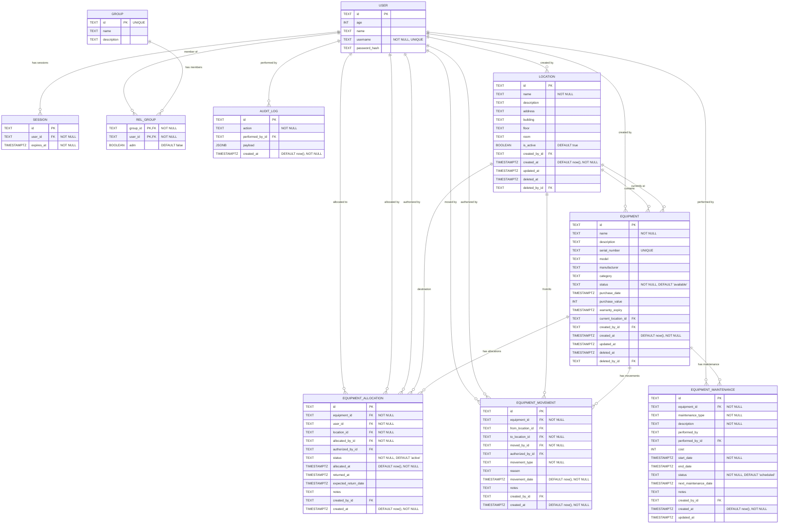

# Database Schema (Mermaid)

> This document mirrors; Update this file whenever the TypeScript schema changes!

- src/lib/db/schema.ts (original)
- src/lib/db/schema.md (mirror)
- src/routes/doc/schema/+page.md (mirror)

Details and constraints

**USER table:**

- user.id is the primary key (NOT NULL)
- user.username is UNIQUE and NOT NULL
- user.age, user.name, and user.password_hash are nullable

**SESSION table:**

- session.id is the primary key (NOT NULL)
- session.user_id → user.id (foreign key, required/NOT NULL)
- session.expires_at uses a timestamp with timezone (mode: date) and is NOT NULL

**GROUP table:**

- group.id is UNIQUE and serves as the primary key (NOT NULL)
- group.name and group.description are nullable

**REL_GROUP table:**

- rel_group has a composite primary key (group_id, user_id)
- rel_group.group_id → group.id (foreign key, required/NOT NULL)
- rel_group.user_id → user.id (foreign key, required/NOT NULL)
- rel_group.adm is a boolean flag indicating admin status (nullable, defaults to false)

**AUDIT_LOG table:**

- audit_log.id is the primary key (NOT NULL)
- audit_log.action is NOT NULL
- audit_log.performed_by_id → user.id (foreign key, optional/nullable)
- audit_log.payload is a JSONB field for storing metadata (nullable)
- audit_log.created_at defaults to now() and is NOT NULL (timestamp with timezone, mode: date)

**LOCATION table:**

- location.id is the primary key (NOT NULL)
- location.name is NOT NULL
- location.description, address, building, floor, room are nullable
- location.is_active defaults to true
- location.created_by_id → user.id (foreign key, optional/nullable)
- location.created_at defaults to now() and is NOT NULL
- location.updated_at, deleted_at, deleted_by_id support soft delete pattern

**EQUIPMENT table:**

- equipment.id is the primary key (NOT NULL)
- equipment.name is NOT NULL
- equipment.serial_number is UNIQUE (nullable)
- equipment.status defaults to 'available' and is NOT NULL
- equipment.current_location_id → location.id (foreign key, optional/nullable)
- equipment.created_by_id → user.id (foreign key, optional/nullable)
- equipment.created_at defaults to now() and is NOT NULL
- equipment.purchase_value is stored in cents (integer)
- equipment.updated_at, deleted_at, deleted_by_id support soft delete pattern

**EQUIPMENT_ALLOCATION table:**

- equipment_allocation.id is the primary key (NOT NULL)
- equipment_allocation.equipment_id → equipment.id (foreign key, required/NOT NULL)
- equipment_allocation.user_id → user.id (foreign key, required/NOT NULL)
- equipment_allocation.location_id → location.id (foreign key, required/NOT NULL)
- equipment_allocation.allocated_by_id → user.id (foreign key, required/NOT NULL)
- equipment_allocation.authorized_by_id → user.id (foreign key, optional/nullable)
- equipment_allocation.status defaults to 'active' and is NOT NULL
- equipment_allocation.allocated_at defaults to now() and is NOT NULL
- equipment_allocation.returned_at, expected_return_date, notes are nullable

**EQUIPMENT_MOVEMENT table:**

- equipment_movement.id is the primary key (NOT NULL)
- equipment_movement.equipment_id → equipment.id (foreign key, required/NOT NULL)
- equipment_movement.from_location_id → location.id (foreign key, optional/nullable)
- equipment_movement.to_location_id → location.id (foreign key, required/NOT NULL)
- equipment_movement.moved_by_id → user.id (foreign key, required/NOT NULL)
- equipment_movement.authorized_by_id → user.id (foreign key, optional/nullable)
- equipment_movement.movement_type is NOT NULL (transfer, allocation, return, maintenance)
- equipment_movement.movement_date defaults to now() and is NOT NULL
- equipment_movement.reason, notes are nullable

**EQUIPMENT_MAINTENANCE table:**

- equipment_maintenance.id is the primary key (NOT NULL)
- equipment_maintenance.equipment_id → equipment.id (foreign key, required/NOT NULL)
- equipment_maintenance.maintenance_type is NOT NULL (preventive, corrective, calibration, upgrade)
- equipment_maintenance.description is NOT NULL
- equipment_maintenance.performed_by_id → user.id (foreign key, optional/nullable)
- equipment_maintenance.cost is stored in cents (integer, nullable)
- equipment_maintenance.start_date is NOT NULL
- equipment_maintenance.status defaults to 'scheduled' and is NOT NULL
- equipment_maintenance.end_date, next_maintenance_date, notes are nullable
- equipment_maintenance.created_at defaults to now() and is NOT NULL
