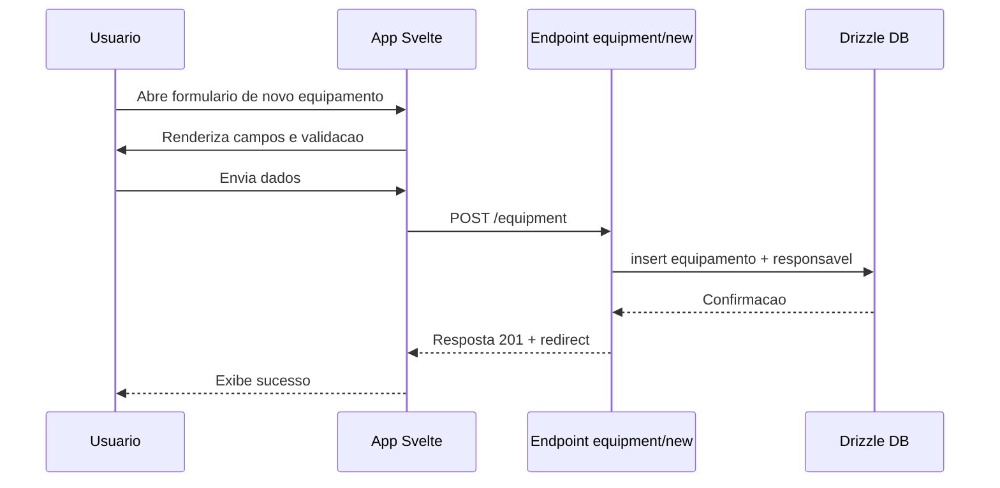
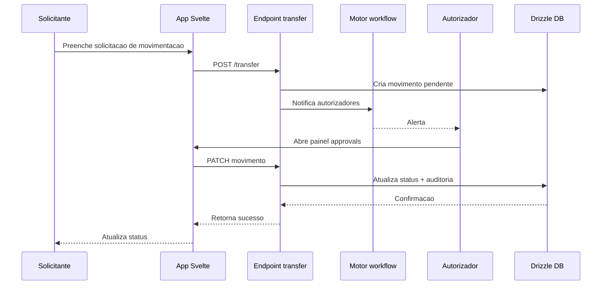
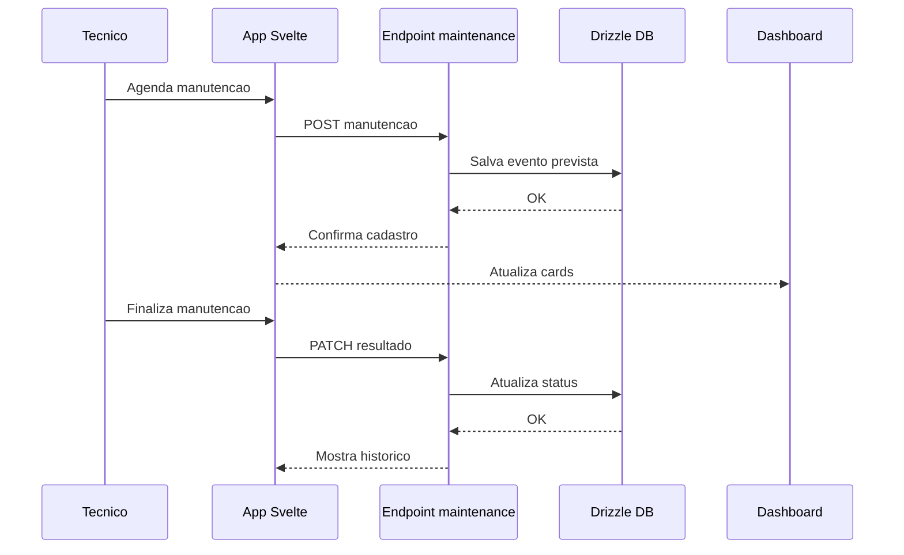

# Specification Document (use Mermaid.js, also use sequence diagrams)

> This document mirrors;

- SPEC.md
- src/routes/doc/spec/+page.md

---

## Equipment Management Module

### Overview

- Sistema web de gestao de equipamentos com rastreabilidade ponta a ponta.
- Controle de autenticacao reutilizando fluxo existente em `src/routes/user`.
- Monitoramento operacional com dashboard, cards de alertas e filtros.
- Fluxos autorizados para movimentacao, manutencao e auditoria completa.

### Functional Scope

- **Dashboard**: `src/routes/equipment/+page.svelte` utiliza consultas em `+page.server.ts` para listar equipamentos com filtros por status, categoria, local e responsavel.
- **Cadastro e Edicao**: formularios em `src/routes/equipment/new/+page.svelte` e `src/routes/equipment/[id]/edit/+page.svelte` com validacao, anexos e criticidade.
- **Localizacoes**: CRUD em `src/routes/equipment/locations/+page.svelte` permitindo hierarquia matriz > filial > sala.
- **Movimentacao**: fluxo de solicitacao em `src/routes/equipment/[id]/transfer/+page.svelte` com aprovacao em `src/routes/equipment/approvals/+page.svelte`.
- **Manutencao**: agendamento e registro em `src/routes/equipment/[id]/maintenance/+page.svelte`, incluindo anexos de laudos.
- **Auditoria**: timeline consolidada em `src/routes/equipment/history/+page.svelte`.
- **Relatorios**: exportacao CSV/Excel via `src/routes/equipment/reports/+page.server.ts` reutilizando utilitarios em `src/lib/utils`.
- **Notificacoes**: preparar integracao para e-mail ou mensagens internas quando solicitacoes mudarem de status.

### Workflow Diagrams

Fluxo de cadastro inicial:

Fluxo de solicitacao e aprovacao:

Fluxo de manutencao preventiva:

### Data Model Summary

- Tabela `equipment`: identifica ativos com campos de status, local atual e responsavel.
- Tabela `location`: representa hierarquia de locais com relacionamentos parent-child.
- Tabela `equipment_movement`: registra solicitacoes, autorizacoes e execucoes de movimentacao.
- Tabela `equipment_maintenance`: controla manutencoes preventivas e corretivas.
- Tabela `equipment_audit_log`: historico imutavel de eventos relevantes.
- Tabela `movement_policy`: mapeia regras de aprovacao para papeis, locais e categorias.

### Testing Guidelines

- Cobrir casos unitarios garantindo validacao de formularios e regras de negocio.
- Adicionar cenarios E2E em `e2e/equipment*.test.ts` para fluxo completo de cadastro, movimentacao e manutencao.
- Garantir rollback em erros de movimentacao e bloqueio para equipamentos inativos.